# Guia didático da EDA — TCC de Marketing Mix Modeling com Google Meridian

**Da pergunta científica à leitura dos resultados: GEO × TIME × MEDIA.**

Versão documental: 07/10/2026. Estado analítico examinado: [`5d8c6a36f267e6d77b42951c7b0059448680175d`](https://github.com/thiagossilva17/MMM_Google_Meridian_Project/commit/5d8c6a36f267e6d77b42951c7b0059448680175d), posterior à auditoria. Dados e resultados são simulados. Este guia explica a EDA existente; não ajusta um MMM nem altera seus dados.

## 1. Como utilizar este guia

Leia primeiro os capítulos 2–5, para entender a pergunta e a arquitetura. Depois mantenha o notebook correspondente aberto ao lado de cada capítulo analítico. Cada análise percorre pergunta, motivação, conceito, analogia, definição, cálculo, localização, leitura, resultado, interpretação, implicação, limite e próxima pergunta. Você pode estudar o conceito sem abrir o código; os links permitem conferir a implementação e os números.

Os exemplos explicitamente chamados **fictícios** ensinam uma definição. As tabelas chamadas **resultado real** vêm dos CSVs versionados, com arredondamento apenas para leitura. Nas tabelas transcritas dos CSVs, o ponto é separador decimal; nas proporções, 0.40 equivale a 40%. `share` significa fração, `mean` média, `std` desvio padrão e `per_capita` valor por habitante na escala indicada. “Real”, aqui, significa resultado efetivamente produzido neste projeto com dados simulados, não observação de uma empresa real. Não atribuímos Channel0–4 a TV, Search ou plataformas específicas.

As evidências de execução são as publicadas na revisão de 06/10/2026. Na preparação deste guia, foram lidos código, notebooks, metadados, tabelas, relatórios e logs; os resultados centrais e links foram conferidos, e figuras representativas foram renderizadas para inspeção. Não houve nova execução do pipeline Meridian, posterior ou sessão Colab. Essa distinção evita transformar leitura documental em alegação de reexecução.

**Navegação:** use o sumário abaixo para a primeira leitura e o índice de artefatos ao final para consulta. Os glossários explicam os termos no contexto do projeto.

- [1. Como utilizar este guia](#sec-01)
- [2. O que estamos tentando descobrir no TCC](#sec-02)
- [3. MMM explicado antes da modelagem](#sec-03)
- [4. Por que GEO é o diferencial](#sec-04)
- [5. Mapa da investigação e da implementação](#sec-05)
- [6. Dataset, proveniência e unidades](#sec-06)
- [7. EDA geral: escala, distribuição e orçamento](#sec-07)
- [8. Atividade, sparsity e extremos: quando zero ou pico traz informação](#sec-08)
- [9. EDA temporal: nível, sazonalidade aparente e co-movimento](#sec-09)
- [10. Geografia: tamanho, intensidade e sincronização](#sec-10)
- [11. Between × within: separar diferenças entre mercados e mudanças dentro deles](#sec-11)
- [12. R² GEO, R² TIME e resíduo two-way](#sec-12)
- [13. Media × GEO: orçamento, mix e alocação territorial](#sec-13)
- [14. Relações: nacional, overall, within e two-way](#sec-14)
- [15. O que significa identificar um efeito?](#sec-15)
- [16. Meridian Official EDA: confronto de definições e revisão de alertas](#sec-16)
- [17. Integração das evidências: o que realmente sustenta o diferencial GEO](#sec-17)
- [18. Fichas de interpretação dos cinco canais](#sec-18)
- [19. Respostas às cinco perguntas da EDA](#sec-19)
- [20. Descrição, associação, predição e causalidade: limites práticos](#sec-20)
- [21. O que aprendemos com a auditoria](#sec-21)
- [22. Lacunas, ressalvas e evidências que não devem ser exageradas](#sec-22)
- [23. O que a EDA preparou para o próximo passo](#sec-23)
- [24. Reprodutibilidade, requisitos e Google Colab](#sec-24)
- [25. Como explicar o percurso para a banca](#sec-25)
- [26. Confusões que eu não posso cometer](#sec-26)
- [27. Glossário de Marketing Science](#sec-27)
- [28. Glossário estatístico contextualizado](#sec-28)
- [29. Índice de navegação: quero entender, onde vou?](#sec-29)
- [30. Mapa dos artefatos: pergunta, código, saída e narrativa](#sec-30)
- [31. Ordem recomendada de estudo](#sec-31)
- [32. Checkpoint final: consigo explicar sem tratar como caixa-preta?](#sec-32)
- [33. Conclusão pedagógica](#sec-33)
- [34. Apêndice — árvore real completa de arquivos examinados](#sec-34)

## 2. O que estamos tentando descobrir no TCC

A pergunta desta fase é: **a estrutura geográfica contém variação adicional potencialmente útil para um MMM geo-level, além do que enxergaríamos em uma série nacional?** Antes de responder, precisamos saber se as linhas são confiáveis, o que representam e quais diferenças são apenas consequência do tamanho dos mercados.

A sequência científica tem cinco perguntas. A primeira é estrutural: cada mercado aparece uma vez por semana? A segunda é temporal: KPI, mídia e controles mudam? A terceira é territorial: os mercados diferem, e quanto disso acompanha a população? A quarta reúne as anteriores: existe comportamento específico de mercado e semana que a soma nacional apaga? A quinta é de identificabilidade: os sinais são suficientemente distintos para justificar investigar seus efeitos em um modelo futuro?

A EDA pode demonstrar variação observada e possíveis dificuldades de separação de sinais. A comparação entre um MMM nacional e um MMM geográfico, incluindo previsão fora da amostra e incerteza de efeitos, permanece uma etapa futura. Assim, “vale investigar a modelagem geo-level” e “o modelo geo-level é superior” são afirmações de força muito diferente.

## 3. MMM explicado antes da modelagem

Imagine uma rede de lojas em várias cidades. O total de conversões de cada loja pode mudar com população, promoções, demanda, concorrência e publicidade. **KPI**, indicador principal de resultado, é aquilo que queremos compreender; neste projeto é `conversions`. **Channel** é um canal de mídia. **Spend** é o dinheiro investido; **media units** são a exposição adquirida, aqui impressões. Um gasto maior pode comprar mais impressões ou apenas pagar mais por cada impressão.

Marketing Mix Modeling procura representar estatisticamente a relação entre o KPI, a mídia e outros fatores, geralmente com evolução temporal, possíveis efeitos persistentes de exposição e resposta não linear. Uma interpretação causal exige hipóteses sobre o que teria acontecido sem determinada mídia. Apenas ajustar uma regressão e encontrar um coeficiente não estabelece esse contrafactual.

Uma **variável de controle** ajuda a representar fatores que podem estar relacionados ao KPI e à alocação de mídia. Por exemplo, demanda alta pode estimular simultaneamente campanhas e conversões. A associação entre campanha e conversão mistura então o possível efeito da mídia com a demanda que motivou a campanha. Também pode ocorrer causalidade reversa ou alocação antecipatória: a empresa aumenta mídia onde espera vender mais.

A analogia das lojas será recorrente, mas tem um limite: os geos desta base são fictícios, sem cidades reais ou informações de gestão. Não sabemos que mecanismo comercial gerou cada pico. A EDA prepara as perguntas e os cuidados do modelo; não recupera uma história de negócio que não foi fornecida.

> **Descrição:** Channel3 recebe 40,03% do gasto. **Associação:** população e KPI acumulado têm Pearson de 0,9693. **Predição:** estimar conversões de semanas futuras requer um modelo e avaliação própria. **Causalidade:** atribuir conversões à mídia requer hipóteses causais e inferência apropriada. As duas últimas não foram demonstradas nesta EDA.

## 4. Por que GEO é o diferencial

| Representação | Uma linha representa | O que fica visível | O que exige cuidado |
|---|---|---|---|
| Nacional | Uma semana, somando os mercados | Trajetória conjunta em 156 semanas | A soma pode esconder movimentos opostos |
| Geo-level | Um mercado em uma semana | 40 trajetórias, totalizando 6.240 células | Linhas dependentes não equivalem a 6.240 observações independentes |

É como acompanhar a média de notas de uma turma versus acompanhar cada aluno. A média mostra o movimento coletivo. Os históricos individuais mostram diferenças persistentes e mudanças dentro de cada pessoa. A analogia deixa de ser perfeita porque os mercados podem compartilhar campanhas, choques e exposição entre regiões; não são réplicas independentes.

**Exemplo fictício:** numa semana, uma cidade recebe mais 100 impressões e outra menos 100. O total nacional não muda, mas a distribuição da exposição mudou. Um painel guarda essa informação; uma soma não permite reconstruí-la. Isso ainda não diz se a alteração de mídia foi independente da demanda.

Ter a coluna `geo` é apenas ter um identificador. Para justificar a investigação geográfica, precisamos examinar diferenças de nível, variação dentro dos mercados, movimentos comuns no tempo, população, atividade e relações entre canais. Um painel que repete a mesma série multiplicada pela população pode parecer rico em números e ser pouco rico em padrões distintos.

## 5. Mapa da investigação e da implementação

```mermaid
flowchart TD
  A["Fonte fixada e raw"] --> B["00: contrato e CPMU"]
  B --> C["01: escala, atividade e extremos"]
  C --> D["02: dinâmica temporal"]
  D --> E["03: GEO e decomposições"]
  E --> F["04: mídia e alocação"]
  F --> G["05: relações e VIF"]
  G --> H["06: confronto oficial"]
  H --> I["07: prontidão e limites"]
  I --> J["Futuro: especificação do MMM"]
  K["População e unidades"] --> E
  K --> F
  L["Manifesto e contratos"] --> B
  L --> I
```

O diagrama representa uma investigação com dependências: o contraste geográfico depende do painel validado e da leitura temporal; a síntese exige compatibilidade dos resultados anteriores. A modelagem futura está indicada como destino, não como atividade executada.

### Pastas: o que procurar e por quê

| Local | Função e conteúdo atual | Como usar daqui a seis meses |
|---|---|---|
| `data/raw/` | `geo_all_channels.csv` original | Referência imutável, como o negativo de uma fotografia; verificar hash antes de transformar |
| `data/processed/` | `geo_time_panel.csv` com 19 colunas, sem índice exportado e com datas ordenadas | Painel de trabalho; não há imputação ou remoção de extremos |
| `data/metadata/` | Fonte, licença Apache-2.0, hash, execução, ambiente e registro Meridian | Identificar exatamente os dados e o software usados |
| `notebooks/` | Oito capítulos mais um master | Interface de estudo e execução; não são nove análises independentes |
| `src/` | Treze arquivos Python contando `__init__.py` | Implementação reutilizável das mesmas análises dos notebooks |
| `scripts/` | Cinco scripts de geração, execução e validação | Operar o pipeline sem copiar funções |
| `outputs/tables/` | 129 CSVs na revisão examinada | Evidência numérica completa, incluindo artefatos oficiais |
| `outputs/figures/` | 79 SVGs em seis subpastas | Figuras versionadas; PNGs são produzidos durante execução |
| `outputs/reports/` | Oito relatórios Markdown e HTML oficial | Narrativas geradas e diagnósticos Meridian |
| `outputs/logs/` | Execução, testes, eixos, validação e manifesto | Distinguir artefato existente de resultado compatível e executado |
| `outputs/audit/` | Evidências da auditoria histórica | Ler como avaliação do commit antigo, não como log da revisão atual |
| `docs/` | Especificação, metodologia, dicionário, auditoria, respostas, decisões e achados | Separar requisitos, métodos, resultados e avaliação histórica |
| `tests/` | Contratos e regressões das correções | Guardrails, como detectores de fumaça: alertam sobre condições testadas, não certificam toda a casa |
| Raiz | README, requirements e configuração pytest | Entradas de navegação e dependências |

Notebook é a cozinha aberta onde acompanhamos a preparação; `src` guarda os utensílios e as receitas reutilizáveis. Copiar a mesma função em nove notebooks criaria nove oportunidades de divergência. Aqui os capítulos chamam as funções comuns, e `src/reporting.py` organiza a apresentação.

### Módulos reais

| Arquivo | Responsabilidade |
|---|---|
| [config.py](../src/config.py) | Caminhos, seed, commit upstream e papéis das variáveis |
| [data.py](../src/data.py) | Download quando necessário, hash, schema, transformação e agregação nacional |
| [validation.py](../src/validation.py) | Contrato e dicionário |
| [statistics.py](../src/statistics.py) | Descritivas, decomposição, VIF e triagem de extremos |
| [eda.py](../src/eda.py) | Capítulos 00, 01, 02 e 05 |
| [geo_analysis.py](../src/geo_analysis.py) | Capítulos 03 e 04; normalização e ordenação |
| [investigation.py](../src/investigation.py) | Aprofundamentos localizados e integração após auditoria |
| [official_eda.py](../src/official_eda.py) | Construção de InputData, execução oficial e R² reconciliado |
| [official_review.py](../src/official_review.py) | Revisão dos alertas e confronto numérico na mesma escala |
| [plots.py](../src/plots.py) | Figuras, eixos e gravação atômica |
| [provenance.py](../src/provenance.py) | Compatibilidade por conteúdo, status e hashes |
| [reporting.py](../src/reporting.py) | CSVs, narrativas, exibição e conclusões |

### Cada notebook como capítulo

Todos recebem o painel preparado pelo bootstrap. Nos modulares, etapas anteriores incompatíveis são recalculadas. O master executa a sequência inteira.

| Notebook | Pergunta e entrada específica | O que executa e principais saídas | Ponte entre capítulos |
|---|---|---|---|
| [00_data_audit](../notebooks/00_data_audit.ipynb) | A estrutura do painel recebido é válida? | `eda.data_audit`; contrato, dicionário, missing e CPMU | Valida o tabuleiro antes de medir padrões |
| [01_eda_general](../notebooks/01_eda_general.ipynb) | Qual a escala e a atividade? Painel validado | `eda.general` e investigação; KPI, canais, share, runs, extremos | Mostra o que precisa ser acompanhado no tempo |
| [02_eda_temporal](../notebooks/02_eda_temporal.ipynb) | Como os sinais evoluem? Painel e agregação nacional | `eda.temporal`; STL, ACF, séries e controles | Pergunta se o nacional esconde diferenças locais |
| [03_eda_geo](../notebooks/03_eda_geo.ipynb) | Quanto é tamanho e quanto é dinâmica? | `geo_analysis.geo_analysis`; população, rankings, sincronização, variância e R² | Prepara a investigação de cada canal entre mercados |
| [04_eda_media_geo](../notebooks/04_eda_media_geo.ipynb) | Onde e como a mídia ocorre? | `geo_analysis.media_geo`; mix, allocation, HHI, CV e heatmaps | Verifica se os diferentes sinais se movem juntos |
| [05_eda_relationships](../notebooks/05_eda_relationships.ipynb) | Há redundância ou associação com KPI? | `eda.relationships`; quatro níveis de correlação, VIF e lags | Prepara o confronto com diagnósticos oficiais |
| [06_meridian_official_eda](../notebooks/06_meridian_official_eda.ipynb) | O que a escala oficial revela? | `official_eda.official_eda`; HTML, 13 checks e reconciliações | Produz alertas investigados para a síntese |
| [07_eda_conclusions](../notebooks/07_eda_conclusions.ipynb) | O que permite avançar? Tabelas 00–06 compatíveis | `reporting.conclusions`; readiness e fichas por canal | Prepara a especificação, sem ajustá-la |
| [EDA_COMPLETE_COLAB](../notebooks/EDA_COMPLETE_COLAB.ipynb) | Como executar tudo em ordem? | Bootstrap, oito capítulos, link HTML e ZIP | Reúne o percurso; reutiliza `src` |

`methodology_eda.md` é a referência de definições; `EDA_AUDIT_REPORT.md` avalia a versão histórica; `AUDIT_RESPONSE.md` registra o tratamento dos achados; `eda_story.md` reúne narrativas geradas; este guia é o material central de estudo. A árvore completa dos arquivos examinados aparece no apêndice, gerada da listagem Git, sem inventar diretórios.

## 6. Dataset, proveniência e unidades

O CSV oficial é `geo_all_channels.csv`, fixado no commit Google Meridian `02111531f8661373aa7b6ba31c316c67d72d1dd2`. O SHA-256 é `d9ee016f7cd21f5c90b50da10a794af91a372b69f881d3caa266edd41fdafbf6`. Fonte, data de aquisição e licença estão em [source.json](../data/metadata/source.json). O raw tem 20 colunas; uma é o índice exportado. A cópia processada tem 19.

| Campo ou grupo | Papel | Unidade e interpretação correta |
|---|---|---|
| `geo` | Coordenada territorial | Geo0–Geo39; sem geometria ou nome de cidade real |
| `time` | Coordenada temporal | 156 datas semanais de 25/01/2021 a 15/01/2024 |
| `conversions` | KPI não monetário | Conversões sintéticas contínuas; não arredondar para inteiros |
| `Channel0_impression` a `Channel4_impression` | Mídia paga | Impressões, não pessoas únicas alcançadas |
| `Channel0_spend` a `Channel4_spend` | Gasto pareado | Moeda não especificada; não chamar de reais, dólares ou euros |
| `competitor_sales_control` | Controle | Índice sintético; o nome não prova unidade de vendas |
| `sentiment_score_control` | Controle | Índice sintético, com valores negativos admissíveis |
| `Organic_channel0_impression` | Mídia orgânica | Impressões sem coluna correspondente de gasto pago |
| `Promo` | Tratamento não mídia | Contínuo com massa em zero; não é dummy binária |
| `revenue_per_conversion` | Fator de monetização | Moeda não especificada por conversão, variável no painel |
| `population` | Escala territorial | Positiva e constante no tempo dentro de cada geo |

Não há reach/frequency. Impressões não permitem reconstruir quantas pessoas distintas foram alcançadas nem quantas exposições cada pessoa recebeu. [Dicionário completo](data_dictionary.md) e [CSV](../outputs/tables/data_dictionary.csv) registram tipo, dimensão, pares, domínio e descritivas.

### Agregar é decidir o significado

No nacional, somam-se conversões, impressões e gasto. Controles e Promo usam média ponderada por população: $C_t=\sum_g P_g C_{gt}/\sum_g P_g$, em que $P_g$ é a população do geo. É uma lente descritiva explícita, não a única agregação conceitualmente possível. A receita derivada é $\sum_g Y_{gt}R_{gt}$, com conversões $Y$ e receita por conversão $R$; o fator nacional é essa receita dividida pelas conversões nacionais. Somar razões ou multiplicar médias diferentes mudaria o significado.

**Exemplo fictício:** 10 conversões a 2 unidades monetárias e 20 a 3 produzem receita 80; receita/conversão nacional é 80/30. Não é 2+3 e não é, em geral, a média simples 2,5. População territorial usa um valor por geo; somar a mesma população nas 156 semanas criaria pessoas fictícias.

### A01 — Contrato GEO × TIME e completude

#### 1. Pergunta

Cada linha identifica um mercado e uma semana, sem lacunas ou duplicatas?

#### 2. Por que importa

Decomposições posteriores pressupõem um painel completo e comparável. Uma semana ausente não pode ser confundida com campanha desligada.

#### 3. Conceito em linguagem simples

Conferimos se todas as casas do tabuleiro mercado–semana estão presentes e se os valores pertencem ao domínio esperado.

#### 4. Analogia

Quarenta lojas preenchem uma ficha por semana durante 156 semanas. Duas fichas da mesma loja na mesma semana duplicam a informação; uma ficha ausente não significa vendas zero.

#### 5. Definição técnica

Painel balanceado tem $N=G\times T$. Unicidade exige uma observação por par $(g,t)$; regularidade temporal exige intervalos de sete dias. Missing é ausência de informação, distinto de zero observado.

#### 6. Cálculo neste projeto

`load_panel` verifica hash e schema, valida a sequência do índice exportado e ordena geo/data. `audit` conta duplicatas, células ausentes, finitos, população e inconsistências mídia/gasto. `require_valid_panel` interrompe nas violações estruturais listadas no código. Não imputa.

#### 7. Onde encontrar

Notebook [00](../notebooks/00_data_audit.ipynb); [data.py](../src/data.py): `load_panel`, `roles`; [validation.py](../src/validation.py): `audit`, `require_valid_panel`; [data_audit.csv](../outputs/tables/data_audit.csv), `missing_summary`, `missing_by_geo`, `missing_by_time`, `missing_by_channel`, `duplicate_summary` no índice final.

#### 8. Como ler

Na matriz de completude, linhas são geos, colunas são semanas e cor representa presença (1) ou ausência (0). No gráfico de missing, a altura seria a quantidade de células sem valor, não células de mídia zero.

#### 9. Resultado real

40 × 156 = 6.240 pares esperados e observados; completude 100%; duplicatas, missing, valores não finitos e violações de domínio verificadas: zero. População varia entre geos, mas é constante dentro de cada um. Todos os dez contadores de inconsistência mídia/gasto são zero.

#### 10. Interpretação

Os dados suportam as operações balanceadas desta EDA. Controles negativos e conversões fracionárias permanecem: são compatíveis com a base sintética.

#### 11. Implicação para MMM

Podemos examinar variação sem atribuir padrões a lacunas de calendário. Os testes protegem o contrato, mas não estabelecem que todo pico seja plausível comercialmente.

#### 12. Limite da conclusão

Integridade não demonstra representatividade, causalidade ou ausência de pontos influentes. Os contadores de inconsistência mídia/gasto são diagnósticos; não são todos parte da lista fatal de `require_valid_panel`.

#### 13. Próxima pergunta

Com o tabuleiro completo, quanto custa a exposição registrada e o que ocorre quando ela é zero?

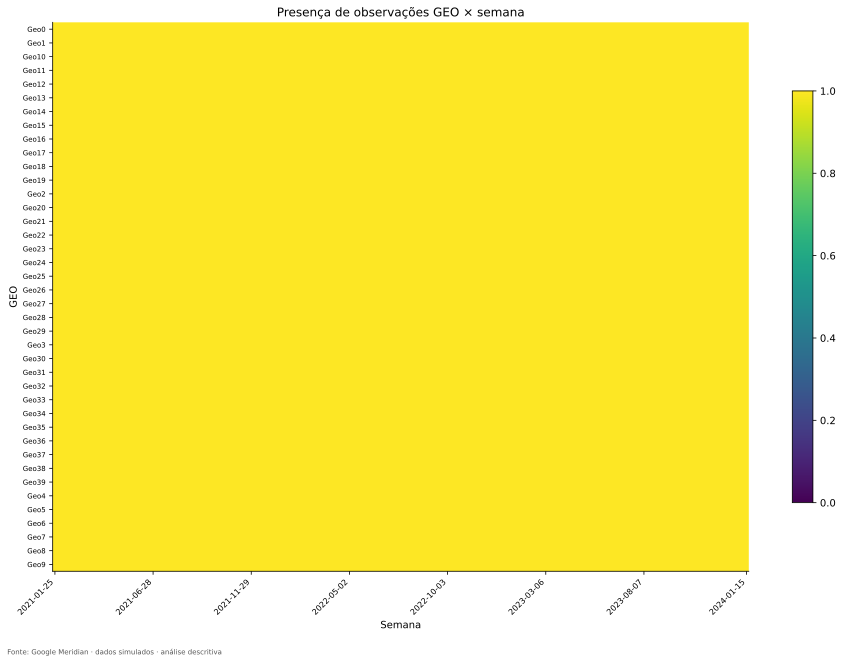

**Como ler:** Cada linha é um geo; cada coluna é uma semana. A barra de cor está fixada entre 0 e 1.

**O que observamos:** Todas as células estão presentes, em acordo com 6.240 pares únicos.

**Por que importa:** A ausência de buracos permite aplicar a decomposição balanceada.

**O que não permite concluir:** Uma célula presente não certifica a qualidade comercial de todas as suas medidas.

### A02 — CPMU: preço por impressão e divisões por zero

#### 1. Pergunta

O gasto acompanha a exposição e o preço unitário muda de maneira relevante?

#### 2. Por que importa

Spend mistura quantidade comprada com preço. Essa distinção evita interpretar aumento de custo como aumento de exposição.

#### 3. Conceito em linguagem simples

CPMU é quanto se paga por uma unidade de mídia; nesta base, uma impressão.

#### 4. Analogia

Na compra de arroz, gasto é quantidade vezes preço por quilo. Comprar o dobro e pagar o dobro não são a mesma informação quando o preço muda.

#### 5. Definição técnica

$CPMU_{gtm}=S_{gtm}/M_{gtm}$, com gasto $S$, impressões $M$, geo $g$, semana $t$ e canal $m$. CPMU não é CPM: custo por mil impressões seria $1.000\times CPMU$.

#### 6. Cálculo neste projeto

`safe_divide` troca denominador zero por NaN. A ficha agregada usa soma do gasto dividida pela soma de impressões; a distribuição de CPMUs locais usa apenas razões definidas. Essas duas médias não precisam coincidir em geral.

#### 7. Onde encontrar

Notebook [00](../notebooks/00_data_audit.ipynb), [statistics.py](../src/statistics.py): `safe_divide`; [cost_per_media_unit.csv](../outputs/tables/cost_per_media_unit.csv), [national_cpmu.csv](../outputs/tables/national_cpmu.csv), [geo_cpmu.csv](../outputs/tables/geo_cpmu.csv).

#### 8. Como ler

Leia `undefined` antes de comparar médias; verifique `cv` para dimensionar a oscilação. Na série de três painéis, os dois primeiros mostram volume/gasto; o terceiro mostra a razão, com eixo iniciando em zero.

#### 9. Resultado real

Há 7.496 razões indefinidas entre os cinco canais, exatamente em células sem impressões. Não há casos de gasto positivo com mídia zero nem do inverso. CPMUs agregados: Channel0 0,00733272; Channel1 0,00964123; Channel2 0,00743092; Channel3 0,00779284; Channel4 0,00779191. CVs locais são da ordem de $10^{-8}$.

#### 10. Interpretação

O custo por impressão é praticamente constante dentro de cada canal. Gasto e impressões carregam quase o mesmo padrão; Channel1 custa mais por impressão, sem que isso revele retorno.

#### 11. Implicação para MMM

Evitar duplicar gasto e impressões como preditores no diagnóstico VIF. Investigar os alertas oficiais de custo na escala relativa antes de chamar a variação de econômica.

#### 12. Limite da conclusão

Zero dividido por zero não é custo grátis. A pequena dispersão é compatível com precisão de exportação, mas a EDA não prova sua causa. CPMU baixo não é ROI alto.

#### 13. Próxima pergunta

Conhecidas as unidades e razões, qual a escala do KPI e como o orçamento se distribui?

### Checkpoint de aprendizagem

Ao terminar este capítulo, tente responder sem consultar as fórmulas:

- Por que 6.240 linhas, isoladamente, não provam completude?
- Por que zero de mídia e missing têm significados diferentes?
- Por que não somar população ao longo das semanas?
- Por que um NaN de CPMU pode ser esperado em dados completos?

## 7. EDA geral: escala, distribuição e orçamento

### A03 — Distribuição nacional do KPI

#### 1. Pergunta

Qual é a escala usual das conversões semanais e quão dispersas são?

#### 2. Por que importa

Precisamos de uma referência antes de chamar qualquer oscilação de grande ou pequena.

#### 3. Conceito em linguagem simples

Média resume o nível, mediana a posição central e dispersão a distância entre semanas. Percentis localizam partes da distribuição.

#### 4. Analogia

A média de despesas de uma casa informa o orçamento típico; o intervalo entre meses mostra o quanto seria arriscado planejar tudo por um único número.

#### 5. Definição técnica

$CV=\sigma/\mu$ compara desvio padrão $\sigma$ à média $\mu$. $IQR=Q_{75}-Q_{25}$ mede a largura dos 50% centrais. Média zero torna CV indefinido; média perto de zero torna a razão instável.

#### 6. Cálculo neste projeto

`national` soma conversões entre geos em cada semana. `describe` usa momentos com `ddof=0`, percentis 1, 5, 25, 50, 75, 95 e 99. O histograma e o boxplot usam as 156 observações nacionais, não as 6.240 células.

#### 7. Onde encontrar

Notebook [01](../notebooks/01_eda_general.ipynb); [data.py](../src/data.py): `national`; [eda.py](../src/eda.py): `general`; [national_descriptive.csv](../outputs/tables/national_descriptive.csv).

#### 8. Como ler

Histograma: X é o KPI nacional, Y é o número de semanas na faixa. Boxplot: linha central é mediana, caixa vai de Q25 a Q75, bigodes seguem o critério do gráfico; pontos além deles são extremos, não erros comprovados.

#### 9. Resultado real

Média 422.632.783 conversões por semana; mediana 422.703.409; desvio 29.118.299; CV 6,89%; IQR 35.127.972. Mínimo 340.283.293 e máximo 491.287.369. Não há semana nacional com KPI zero.

#### 10. Interpretação

A distribuição nacional se concentra em torno de 423 milhões, com variação relativa muito menor que a heterogeneidade bruta entre células locais. A soma pode suavizar movimentos locais que se compensam.

#### 11. Implicação para MMM

A escala e o calendário orientam a leitura de resíduos e previsões futuras. Não tratar o CV nacional como resumo de toda a variação territorial.

#### 12. Limite da conclusão

Conversões são sintéticas e contínuas; valores elevados não representam clientes únicos. A distribuição não informa o que causou a variação.

#### 13. Próxima pergunta

Qual parcela do gasto pertence a cada canal e quantas células têm exposição?

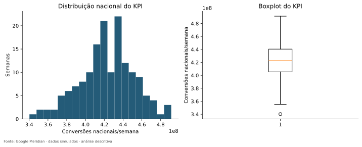

**Como ler:** Histograma à esquerda e boxplot à direita resumem as mesmas 156 semanas.

**O que observamos:** Média e mediana próximas de 422,7 milhões; a amplitude total é aproximadamente 151 milhões.

**Por que importa:** O nível típico oferece referência para interpretar mudanças semanais.

**O que não permite concluir:** Um ponto extremo do boxplot não autoriza exclusão.

### A04 — Fichas de canais e share de spend

#### 1. Pergunta

Como as impressões, o gasto e a atividade se distribuem entre os cinco canais?

#### 2. Por que importa

Escala de investimento e cobertura observada ajudam a antecipar quais canais terão menos suporte empírico.

#### 3. Conceito em linguagem simples

Share é uma fatia do gasto total; descreve alocação. A ficha acrescenta quantidade, dispersão, zeros e presença territorial.

#### 4. Analogia

Se aluguel recebe 40% do orçamento doméstico, isso informa a divisão do dinheiro; não informa um retorno maior que o da alimentação.

#### 5. Definição técnica

$Share_m=\sum_{g,t}S_{gtm}/\sum_{g,t,j}S_{gtj}$, com $j$ percorrendo todos os canais pagos. As participações somam 1. `active_geos` conta mercados com ao menos uma semana positiva, não atividade permanente.

#### 6. Cálculo neste projeto

`general` calcula estatísticas no painel de impressões por canal e soma gasto/impressões em todo o período. Não mistura KPI com gasto na fórmula de share.

#### 7. Onde encontrar

Notebook [01](../notebooks/01_eda_general.ipynb); [channel_summary.csv](../outputs/tables/channel_summary.csv), [spend_share.csv](../outputs/tables/spend_share.csv), [channel_activity.csv](../outputs/tables/channel_activity.csv).

#### 8. Como ler

Cada barra de spend share é uma proporção do mesmo denominador nacional acumulado. Na ficha, diferencie estatísticas por célula de totais do período.

#### 9. Resultado real

| channel | total_media_units | total_spend | spend_share | active_periods | active_geos | zero_share |
| --- | --- | --- | --- | --- | --- | --- |
| Channel0 | 5523420467 | 40501713.0800 | 0.1845 | 156 | 40 | 0.1210 |
| Channel1 | 3248578573 | 31320298.2024 | 0.1427 | 156 | 40 | 0.2792 |
| Channel2 | 1625551369 | 12079349.3415 | 0.0550 | 152 | 40 | 0.6426 |
| Channel3 | 11274497204 | 87860358.2489 | 0.4003 | 156 | 40 | 0.0271 |
| Channel4 | 6125670562 | 47730683.4777 | 0.2175 | 156 | 40 | 0.1314 |

Fonte integral: [channel_summary.csv](../outputs/tables/channel_summary.csv).

#### 10. Interpretação

Channel3 reúne 40,03% do gasto e Channel2 5,50%. Todos aparecem em 40 geos; Channel2 tem alguma exposição nacional em 152 semanas, os demais em 156. A mediana de impressões de Channel2 é zero, coerente com a maioria das células zeradas.

#### 11. Implicação para MMM

O baixo share e a intermitência de Channel2 pedem atenção à incerteza futura e ao suporte de treino/holdout. Não há motivo descritivo para eliminar automaticamente o canal.

#### 12. Limite da conclusão

Maior participação não significa maior importância causal, eficiência ou ROI. Totais de impressões não são alcance único.

#### 13. Próxima pergunta

Os zeros estão espalhados ou formam longas sequências dentro de mercados?

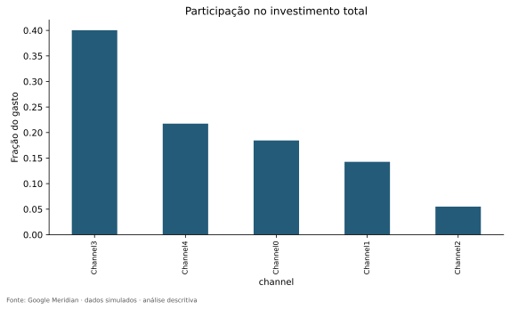

**Como ler:** O eixo X lista canais ordenados; Y é fração do gasto total, de modo que 0,4 significa 40%.

**O que observamos:** Channel3 domina a composição do orçamento; Channel2 ocupa a menor fatia.

**Por que importa:** Mostra a distribuição dos recursos e orienta a leitura das fichas.

**O que não permite concluir:** Não compara retorno nem recomenda realocação.

## 8. Atividade, sparsity e extremos: quando zero ou pico traz informação

### A05 — Sparsity, sequências e suporte local

#### 1. Pergunta

Quando e onde um canal está ativo, e por quanto tempo fica desligado?

#### 2. Por que importa

Ter atividade em todos os mercados no período completo não assegura exposição em cada janela usada futuramente pelo modelo.

#### 3. Conceito em linguagem simples

Sparsity é a presença de muitos zeros. Uma streak é uma sequência consecutiva de semanas no mesmo estado, ativo ou inativo.

#### 4. Analogia

Uma loja pode abrir em todos os meses do ano e ainda passar três semanas seguidas fechada. “Atendeu no ano” e “atendeu nesta janela” respondem perguntas diferentes.

#### 5. Definição técnica

$A_{gtm}=I(M_{gtm}>0)$ vale 1 quando há impressão positiva e 0 quando não há. A proporção ativa é a média desse indicador. Uma janela móvel de 13 semanas conta quantas semanas positivas existem naquele trecho.

#### 6. Cálculo neste projeto

`general` identifica mudanças do indicador dentro do geo ordenado por data. `activity_investigation` resume sequências, exposição positiva e suporte mínimo de janelas. Não infere calendário real de campanhas.

#### 7. Onde encontrar

Notebook [01](../notebooks/01_eda_general.ipynb); [investigation.py](../src/investigation.py): `activity_investigation`; [activity_runs.csv](../outputs/tables/activity_runs.csv), [activity_support_by_geo.csv](../outputs/tables/activity_support_by_geo.csv), [national_zero_media_weeks.csv](../outputs/tables/national_zero_media_weeks.csv).

#### 8. Como ler

Leia `active_share` por geo junto a `max_zero_streak` e `minimum_active_in_13_weeks`. Uma fração anual razoável pode esconder uma janela inteiramente sem exposição.

#### 9. Resultado real

Channel2: 4.010/6.240 células zero (64,26%); atividade por geo entre 28,21% e 44,23%; maior sequência sem mídia de 27 semanas. Há janela de 13 semanas sem exposição em pelo menos um geo. As quatro semanas nacionais zero são 26/04/2021, 25/07/2022, 15/05/2023 e 19/06/2023. Geo31 tem a menor fração ativa: 44/156 semanas. Channel3: 2,71% de zeros e sequência ativa máxima de 127 semanas.

#### 10. Interpretação

Channel2 é intermitente; Channel3 se aproxima de um padrão always-on, sem estar literalmente ativo em toda célula. Agregação nacional mascara boa parte dos zeros locais.

#### 11. Implicação para MMM

No desenho do holdout, conferir se cada canal tem suporte nas janelas escolhidas. Exposição zero pode gerar contraste informativo, mas zero não foi randomizado e não constitui automaticamente grupo de controle.

#### 12. Limite da conclusão

Mais zeros não é sempre melhor nem pior. Extrema escassez reduz observações positivas; alternância pode ser confundida por targeting ou demanda. Não atribuir datas a promoções reais.

#### 13. Próxima pergunta

Quanto da variância de Channel2 vem de ligar/desligar e quanto vem da intensidade quando ligado?

#### Como explicar isso oralmente

> Channel2 aparece em todos os mercados, mas fica zerado na maior parte das células. Por isso eu separei cobertura do período inteiro e suporte em janelas locais. Essa distinção orienta o desenho da validação, sem transformar os zeros em um experimento.

### A06 — Atividade versus intensidade e CV within

#### 1. Pergunta

Um CV elevado expressa intensidade muito variável ou alternância entre zero e positivo?

#### 2. Por que importa

Confundir esses mecanismos exagera a riqueza dos dados de um canal intermitente.

#### 3. Conceito em linguagem simples

O CV within mede oscilação relativa dentro do mesmo mercado. Separar os valores positivos mostra como o canal varia quando está em operação.

#### 4. Analogia

Duas torneiras podem entregar água de modo irregular: uma alterna entre aberta e fechada; outra permanece aberta, mas varia a vazão. A variância total pode ser alta nos dois casos, por razões distintas.

#### 5. Definição técnica

Para mídia não negativa $X$, com $p=P(X>0)$ e média positiva $\mu_+$: $Var(X)=pVar(X|X>0)+p(1-p)\mu_+^2$. O primeiro termo é intensidade; o segundo, alternância. $CV_{gm}=sd_t(M_{gtm})/mean_t(M_{gtm})$.

#### 6. Cálculo neste projeto

Calculam-se momentos `ddof=0` em cada geo e somam-se componentes entre geos. Como cada geo tem 156 semanas, isso equivale a pesos iguais para a variância within. O CV mediano é a mediana dos 40 CVs, não o CV do painel inteiro. Média zero produz NaN; média quase zero pode gerar razão enorme.

#### 7. Onde encontrar

Notebook [01](../notebooks/01_eda_general.ipynb) para a identidade; [04](../notebooks/04_eda_media_geo.ipynb) para CV; `investigation.activity_investigation`, `geo_analysis.media_geo`; [activity_intensity_summary.csv](../outputs/tables/activity_intensity_summary.csv), [within_geo_cv.csv](../outputs/tables/within_geo_cv.csv).

#### 8. Como ler

Na tabela, as duas colunas finais somam 1 por canal. No boxplot de CV, cada canal reúne 40 valores: a caixa mostra quartis entre geos, não incerteza de um efeito.

#### 9. Resultado real

| channel | median_positive_cv | median_unconditional_cv | within_variance_activity_share | within_variance_intensity_share |
| --- | --- | --- | --- | --- |
| Channel0 | 0.5924 | 0.7356 | 0.2533 | 0.7467 |
| Channel1 | 0.6737 | 1.0128 | 0.3776 | 0.6224 |
| Channel2 | 0.8073 | 1.8809 | 0.5048 | 0.4952 |
| Channel3 | 0.4847 | 0.5209 | 0.1050 | 0.8950 |
| Channel4 | 0.5962 | 0.7585 | 0.2748 | 0.7252 |

Fonte integral: [activity_intensity_summary.csv](../outputs/tables/activity_intensity_summary.csv).

#### 10. Interpretação

Em Channel2, 50,48% da variância within corresponde à alternância e 49,52% à intensidade positiva. Seu CV mediano cai de 1,881 para 0,807 quando examinamos apenas positivos. Em Channel3, a alternância corresponde a 10,50% e o CV passa de 0,521 para 0,485. Os CVs within individuais variam de 0,442 a 2,153 entre todos os canais/geos.

#### 11. Implicação para MMM

O modelo futuro terá de aprender com regimes diferentes de suporte. Um canal quase sempre ativo pode oferecer intensidade variada; um canal esparso pode exigir maior cuidado com janelas sem exposição.

#### 12. Limite da conclusão

Esta identidade decompõe variância within, que ainda contém choques nacionais. Não decompõe o resíduo two-way, não mede informação causal nem autoriza atribuir 50,48% do efeito à atividade.

#### 13. Próxima pergunta

Quais picos foram sinalizados e continuam extremos depois de considerar a escala do mercado?

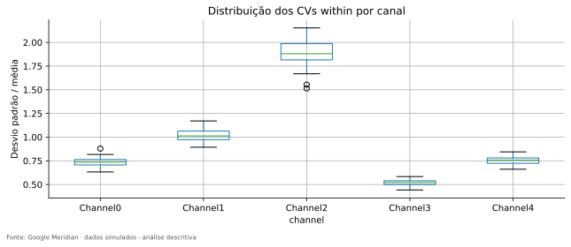

**Como ler:** X lista canais; Y é desvio dividido pela média de impressões dentro do geo. Cada distribuição contém os 40 geos.

**O que observamos:** Channel2 tem CVs maiores; Channel3 menores. O contraste diminui ao condicionar em mídia positiva, como mostra a tabela.

**Por que importa:** Ajuda a distinguir intermitência de oscilação da intensidade.

**O que não permite concluir:** CV alto não é qualidade superior de identificação; médias pequenas e zeros influenciam a razão.

### A07 — Outliers: detectar, contextualizar e preservar

#### 1. Pergunta

Os extremos são erros, diferenças de escala ou caudas legítimas da simulação?

#### 2. Por que importa

Excluir extremos sem investigar pode remover justamente a variação importante para o estudo.

#### 3. Conceito em linguagem simples

Outlier é um valor incomum sob uma regra de referência. A regra depende do grupo e da escala usados.

#### 4. Analogia

Uma conta de energia pode parecer anômala entre casas pequenas e ser normal para um prédio. Também pode ser extraordinária para o próprio prédio: são duas comparações diferentes.

#### 5. Definição técnica

IQR sinaliza valores fora de $[Q_1-1,5IQR,Q_3+1,5IQR]$. MAD é a mediana de $|x-mediana(x)|$; o z modificado é $0,67448975(x-mediana)/MAD$, sinalizado quando seu módulo supera 3,5. Se MAD=0, esse escore é indefinido.

#### 6. Cálculo neste projeto

`statistics.outliers` faz triagem IQR ou MAD. `outlier_investigation` compara IQR bruto, por 1.000 habitantes para medidas aditivas e dentro de cada geo; seleciona até três casos por variável e mostra janelas de ±2 semanas. Coincidência conta quantas variáveis foram sinalizadas na mesma célula.

#### 7. Onde encontrar

Notebook [01](../notebooks/01_eda_general.ipynb); [outliers.csv](../outputs/tables/outliers.csv), [outlier_group_review.csv](../outputs/tables/outlier_group_review.csv), [outlier_case_review.csv](../outputs/tables/outlier_case_review.csv), [outlier_case_windows.csv](../outputs/tables/outlier_case_windows.csv), [outlier_coincidence.csv](../outputs/tables/outlier_coincidence.csv).

#### 8. Como ler

Leia variável, geo, data, valor e as três flags. A coluna `normalized_iqr` em controles/Promo reutiliza a escala original; não significa que esses índices foram divididos por população. O percentil local situa o ponto nas 156 semanas daquele geo.

#### 9. Resultado real

Foram 6.039 pares observação–variável sinalizados, não 6.039 linhas distintas. KPI: 56 extremos IQR brutos, 40 per capita, apenas 7 em comum; 36 no IQR dentro do geo. Channel2: 941 brutos e 765 per capita. Promo: 2.128 casos pela união IQR/MAD, mas 248 pelo IQR global; possui 3.319 valores distintos e 46,83% de zeros.

#### 10. Interpretação

Em Geo36, 14/08/2023, KPI 34.850.500 é extremo bruto, mas não per capita nem no IQR local; isso exemplifica o papel do tamanho. Em Geo23, 28/02/2022, KPI 36.712.692 permanece extremo nas três comparações. Promo em Geo19, 18/10/2021, vale 4,8005548: extremo localizado, sem evidência de erro ou calendário comercial conhecido.

#### 11. Implicação para MMM

Preservar os dados e registrar casos para futura análise de influência e sensibilidade. A revisão descritiva ajuda a não confundir escala e corrupção.

#### 12. Limite da conclusão

Domínio válido e concordância entre algoritmos não provam plausibilidade econômica. Contagem de coincidências não comprova evento causal conjunto. Nenhuma observação foi excluída.

#### 13. Próxima pergunta

Agora que zeros e picos têm contexto, como o mercado evolui ao longo das semanas?

#### Como explicar isso oralmente

> Eu não usei outlier como sinônimo de erro. Comparei os extremos na escala bruta, por habitante e dentro do próprio mercado. Alguns desaparecem ao ajustar a escala; outros permanecem e foram documentados, sem exclusão automática.

### Checkpoint de aprendizagem

Ao terminar este capítulo, tente responder sem consultar as fórmulas:

- Por que Channel2 pode estar presente em todos os geos e ainda ter janelas sem suporte?
- O que muda quando calculamos CV só nos valores positivos?
- Por que 6.039 sinalizações não são 6.039 linhas erradas?
- Por que a investigação de extremos não termina ao contar flags?

## 9. EDA temporal: nível, sazonalidade aparente e co-movimento

### A08 — Trajetória, média móvel e mudanças de nível

#### 1. Pergunta

Quando o KPI atinge picos e quedas, e existe movimento lento perceptível?

#### 2. Por que importa

Mídia e resultado podem se mover por calendário ou demanda. Primeiro precisamos descrever esses movimentos.

#### 3. Conceito em linguagem simples

A média móvel suaviza oscilações; a diferença semanal mostra saltos. São duas lentes da mesma série.

#### 4. Analogia

Acompanhar a temperatura diária e a média dos últimos dias ajuda a distinguir um dia extremo de uma mudança gradual de estação.

#### 5. Definição técnica

A média retrospectiva de 13 semanas usa a semana atual e as 12 anteriores. A diferença é $\Delta Y_t=Y_t-Y_{t-1}$; variação percentual divide essa diferença pelo nível anterior. Não se usam semanas futuras na média móvel.

#### 6. Cálculo neste projeto

`temporal` agrega o KPI e calcula `rolling(13,min_periods=13)`, diferenças e ranking pelo módulo dos saltos. As primeiras 12 médias móveis não são calculadas.

#### 7. Onde encontrar

Notebook [02](../notebooks/02_eda_temporal.ipynb); [eda.py](../src/eda.py): `temporal`; [national_timeseries.csv](../outputs/tables/national_timeseries.csv), [kpi_level_changes.csv](../outputs/tables/kpi_level_changes.csv).

#### 8. Como ler

No gráfico, X é data e Y é conversão nacional. A linha suavizada não é previsão: acompanha o histórico com atraso. Na tabela de mudanças, leia sinal e data, além do módulo usado no ranking.

#### 9. Resultado real

KPI mínimo em 19/09/2022: 340.283.293; máximo em 15/05/2023: 491.287.369. A maior mudança semanal absoluta ocorre em 06/03/2023: −101.396.624 conversões.

#### 10. Interpretação

Há oscilações consideráveis ao redor do nível nacional. A data do máximo coincide com uma das semanas sem Channel2, o que ilustra por que um resultado nacional não pode ser atribuído ingenuamente a um canal.

#### 11. Implicação para MMM

O calendário deve ser considerado na futura especificação, preservando picos que ainda não foram diagnosticados como erro.

#### 12. Limite da conclusão

Nenhum teste formal de quebra foi executado. Coincidência de datas não explica causas, nem ausência de Channel2 naquela semana demonstra ausência de efeito defasado.

#### 13. Próxima pergunta

Quanto da trajetória uma decomposição exploratória descreve como tendência e componente sazonal?

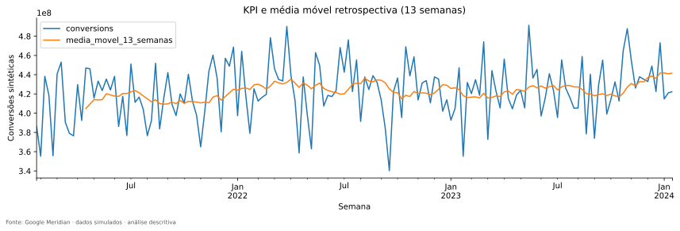

**Como ler:** Duas linhas compartilham eixo temporal e unidade: KPI observado e média móvel retrospectiva.

**O que observamos:** A linha semanal oscila; a média móvel suaviza. Os extremos factuais são os registrados na tabela de datas.

**Por que importa:** Separa visualmente movimentos rápidos e lentos antes das relações com mídia.

**O que não permite concluir:** A curva suavizada não confirma mecanismo comercial, previsão nem quebra estrutural.

### A09 — STL e ACF: duas perguntas sobre o tempo

#### 1. Pergunta

A série sugere componente lento, repetição anual aproximada ou persistência entre semanas?

#### 2. Por que importa

Padrões comuns no calendário podem competir com o sinal atribuído à mídia.

#### 3. Conceito em linguagem simples

STL separa uma trajetória em tendência, componente sazonal e resíduo. ACF compara a série com versões anteriores de si mesma.

#### 4. Analogia

Uma música mistura linha de fundo, ritmo repetido e improvisos. Separar essas partes ajuda a descrevê-la, mas diferentes arranjos podem oferecer divisões distintas.

#### 5. Definição técnica

STL representa $Y_t=T_t+S_t+R_t$. A força descritiva sazonal usada é $\max(0,1-Var(R)/Var(S+R))$, substituindo $S$ por $T$ para tendência. ACF no lag $k$ mede dependência linear temporal segundo a implementação `statsmodels.acf`.

#### 6. Cálculo neste projeto

`STL(...,period=52,robust=True)` aproxima anualidade; `acf(...,nlags=52)` calcula 53 posições, incluindo lag zero. `temporal_investigation` resume forças, extremos da tendência e ACF 1/13/52.

#### 7. Onde encontrar

Notebook [02](../notebooks/02_eda_temporal.ipynb); [kpi_stl_52.csv](../outputs/tables/kpi_stl_52.csv), [kpi_acf.csv](../outputs/tables/kpi_acf.csv), [temporal_interpretation.csv](../outputs/tables/temporal_interpretation.csv); `investigation.temporal_investigation`.

#### 8. Como ler

STL tem quatro painéis com escalas próprias: observado, tendência, sazonal e resíduo. ACF 0 vale 1 por definição; os demais lags merecem interpretação, sem tratar qualquer pico como teste.

#### 9. Resultado real

Tendência STL: 413.074.059 no início e 429.184.890 no fim, +3,90%. Força sazonal 0,5026; força de tendência 0,0343. ACF: lag 1 = 0,0078; 13 = 0,0903; 52 = 0,0324.

#### 10. Interpretação

A decomposição encontra um componente sazonal, mas a autocorrelação anual observada é pequena. Não é contradição: os diagnósticos resumem objetos diferentes. A tendência cresce pouco frente à oscilação semanal. No gráfico, o resíduo se concentra mais no trecho central; é preciso considerar como a suavização distribui componentes em uma série curta.

#### 11. Implicação para MMM

Usar essas evidências para justificar investigar flexibilidade temporal; a EDA não determina knots finais nem exige testes de estacionariedade como ritual.

#### 12. Limite da conclusão

Há somente três ciclos de 52 semanas. Forças não são p-valores, parcelas aditivas de variação causal ou prova de sazonalidade comercial. A razão 0,5026 não significa que “50,26% das vendas são causadas pelo calendário”.

#### 13. Próxima pergunta

Como comparar a forma das séries de mídia e KPI sem misturar unidades?

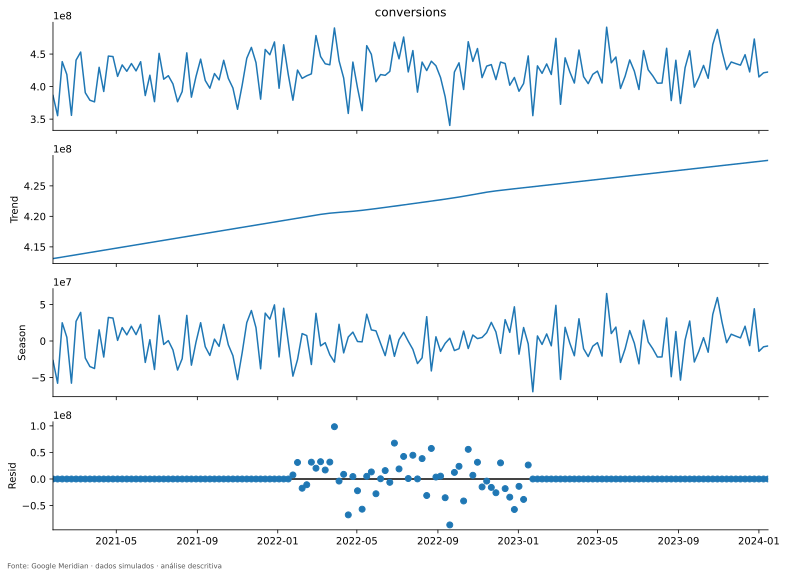

**Como ler:** Leia de cima para baixo: série, tendência, sazonalidade e resíduo. Cada eixo vertical tem escala própria.

**O que observamos:** Tendência lentamente crescente; oscilações de curta duração predominam na série observada.

**Por que importa:** Ajuda a discutir o componente temporal que o futuro MMM precisará representar.

**O que não permite concluir:** Três ciclos e uma decomposição flexível não confirmam um padrão sazonal estável fora da amostra.

### A10 — Séries de mídia, gasto e comparação em z-score

#### 1. Pergunta

O timing da exposição acompanha o KPI, e as diferenças de unidade dificultam a comparação?

#### 2. Por que importa

Impressões, moeda e conversões têm escalas diferentes; sobrepô-las diretamente pode induzir leitura visual errada.

#### 3. Conceito em linguagem simples

Z-score informa quantos desvios padrão uma observação está acima ou abaixo da própria média.

#### 4. Analogia

Comparar quilômetros e graus Celsius em um mesmo eixo não faz sentido. Comparar afastamentos relativos da rotina permite observar timing, sem igualar os fenômenos.

#### 5. Definição técnica

$Z(X_t)=(X_t-\bar X)/sd(X)$, usando média e desvio da própria série nacional. Z=1 significa um desvio acima da sua média, não aumento de 100%.

#### 6. Cálculo neste projeto

`temporal` produz para cada Channel0–4 uma figura de impressões, gasto e CPMU e outra de KPI/mídia padronizados. Usa `ddof=0` e toda a janela de 156 semanas para descrição.

#### 7. Onde encontrar

Notebook [02](../notebooks/02_eda_temporal.ipynb); [national_timeseries.csv](../outputs/tables/national_timeseries.csv); figuras `temporal/Channel0_timeseries.svg` a `Channel4_timeseries.svg` e `Channel0_kpi_z.svg` a `Channel4_kpi_z.svg` no inventário.

#### 8. Como ler

Nos três painéis de um canal, a data é comum e a unidade muda. No z-score, as duas curvas têm média zero e desvio 1; cruzar zero significa cruzar a média da própria série.

#### 9. Resultado real

CPMU quase constante explica a semelhança de impressões/gasto. Channel2 tem quatro semanas nacionais sem exposição. As correlações nacionais contemporâneas com KPI vão de −0,1788 (Channel4) a +0,0514 (Channel0), sem forte associação linear positiva nesta lente.

#### 10. Interpretação

As séries padronizadas não sustentam uma narrativa simples de “mídia subiu, KPI necessariamente subiu”. Isso motiva examinar a composição geográfica e os demais fatores.

#### 11. Implicação para MMM

Comparar timing e observar variação antes de formular modelos. Na futura validação, transformações aprendidas dos dados precisarão respeitar treino/holdout; este z-score é descritivo da janela completa.

#### 12. Limite da conclusão

Uma distância entre linhas não mede conversões incrementais. Correlação negativa não prova que publicidade reduz conversões, e contemporaneidade ignora carryover.

#### 13. Próxima pergunta

O que a agregação nacional esconde sobre tamanho e intensidade dos mercados?

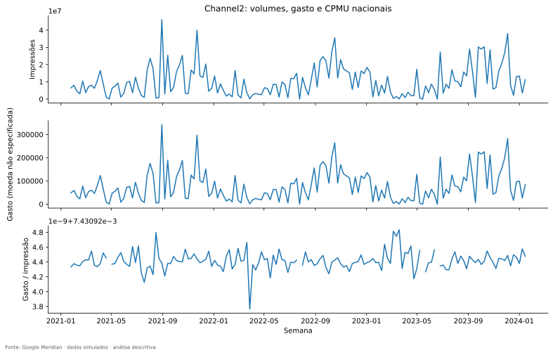

**Como ler:** Os três painéis usam semanas no X; Y mostra impressões, gasto e custo por impressão, respectivamente.

**O que observamos:** Impressões e gasto acompanham o mesmo padrão; a razão definida é quase horizontal, com lacunas quando não há mídia.

**Por que importa:** Mostra por que spend e exposição não são dois sinais independentes nesta base.

**O que não permite concluir:** A altura do gasto ou um pico de impressão não mede eficácia.

### Checkpoint de aprendizagem

Ao terminar este capítulo, tente responder sem consultar as fórmulas:

- Por que média móvel não é previsão?
- Como força sazonal moderada pode coexistir com ACF anual pequena?
- Z=1 significa aumento de 100%?
- Por que não escolher adstock olhando apenas curvas alinhadas?

## 10. Geografia: tamanho, intensidade e sincronização

### A11 — Ranking territorial e concentração do KPI

#### 1. Pergunta

Quais geos concentram conversões, e o resultado depende de poucos mercados?

#### 2. Por que importa

Dominância de alguns mercados pode influenciar agregações e a interpretação do painel.

#### 3. Conceito em linguagem simples

Ordenar volume revela onde o KPI está; acumular shares mostra quanto os maiores representam no conjunto.

#### 4. Analogia

Uma rede pode vender mais em sua maior loja simplesmente porque ela atende mais pessoas. O ranking de faturamento não é um ranking de produtividade.

#### 5. Definição técnica

$Y_g=\sum_tY_{gt}$ e $s_g=Y_g/\sum_hY_h$. A curva acumulada soma $s_g$ do maior ao menor. Todos os geos têm o mesmo número de semanas nesta base.

#### 6. Cálculo neste projeto

`geo_analysis` soma KPI por geo, calcula média, desvio, extremos, população e participações; a ordenação por KPI total também orienta vários heatmaps.

#### 7. Onde encontrar

Notebook [03](../notebooks/03_eda_geo.ipynb); [geo_kpi_summary.csv](../outputs/tables/geo_kpi_summary.csv), [kpi_concentration.csv](../outputs/tables/kpi_concentration.csv); `geo_analysis.geo_analysis`.

#### 8. Como ler

Barras: geo no X e conversões acumuladas no Y. Curva acumulada: X é posição no ranking, não tempo; Y é parcela do KPI. Quanto mais rapidamente sobe, maior a concentração.

#### 9. Resultado real

Geo36 lidera com aproximadamente 3,291 bilhões de conversões acumuladas e 4,99% do KPI. Os cinco maiores somam 22,95%. Geo0 tem aproximadamente 360,882 milhões e 0,55%.

#### 10. Interpretação

Existe heterogeneidade de volume, mas nenhum geo sozinho domina o total. Ainda não sabemos quanto da diferença apenas acompanha população.

#### 11. Implicação para MMM

Considerar heterogeneidade de escala e eventuais sensibilidades a grandes geos no desenho futuro. A curva é um diagnóstico descritivo, não critério automático de exclusão.

#### 12. Limite da conclusão

Volume alto não significa maior produtividade ou resposta à mídia. Geo36 não é uma cidade identificada.

#### 13. Próxima pergunta

A população explica parte desse ranking e o que muda por habitante?

### A12 — Population × KPI e métricas per capita

#### 1. Pergunta

Os mercados maiores têm mais conversões apenas por terem mais habitantes?

#### 2. Por que importa

Comparações de intensidade exigem um denominador que contextualize tamanho.

#### 3. Conceito em linguagem simples

Per capita pergunta quanto KPI corresponde a uma quantidade padronizada de habitantes. É uma lente complementar ao volume.

#### 4. Analogia

Uma cidade com dez vezes mais habitantes pode vender dez vezes mais e ter a mesma intensidade por pessoa.

#### 5. Definição técnica

$Y^{pc}_{gt}=1.000Y_{gt}/P_g$. No ranking territorial usa-se a média semanal de $Y$ dividida por $P_g$. Pearson mede associação linear; Spearman mede associação entre posições no ranking.

#### 6. Cálculo neste projeto

População é `first()` por geo após validação da constância. O código calcula correlações com KPI acumulado e normaliza medidas aditivas. Não divide os controles e Promo por população nesta exploração.

#### 7. Onde encontrar

Notebook [03](../notebooks/03_eda_geo.ipynb); [population_kpi_correlation.csv](../outputs/tables/population_kpi_correlation.csv), [population_summary.csv](../outputs/tables/population_summary.csv), [per_capita_panel.csv](../outputs/tables/per_capita_panel.csv).

#### 8. Como ler

Scatter: X população, Y KPI acumulado, cada ponto um geo. No ranking per capita, Y é conversões médias semanais por 1.000 habitantes, distinto do acumulado do gráfico bruto.

#### 9. Resultado real

População varia de 136.670,94 a 994.048,94. População × KPI: Pearson 0,9693; Spearman 0,9782. Intensidade semanal vai de 16.211,72 por 1.000 habitantes (Geo21) a 25.858,38 (Geo39). Geo36 lidera volume, mas não intensidade.

#### 10. Interpretação

O tamanho acompanha fortemente o KPI total. A normalização muda o objeto comparado e revela diferenças que um ranking bruto não distingue. A escala sintética não deve ser interpretada como taxa de pessoas únicas convertidas.

#### 11. Implicação para MMM

Confrontar bruto e per capita antes de justificar heterogeneidade geográfica. Os dados de entrada brutos do Meridian são preservados para evitar aplicar uma normalização adicional indevida.

#### 12. Limite da conclusão

Per capita não é eficiência causal, taxa de conversão de usuários únicos ou substituição automática do alvo. Correlação população/KPI não prova que população seja a única explicação.

#### 13. Próxima pergunta

Além do nível, as trajetórias locais têm formas semelhantes ou diferentes?

#### Como explicar isso oralmente

> O volume de conversões acompanha fortemente o tamanho populacional. Por isso comparei também a intensidade semanal por 1.000 habitantes. Essa lente complementa o volume, mas não transforma o ranking em medida de eficácia da mídia.

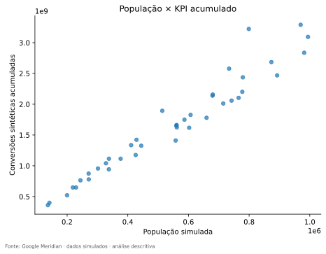

**Como ler:** Cada ponto é um dos 40 geos; X representa população e Y conversões acumuladas.

**O que observamos:** A associação positiva é forte, com Pearson 0,9693.

**Por que importa:** Explica por que um ranking de volume pede normalização complementar.

**O que não permite concluir:** A nuvem não identifica efeito causal da população ou retorno de mídia.

### A13 — Small multiples: nível e dinâmica local

#### 1. Pergunta

Os padrões individuais confirmam ou contradizem a impressão obtida do agregado?

#### 2. Por que importa

Uma série nacional pode ocultar trajetórias distintas e compensações entre geos.

#### 3. Conceito em linguagem simples

Small multiples repetem o mesmo tipo de gráfico em pequenos painéis para comparar formas.

#### 4. Analogia

É como olhar as notas de vários alunos ao longo das provas, em vez de apenas a média da turma.

#### 5. Definição técnica

A seleção visual é determinística: dois maiores e dois menores geos por KPI, dois centrais no ranking e extremos de CV; duplicações são removidas. Cálculos completos continuam usando os 40 geos.

#### 6. Cálculo neste projeto

`geo_analysis` cria uma grade de oito posições; nesta base sete geos únicos são selecionados e o painel excedente fica oculto. Cada gráfico tem escala Y própria.

#### 7. Onde encontrar

Notebook [03](../notebooks/03_eda_geo.ipynb); [geo_plot_selection.csv](../outputs/tables/geo_plot_selection.csv); figura [kpi_small_multiples.svg](../outputs/figures/geo/kpi_small_multiples.svg).

#### 8. Como ler

Compare primeiro X, calendário comum, depois nível e amplitude Y de cada painel. Uma oscilação visual de mesma altura não representa a mesma quantidade de conversões entre painéis.

#### 9. Resultado real

Geos exibidos: Geo36, Geo39, Geo24, Geo0, Geo27, Geo20 e Geo1. Geo39 acumula alto volume com CV menor que Geo1, cuja série tem oscilação relativa maior. As escalas mostram milhões a dezenas de milhões, conforme o geo.

#### 10. Interpretação

Há dinâmicas locais que não são cópias visualmente idênticas. A seleção inclui centro e extremos, reduzindo a tentação de mostrar só os maiores mercados.

#### 11. Implicação para MMM

Ajuda a formular perguntas sobre heterogeneidade e outliers locais que serão quantificadas pela sincronização e decomposição.

#### 12. Limite da conclusão

Sete gráficos não substituem cálculo sobre todos os geos. Escalas próprias favorecem comparar forma, mas não comparação direta de amplitude absoluta.

#### 13. Próxima pergunta

Quão sincronizadas são as 40 trajetórias, considerando todos os pares?

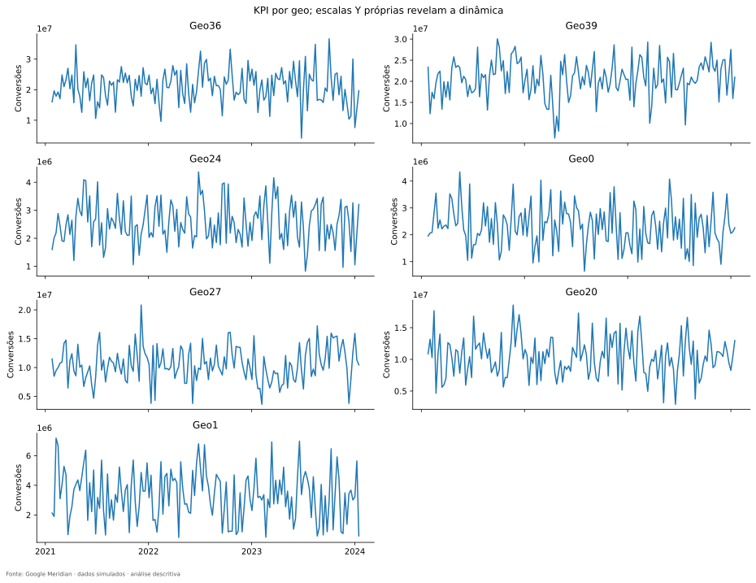

**Como ler:** Cada título identifica um geo; X é calendário e Y conversões com escala própria.

**O que observamos:** Há sete painéis selecionados por volume e CV; os níveis diferem bastante.

**Por que importa:** Permite reconhecer dinâmica local escondida na série nacional.

**O que não permite concluir:** A seleção visual não determina clusters nem independência estatística.

### A14 — Correlação entre geos

#### 1. Pergunta

Os mercados sobem e descem juntos?

#### 2. Por que importa

Sincronização muito elevada pode limitar a diversidade temporal que o painel acrescenta.

#### 3. Conceito em linguagem simples

Duas cidades podem dançar a mesma música, oscilando nas mesmas semanas, mesmo em volumes diferentes.

#### 4. Analogia

Dois alunos podem manter médias distintas, mas ir bem e mal exatamente nas mesmas provas. Isso é sincronização de trajetória, não igualdade de nível.

#### 5. Definição técnica

Calcula-se Pearson entre cada par de séries de 156 semanas. Com 40 geos, há $40\times39/2=780$ pares distintos, retirando diagonal e duplicação simétrica.

#### 6. Cálculo neste projeto

O pivot usa semanas nas linhas e geos nas colunas. `enrich` do capítulo 03 resume os pares, quartis e extremos.

#### 7. Onde encontrar

Notebook [03](../notebooks/03_eda_geo.ipynb); [geo_kpi_correlation.csv](../outputs/tables/geo_kpi_correlation.csv), [geo_synchronization_summary.csv](../outputs/tables/geo_synchronization_summary.csv), [geo_synchronization_pairs.csv](../outputs/tables/geo_synchronization_pairs.csv).

#### 8. Como ler

No heatmap, ambos os eixos são geos; cada célula é uma correlação de séries. A diagonal 1 é trivial. Observe células fora da diagonal e a escala de −1 a 1, sem confundir esse heatmap com GEO × TIME.

#### 9. Resultado real

Mediana 0,0280; mínimo −0,2151 no par Geo32/Geo24; máximo 0,2804 no par Geo14/Geo22. Nenhum par tem sincronização linear próxima de 1.

#### 10. Interpretação

Os geos têm baixa sincronização linear do KPI, embora seus volumes acompanhem população. Nível territorial e co-movimento temporal são propriedades distintas.

#### 11. Implicação para MMM

Justifica investigar o painel em vez de assumir uma trajetória local única multiplicada por tamanho. A próxima decomposição quantifica fontes de variação.

#### 12. Limite da conclusão

Correlação baixa não prova independência, ausência de choque comum ou spillover. Não foram estimados clusters, mapas ou dependência espacial.

#### 13. Próxima pergunta

Quanto da variância é diferença persistente entre geos e quanto é mudança dentro de cada geo?

### Checkpoint de aprendizagem

Ao terminar este capítulo, tente responder sem consultar as fórmulas:

- Por que Geo36 liderar volume não o torna o melhor mercado?
- Qual unidade aparece no ranking per capita?
- Como a escala Y própria altera a comparação dos small multiples?
- Por que correlações baixas entre geos não garantem independência?

## 11. Between × within: separar diferenças entre mercados e mudanças dentro deles

Esta é uma passagem central. Imagine três alunos cujas médias são 9, 7 e 5. A diferença das médias é **between**: entre alunos. Se o aluno de média 9 tira 8, 9, 10, 7 e 11, seus desvios em torno de 9 são **within**: dentro do mesmo aluno. No marketing, o aluno é o geo, cada prova é uma semana e a nota é uma variável como impressões ou KPI.

Um canal que sempre recebe muita mídia em um mercado e pouca em outro pode ter muito between e pouco within. Um canal que varia ao longo das semanas com níveis médios parecidos entre geos pode ter pouco between e muito within. Ter os dois componentes oferece contrastes distintos, mas ainda precisamos separar movimento temporal comum de execução local.

### A15 — Decomposição total = between + within

#### 1. Pergunta

Quanto da variação de cada variável se deve às médias dos geos e quanto ocorre ao redor dessas médias?

#### 2. Por que importa

Uma grande diferença entre mercados não assegura variação temporal suficiente para distinguir mídia de características persistentes do mercado.

#### 3. Conceito em linguagem simples

Between compara médias locais; within acompanha desvios em relação à própria média local.

#### 4. Analogia

Na rede de lojas, uma loja pode vender sempre mais porque é maior. Within pergunta quando essa mesma loja vende acima ou abaixo de seu próprio padrão.

#### 5. Definição técnica

Com $N=GT$, média global $\bar X$ e média local $\bar X_g$: 

$$
V_T=\frac1N\sum_{g,t}(X_{gt}-\bar X)^2,\quad V_B=\frac1N\sum_{g,t}(\bar X_g-\bar X)^2,\quad V_W=\frac1N\sum_{g,t}(X_{gt}-\bar X_g)^2.
$$

 Neste painel, $V_T=V_B+V_W$. As parcelas são $V_B/V_T$ e $V_W/V_T$.

#### 6. Cálculo neste projeto

`variance_decomposition` usa momentos populacionais (`ddof=0`) e peso igual por observação. Cada média local é repetida nas semanas do geo. Como o painel é balanceado, cada geo recebe também o mesmo peso na decomposição. Não se aplicam pesos populacionais aqui. Variância zero deixa as razões indefinidas.

#### 7. Onde encontrar

Notebook [03](../notebooks/03_eda_geo.ipynb); [statistics.py](../src/statistics.py): `variance_decomposition`; [within_between_variance.csv](../outputs/tables/within_between_variance.csv), que inclui KPI, cinco impressões, cinco gastos, orgânico, dois controles e Promo.

#### 8. Como ler

Barras empilhadas têm altura 1. A parte between é a fração explicada pelas diferenças das médias territoriais; a parte within é a fração remanescente. Uma barra não mostra tamanho de efeito no KPI.

#### 9. Resultado real

| variable | between_share | within_share |
| --- | --- | --- |
| conversions | 0.6789 | 0.3211 |
| Channel0_impression | 0.2484 | 0.7516 |
| Channel1_impression | 0.1441 | 0.8559 |
| Channel2_impression | 0.0535 | 0.9465 |
| Channel3_impression | 0.3899 | 0.6101 |
| Channel4_impression | 0.2372 | 0.7628 |
| Channel0_spend | 0.2484 | 0.7516 |
| Channel1_spend | 0.1441 | 0.8559 |
| Channel2_spend | 0.0535 | 0.9465 |
| Channel3_spend | 0.3899 | 0.6101 |
| Channel4_spend | 0.2372 | 0.7628 |
| Organic_channel0_impression | 0.1302 | 0.8698 |
| competitor_sales_control | 0.0054 | 0.9946 |
| sentiment_score_control | 0.0042 | 0.9958 |
| Promo | 0.0053 | 0.9947 |

Fonte integral: [within_between_variance.csv](../outputs/tables/within_between_variance.csv).

#### 10. Interpretação

KPI tem 67,89% between e 32,11% within. Nas impressões pagas, Channel3 tem maior between (38,99%) e Channel2 menor (5,35%). O gasto repete quase os mesmos componentes das impressões porque o CPMU é quase constante. Controles têm between abaixo de 0,55%, portanto suas diferenças médias entre geos são pequenas.

#### 11. Implicação para MMM

Um canal de alto between merece cuidado com confusão entre exposição e efeitos persistentes de mercado. Um canal de alto within tem movimento temporal, mas parte pode ser compartilhada nacionalmente.

#### 12. Limite da conclusão

Between e within não são efeitos causais nem “fontes independentes de amostra”. Não misturar variâncias com `ddof=1` e médias sem ponderação em um painel desbalanceado para reivindicar esta mesma implementação. A auditoria confirmou os cálculos centrais; a revisão não corrigiu uma decomposição matematicamente errada.

#### 13. Próxima pergunta

Quanto do within pode ser explicado apenas por saber qual semana estamos observando?

#### Como explicar isso oralmente

> Eu separei diferenças permanentes entre mercados das mudanças dentro de cada mercado. No KPI, a maior parcela bruta está entre geos; nas mídias, o componente dentro dos geos predomina. Isso ainda inclui movimentos nacionais, por isso a análise precisa continuar com os efeitos de semana.

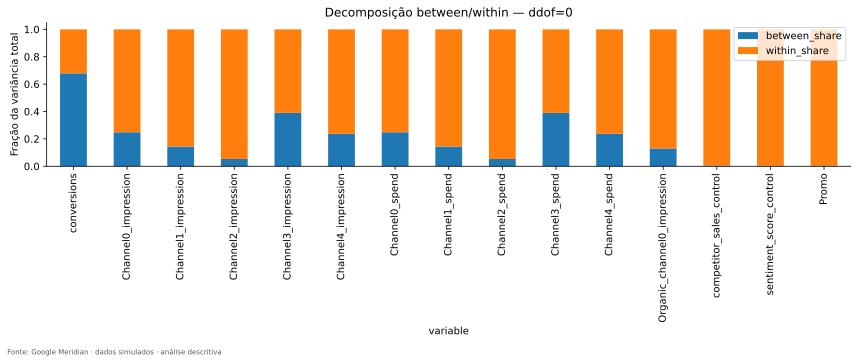

**Como ler:** X lista variáveis; Y é fração da variância total. Azul é between e laranja é within.

**O que observamos:** KPI tem a maior parcela between; controles e Promo são quase inteiramente within. Gasto e impressão do mesmo canal quase coincidem.

**Por que importa:** Evita tratar diferença de tamanho como mudança de campanha.

**O que não permite concluir:** A barra laranja não é automaticamente informação local adicional nem efeito de mídia.

### Exemplo numérico fictício, calculável à mão

Considere duas lojas e duas semanas. A loja A tem valores 1 e 3; a B, 5 e 7. A média global é 4; as médias locais são 2 e 6. A variância total é $(9+1+1+9)/4=5$. Between é $(4+4+4+4)/4=4$; within é $(1+1+1+1)/4=1$. Logo 80% é between e 20% within.

Mas ambas as lojas sobem exatamente 2 na segunda semana. Todo o within desse exemplo é um movimento comum de calendário. Não existe desvio adicional geo–semana depois de remover médias locais e semanais. É por isso que **within sozinho não responde à pergunta central da EDA**.

## 12. R² GEO, R² TIME e resíduo two-way

### A16 — R² GEO e R² TIME: o que cada informação explica?

#### 1. Pergunta

Saber o mercado ou saber a semana explica quanto da variação observada?

#### 2. Por que importa

Mídia quase determinada por geo ou por tempo pode ser difícil de separar dos respectivos componentes de baseline.

#### 3. Conceito em linguagem simples

R² GEO resume quanto ganhamos ao prever pela média do mercado; R² TIME, ao prever pela média da semana.

#### 4. Analogia

Saber qual aluno fez a prova permite prever sua média habitual. Saber qual prova foi aplicada permite prever uma dificuldade comum. São informações diferentes.

#### 5. Definição técnica

$R^2=1-SSE/SST$: soma de erros quadráticos residual sobre a soma de desvios em relação à média. Para indicadores de geo com intercepto, $R^2_{geo}=V_B/V_T$. Para semana, $R^2_{time}=mean((\bar X_t-\bar X)^2)/V_T$. $\bar X_t$ é a média entre geos naquela semana.

#### 6. Cálculo neste projeto

O projeto calcula essas projeções por médias e somas de quadrados, equivalentes às regressões em dummies com intercepto no painel completo. Time é categórico: não é uma reta na data nem apenas uma senoide anual.

#### 7. Onde encontrar

Notebook [03](../notebooks/03_eda_geo.ipynb); `statistics.variance_decomposition`; [geo_time_r2.csv](../outputs/tables/geo_time_r2.csv).

#### 8. Como ler

No scatter, X é R² GEO e Y é R² TIME. Cada ponto identifica uma variável na legenda. Gasto foi omitido visualmente porque suas coordenadas quase coincidem com impressões; os valores continuam no CSV.

#### 9. Resultado real

| variable | r2_geo | r2_time | residual_geo_time_share |
| --- | --- | --- | --- |
| conversions | 0.6789 | 0.0143 | 0.3068 |
| Channel0_impression | 0.2484 | 0.1363 | 0.6153 |
| Channel1_impression | 0.1441 | 0.1679 | 0.6880 |
| Channel2_impression | 0.0535 | 0.1671 | 0.7794 |
| Channel3_impression | 0.3899 | 0.1811 | 0.4290 |
| Channel4_impression | 0.2372 | 0.1907 | 0.5720 |
| Channel0_spend | 0.2484 | 0.1363 | 0.6153 |
| Channel1_spend | 0.1441 | 0.1679 | 0.6880 |
| Channel2_spend | 0.0535 | 0.1671 | 0.7794 |
| Channel3_spend | 0.3899 | 0.1811 | 0.4290 |
| Channel4_spend | 0.2372 | 0.1907 | 0.5720 |
| Organic_channel0_impression | 0.1302 | 0.1704 | 0.6994 |
| competitor_sales_control | 0.0054 | 0.3322 | 0.6624 |
| sentiment_score_control | 0.0042 | 0.2740 | 0.7219 |
| Promo | 0.0053 | 0.1984 | 0.7963 |

Fonte integral: [geo_time_r2.csv](../outputs/tables/geo_time_r2.csv).

#### 10. Interpretação

Channel3 está mais à direita entre as mídias (0,3899; 0,1811); Channel2, mais à esquerda (0,0535; 0,1671). Channel0=(0,2484;0,1363), Channel1=(0,1441;0,1679), Channel4=(0,2372;0,1907). KPI=(0,6789;0,0143): grande heterogeneidade de nível e pequena parcela de calendário comum bruto. Os controles se aproximam do eixo Y, com R² TIME 0,3322 e 0,2740.

#### 11. Implicação para MMM

Avaliar se efeitos fixos de mercado e flexibilidade temporal podem competir com os preditores. Valores distantes de 1 não eliminam confundimento ou dependência entre canais.

#### 12. Limite da conclusão

R² GEO não é efeito causal do local; R² TIME não identifica a causa sazonal. “Alto” e “baixo” são comparativos aqui, sem corte arbitrário de 0,5.

#### 13. Próxima pergunta

O que permanece depois de retirar simultaneamente médias geográficas e temporais?

#### Como explicar isso oralmente

> O scatter não mostra quais canais funcionam melhor. Ele mostra onde está a variação de cada sinal. Channel3 varia mais por nível geográfico que Channel2, mas nenhum desses números é uma medida de retorno.

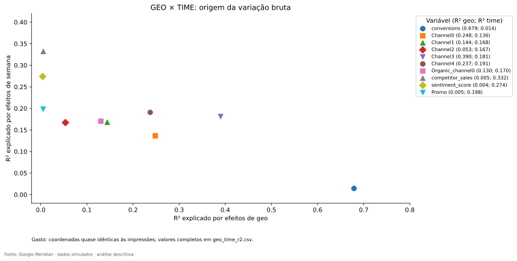

**Como ler:** Cada ponto é uma variável; a legenda fornece as coordenadas. X cresce com diferenças persistentes de geo e Y com movimentos comuns de semana.

**O que observamos:** KPI fica à direita e abaixo; controles ficam próximos do eixo vertical; Channel3 tem o maior R² GEO entre as mídias pagas.

**Por que importa:** Organiza a origem da variação antes de discutir identificabilidade.

**O que não permite concluir:** Os pontos não são coeficientes de mídia, e sua posição não prova eficácia.

### Quadrantes conceituais — e uma restrição que evita erro

| Posição conceitual | Leitura permitida | Pergunta seguinte |
|---|---|---|
| GEO baixo / TIME baixo | Nem médias locais nem semanais explicam muito isoladamente | O resíduo é exposição útil, ruído ou ambos? |
| GEO relativamente alto / TIME baixo | Diferenças persistentes de mercado predominam mais | Quanto desaparece por habitante? |
| GEO baixo / TIME relativamente alto | Movimento comum de calendário é mais importante | Há sinal suficiente além da trajetória nacional? |
| Ambos relativamente elevados | Os dois componentes consomem parcela importante da variância | Quanto sobra após retirar ambos? |

**Não existem dois R² próximos de 1 simultaneamente nesta definição e neste painel completo.** Os componentes centrados são ortogonais, e sua soma é no máximo 1. Portanto, “alto GEO/alto TIME” não deve ser desenhado como região livre de qualquer valor no canto superior direito. Sem cortes definidos, quadrantes são apenas auxílio conceitual. Em painéis desbalanceados ou regressões de outra definição, essa identidade não se transfere automaticamente.

### A17 — Resíduo two-way e informação perdida na agregação

#### 1. Pergunta

O painel contém diferenças específicas de geo e semana além de médias locais e calendário comum?

#### 2. Por que importa

Esta é a ligação mais direta entre os diagnósticos descritivos e a pergunta científica desta fase.

#### 3. Conceito em linguagem simples

Retiramos o nível habitual de cada mercado e o movimento médio de cada semana. O que sobra é uma diferença local naquele momento.

#### 4. Analogia

Na turma, retiramos a média de cada aluno e a dificuldade média da prova. Sobra quem foi particularmente bem ou mal naquela prova, além dessas duas referências.

#### 5. Definição técnica

$$
e_{gt}=X_{gt}-\bar X_g-\bar X_t+\bar X,\qquad q_e=mean(e_{gt}^2)/V_T.
$$

 A média global é somada de volta porque foi retirada duas vezes. No painel balanceado, $R^2_{geo}+R^2_{time}+q_e=1$.

#### 6. Cálculo neste projeto

`variance_decomposition` faz double demeaning e verifica previamente completude e finitos. A aplicação a valores por 1.000 habitantes repete o cálculo, mudando a escala, não os registros.

#### 7. Onde encontrar

Notebook [03](../notebooks/03_eda_geo.ipynb); [geo_time_r2.csv](../outputs/tables/geo_time_r2.csv), [geo_time_r2_per_capita.csv](../outputs/tables/geo_time_r2_per_capita.csv); [methodology_eda.md](methodology_eda.md).

#### 8. Como ler

Leia `residual_geo_time_share` como fração da variância da própria variável na escala escolhida. Não compare valores absolutos de variância entre impressões e moeda sem unidade.

#### 9. Resultado real

Impressões pagas: resíduo bruto de 42,90% a 77,94%; por habitante, 64,85% a 79,28%. KPI: 30,68% bruto e 86,11% per capita. No exemplo fictício das lojas 1–3 e 5–7, o resíduo seria zero, embora houvesse within positivo.

#### 10. Interpretação

Para cada semana, os resíduos brutos somam zero entre geos; a agregação nacional apaga essa estrutura. Os resultados mostram que o painel observado não se reduz a nível local mais uma trajetória aditiva comum. Na escala per capita, a propriedade de soma zero se refere às variáveis normalizadas, não a uma identidade direta de soma de volumes brutos ponderados.

#### 11. Implicação para MMM

Existe motivo empírico para investigar um MMM geográfico. A modelagem deverá avaliar se essa variação ajuda a distinguir efeitos e melhorar generalização.

#### 12. Limite da conclusão

Resíduo descritivo pode conter ruído, targeting e confundimento. Não é resíduo de MMM ajustado, não é interação causal estimada e não quantifica automaticamente informação estatística efetiva. Variação multiplicativa por população pode produzir resíduo aditivo bruto, exigindo o contraste per capita.

#### 13. Próxima pergunta

A conclusão sobre mídia persiste quando retiramos a escala populacional?

#### Como explicar isso oralmente

> Depois de remover médias de mercado e de semana, ainda sobra variação relevante nas mídias. Essa estrutura desaparece quando se observa apenas a soma nacional. Ela justifica investigar o modelo geo-level, mas ainda não demonstra que o sinal residual identifica efeitos causais.

### A18 — Population scaling: antes e depois da normalização

#### 1. Pergunta

A aparente diferenciação geográfica da mídia é apenas escala de população?

#### 2. Por que importa

Sem esse contraste, poderíamos vender como estratégia territorial o que é apenas comprar mídia proporcional ao mercado.

#### 3. Conceito em linguagem simples

Comparamos volume de exposição e exposição por habitante, e repetimos as decomposições nas duas escalas.

#### 4. Analogia

Duas lojas podem comprar estoques proporcionais ao número de clientes. O estoque total difere muito; estoque por cliente pode ser semelhante.

#### 5. Definição técnica

$M^{pc}_{gtm}=1.000M_{gtm}/P_g$. O fator 1.000 melhora a unidade de leitura; não altera correlações ou parcelas de variância em comparação com divisão apenas por $P_g$. Dividir por populações diferentes, porém, muda a estrutura entre geos.

#### 6. Cálculo neste projeto

`media_investigation` calcula Spearman população × total de mídia e população × total per capita. `geo_analysis` repete R² e resíduo por habitante. Spend acompanha impressões quase proporcionalmente nesta base.

#### 7. Onde encontrar

Notebooks [03](../notebooks/03_eda_geo.ipynb) e [04](../notebooks/04_eda_media_geo.ipynb); [channel_geo_interpretation.csv](../outputs/tables/channel_geo_interpretation.csv), [population_media_correlation.csv](../outputs/tables/population_media_correlation.csv).

#### 8. Como ler

Na tabela abaixo, compare R² GEO bruto e per capita na mesma linha, depois leia o resíduo per capita. Correlação com população responde outra pergunta e não deve ser confundida com o R² das dummies.

#### 9. Resultado real

| channel | population_corr_raw | population_corr_per_capita | r2_geo_raw | r2_geo_per_capita | residual_per_capita |
| --- | --- | --- | --- | --- | --- |
| Channel0 | 0.9932 | 0.2857 | 0.2484 | 0.0059 | 0.7828 |
| Channel1 | 0.9874 | 0.0471 | 0.1441 | 0.0044 | 0.7652 |
| Channel2 | 0.9664 | 0.2058 | 0.0535 | 0.0043 | 0.7928 |
| Channel3 | 0.9936 | 0.1424 | 0.3899 | 0.0049 | 0.6485 |
| Channel4 | 0.9931 | 0.2319 | 0.2372 | 0.0042 | 0.7058 |

Fonte integral: [channel_geo_interpretation.csv](../outputs/tables/channel_geo_interpretation.csv).

#### 10. Interpretação

Spearman população × mídia bruta fica entre 0,9664 e 0,9936; por habitante, entre 0,0471 e 0,2857. R² GEO das mídias cai para aproximadamente 0,42%–0,59%, enquanto persiste resíduo de 64,85%–79,28%. A principal diferença não é um nível médio per capita territorial muito desigual; é a execução no espaço e no tempo.

#### 11. Implicação para MMM

Fundamentar a utilidade potencial do painel pelo conjunto das evidências, especialmente o resíduo normalizado, e evitar aplicar normalização duplicada aos inputs do Meridian.

#### 12. Limite da conclusão

As parcelas mudam de denominador quando a escala muda. Dizer que o resíduo passou de 42,90% a 64,85% não significa que novas impressões ou nova informação causal tenham sido criadas pela divisão.

#### 13. Próxima pergunta

O orçamento acumulado também revela estratégias muito distintas, ou o mix é semelhante?

### Checkpoint de aprendizagem

Ao terminar este capítulo, tente responder sem consultar as fórmulas:

- Por que within pode ser inteiramente um movimento nacional?
- Por que a média global é somada no double demeaning?
- Por que os dois R² não podem ser quase 1 ao mesmo tempo neste painel?
- O que a queda de R² GEO per capita diz sobre o tamanho dos mercados?
- Qual a diferença entre resíduo descritivo e efeito causal?

## 13. Media × GEO: orçamento, mix e alocação territorial

### A19 — Gasto absoluto e media mix por GEO

#### 1. Pergunta

Dentro de cada mercado, como o orçamento é dividido entre canais?

#### 2. Por que importa

Diferenças de estratégia acumulada são uma possível fonte de contraste, mas precisam ser quantificadas, não apenas sugeridas por cores.

#### 3. Conceito em linguagem simples

Mix fixa o mercado e reparte seu orçamento entre canais.

#### 4. Analogia

Em uma família, calcular a fatia de alimentação, transporte e moradia usa o orçamento daquela família como denominador.

#### 5. Definição técnica

$S_{gm}=\sum_tS_{gtm}$ é gasto acumulado. $Mix_{gm}=S_{gm}/\sum_jS_{gj}$, onde $j$ percorre canais. Cada linha GEO × CHANNEL soma 1. Diferença entre shares é expressa em pontos percentuais.

#### 6. Cálculo neste projeto

`media_geo` calcula gasto por geo/canal, divide pelas somas de linha e gera heatmap e barras empilhadas. `media_investigation` mostra desvio em p.p. em relação ao mix nacional, mínimo, máximo e dispersão.

#### 7. Onde encontrar

Notebook [04](../notebooks/04_eda_media_geo.ipynb); [geo_media_summary.csv](../outputs/tables/geo_media_summary.csv), [media_mix.csv](../outputs/tables/media_mix.csv), [channel_geo_interpretation.csv](../outputs/tables/channel_geo_interpretation.csv).

#### 8. Como ler

Heatmap absoluto mostra volumes monetários, dominados também por tamanho. Heatmap de mix fixa escala 0–1. No gráfico de desvios, vermelho indica share local acima do nacional e azul abaixo; a unidade é p.p., não percentual de retorno.

#### 9. Resultado real

| channel | mix_min_percent | mix_max_percent | mix_range_pp | mix_std_pp |
| --- | --- | --- | --- | --- |
| Channel0 | 16.7001 | 19.9994 | 3.2993 | 0.7388 |
| Channel1 | 12.3598 | 16.0983 | 3.7386 | 0.8203 |
| Channel2 | 4.0391 | 6.4572 | 2.4181 | 0.5703 |
| Channel3 | 38.0017 | 41.3591 | 3.3574 | 0.9145 |
| Channel4 | 20.5559 | 23.9250 | 3.3690 | 0.7907 |

Fonte integral: [channel_geo_interpretation.csv](../outputs/tables/channel_geo_interpretation.csv).

#### 10. Interpretação

Channel3 recebe entre 38,00% e 41,36% em cada geo. Channel1 tem a maior amplitude de mix: 3,74 p.p.; seu desvio entre geos é 0,82 p.p. Os mix acumulados são relativamente semelhantes. Exemplo fictício: passar de 10% para 12% é +2 p.p., mas +20% em relação aos 10% iniciais.

#### 11. Implicação para MMM

Mix semelhante enfraquece uma narrativa de estratégias territoriais radicalmente diferentes no acumulado, mas não elimina diferenças semanais de execução.

#### 12. Limite da conclusão

Não interpretar diferenças de cor como heterogeneidade enorme sem ler escala. Mix não mede eficiência. Acumular três anos oculta quando o investimento ocorreu.

#### 13. Próxima pergunta

Para um canal fixo, em quais mercados está distribuído o orçamento?

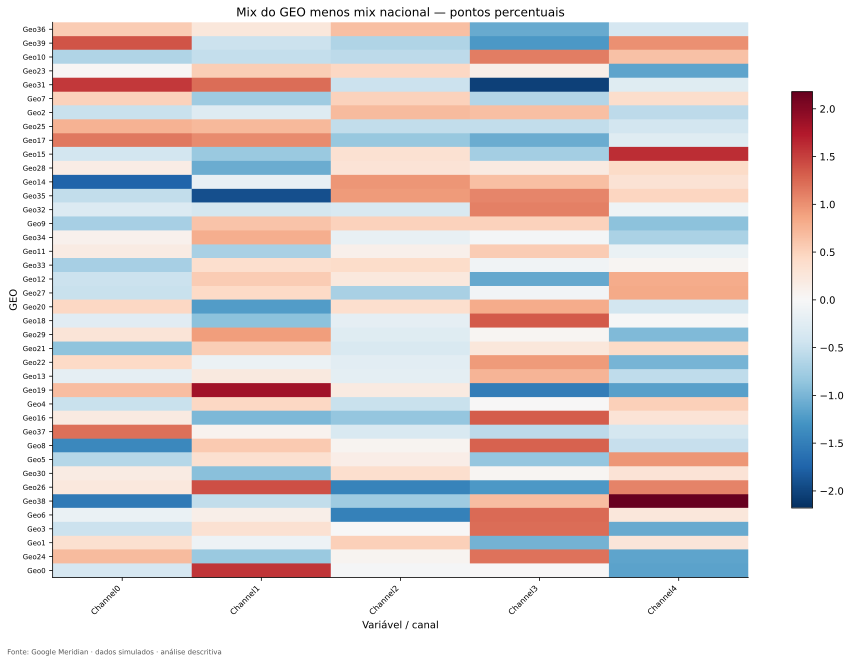

**Como ler:** Linhas são geos, colunas canais; cor é mix local menos mix nacional em pontos percentuais. Zero é a referência central.

**O que observamos:** Desvios são de poucos pontos percentuais. A amplitude entre geos por canal não supera 3,74 p.p.

**Por que importa:** Expõe pequenas diferenças que o heatmap 0–1 pode comprimir visualmente.

**O que não permite concluir:** Não demonstra segmentação estratégica real nem retornos distintos.

### A20 — Geo allocation e concentração geográfica

#### 1. Pergunta

Para um canal fixo, quanto de seu gasto vai para cada mercado?

#### 2. Por que importa

O denominador muda em relação ao mix; confundi-los altera inteiramente a pergunta.

#### 3. Conceito em linguagem simples

Alocação fixa o canal e divide seu orçamento entre geos. Concentração resume se poucas regiões recebem grande parte dele.

#### 4. Analogia

Uma família reparte seu próprio orçamento entre despesas: mix. Uma rede reparte todo o orçamento de um único canal entre cidades: allocation.

#### 5. Definição técnica

$Allocation_{gm}=S_{gm}/\sum_hS_{hm}$, onde $h$ percorre geos. Cada coluna soma 1. $HHI_m=\sum_g Allocation_{gm}^2$; para 40 geos, mínimo uniforme 1/40=0,025 e máximo 1. O inverso $1/HHI$ é o número equivalente de geos com participações iguais.

#### 6. Cálculo neste projeto

`media_geo` divide somas territoriais pela soma da coluna; calcula top1, top5, HHI e inverso. Nenhum threshold antitruste é aplicado.

#### 7. Onde encontrar

Notebook [04](../notebooks/04_eda_media_geo.ipynb); [geo_allocation.csv](../outputs/tables/geo_allocation.csv), [channel_geo_concentration.csv](../outputs/tables/channel_geo_concentration.csv).

#### 8. Como ler

No heatmap de allocation, compare geos dentro da mesma coluna; no mix, compare canais dentro da mesma linha. Top5 é a participação dos cinco maiores destinatários daquele canal, que não precisam ser o mesmo conjunto em todos os canais.

#### 9. Resultado real

| channel | hhi | effective_geos | top1 | top5 |
| --- | --- | --- | --- | --- |
| Channel0 | 0.0303 | 32.9822 | 0.0458 | 0.2183 |
| Channel1 | 0.0301 | 33.2014 | 0.0470 | 0.2197 |
| Channel2 | 0.0311 | 32.1826 | 0.0498 | 0.2315 |
| Channel3 | 0.0301 | 33.2420 | 0.0454 | 0.2152 |
| Channel4 | 0.0301 | 33.1763 | 0.0454 | 0.2129 |

Fonte integral: [channel_geo_concentration.csv](../outputs/tables/channel_geo_concentration.csv).

#### 10. Interpretação

HHI entre 0,03008 e 0,03107 é relativamente próximo do mínimo uniforme 0,025. Channel2 tem maior concentração: top5 de 23,15% e equivalente a 32,18 geos uniformes; Channel3, top5 de 21,52% e equivalente a 33,24. Não há concentração em um único mercado.

#### 11. Implicação para MMM

Verificar distribuição de suporte, mas não confundir HHI com tamanho efetivo da amostra. População explica grande parte da alocação absoluta.

#### 12. Limite da conclusão

Allocation não é mix, efeito local ou intensidade per capita. O inverso do HHI não corrige dependência temporal ou geográfica.

#### 13. Próxima pergunta

O que acontece quando mantemos a dimensão semanal em vez de acumular todo o período?

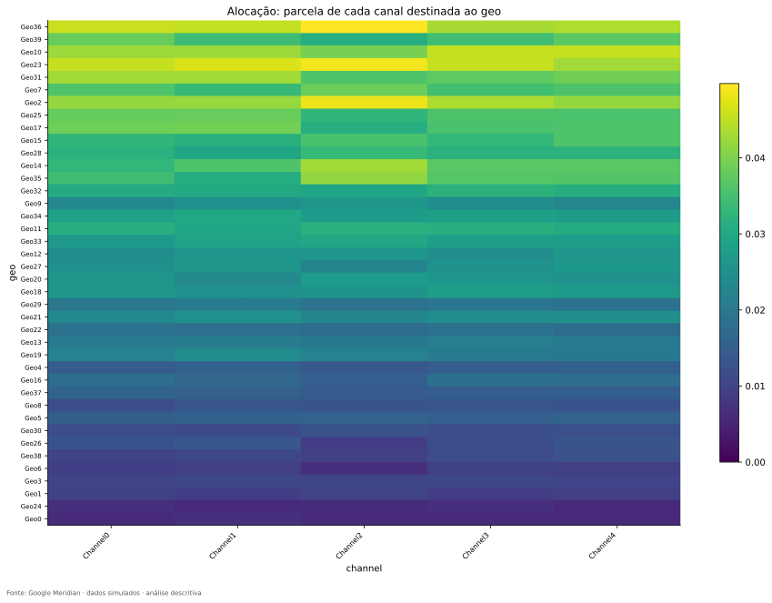

**Como ler:** Cada coluna é um canal; cada célula é a parcela do orçamento desse canal destinada ao geo da linha.

**O que observamos:** Participações individuais máximas ficam perto de 4,5%–5,0%; há gasto distribuído pelos 40 geos.

**Por que importa:** Complementa o mix, mostrando o destino territorial do orçamento.

**O que não permite concluir:** Uma célula maior não significa maior retorno; a soma de uma linha não é obrigatoriamente 1.

### Exemplo fictício que impede a troca de denominadores

| Mercado | Canal A | Canal B | Total do mercado |
|---|---:|---:|---:|
| Cidade 1 | 30 | 70 | 100 |
| Cidade 2 | 60 | 40 | 100 |
| Total do canal | 90 | 110 | 200 |

Na Cidade 1, o mix do Canal A é 30/100=30%. A alocação do Canal A para a Cidade 1 é 30/90=33,33%. O numerador é o mesmo, mas os denominadores e as perguntas mudam. Para a base real, os CSVs `media_mix` e `geo_allocation` usam exatamente essa distinção.

### A21 — Heatmaps GEO × TIME: onde e quando ocorre a exposição

#### 1. Pergunta

Existem blocos de atividade local, semanas compartilhadas ou apenas faixas persistentes de tamanho?

#### 2. Por que importa

Uma tabela acumulada elimina o calendário; o heatmap torna visível a execução no painel.

#### 3. Conceito em linguagem simples

É um calendário colorido com uma linha por mercado. Cada cor corresponde ao valor daquela semana naquele geo.

#### 4. Analogia

Imagine calendários de abertura de 40 lojas empilhados. Colunas escuras podem indicar fechamento geral; trechos escuros de uma linha, fechamento local.

#### 5. Definição técnica

Linhas são GEO; colunas são TIME. Faixas horizontais podem indicar nível persistente, verticais movimento comum e blocos locais execução diferenciada. Esses padrões são possibilidades de leitura, não causas diagnosticadas.

#### 6. Cálculo neste projeto

O código reordena os geos por KPI acumulado, inclusive depois da divisão por população. Para cada canal há impressões e gasto, brutos e per capita. Também existem KPI, KPI per capita e dois controles. As escalas de cor são próprias de cada variável.

#### 7. Onde encontrar

Notebooks [03](../notebooks/03_eda_geo.ipynb) e [04](../notebooks/04_eda_media_geo.ipynb); `geo_analysis.geo_analysis`, `media_geo`, `per_capita_matrix`; [heatmap_axes.json](../outputs/logs/heatmap_axes.json); figuras listadas no inventário.

#### 8. Como ler

Comece pela unidade e barra de cor; confirme a mesma ordem de geos. Uma cor escura em controles pode ser valor negativo, não inatividade. Em impressões não negativas pode representar zero ou valor baixo. Não comparar duas cores sem comparar os limites das barras.

#### 9. Resultado real

Channel2 per capita mostra muitos espaços de intensidade zero/baixa e pontos positivos localizados; Channel3 tem exposição muito mais contínua. As proporções zero são 64,26% e 2,71%. O resíduo per capita é 79,28% e 64,85%, respectivamente. Os eixos da revisão têm 21 verificações de ordenação publicadas.

#### 10. Interpretação

O contraste visual combina com sparsity e decomposição. Para KPI, a comparação bruto/per capita reduz o predomínio visual do tamanho e corresponde à queda de R² GEO de 67,89% para 9,10%. Nos controles, R² TIME de 33,22% e 27,40% contextualiza a presença de movimento comum, sem fazê-los séries idênticas entre mercados.

#### 11. Implicação para MMM

Essas figuras ajudam a localizar suporte para comparar mercado–semana e a formular verificações de janelas futuras. Gasto e impressões similares não duplicam evidência independente.

#### 12. Limite da conclusão

Um bloco colorido não identifica campanha real, evento ou causalidade. A ordenação por KPI não é ordem espacial; geos fictícios não permitem desenhar fronteiras.

#### 13. Próxima pergunta

Sinais distintos no espaço e no tempo ainda podem se mover juntos entre canais; quão forte é essa associação?

#### Como explicar isso oralmente

> Eu li os heatmaps junto com as tabelas. Channel2 é muito mais intermitente que Channel3, e ambos mantêm variação local após normalização. O gráfico localiza os padrões; as decomposições quantificam a leitura e limitam conclusões apenas visuais.

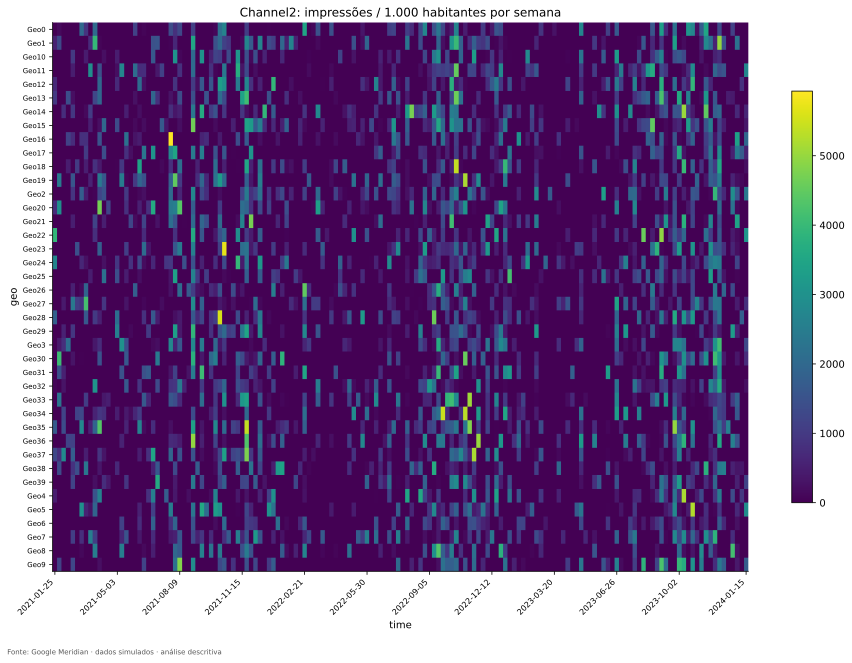

**Como ler:** GEO nas linhas, semanas nas colunas, impressões por 1.000 habitantes na cor.

**O que observamos:** Predominam células zero/baixas, intercaladas com exposição positiva localizada; 64,26% dos valores são zero.

**Por que importa:** Mostra o suporte descontínuo que um total nacional suaviza.

**O que não permite concluir:** Células escuras não são automaticamente controles experimentais.

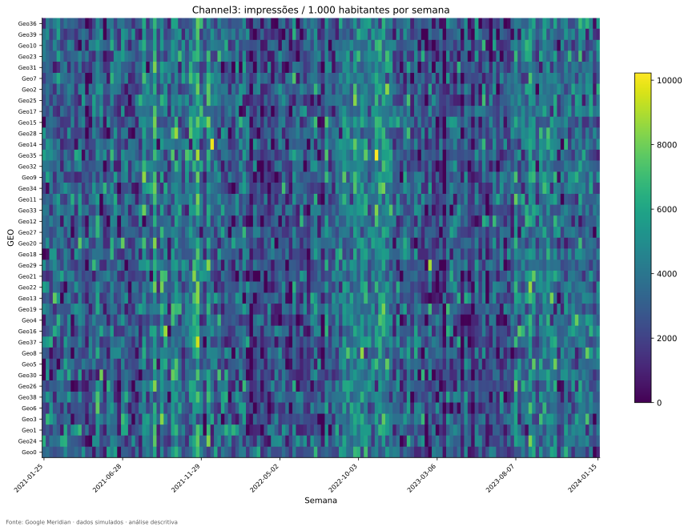

**Como ler:** Mesma ordenação territorial do Channel2, mas outra escala de cor; confira a barra antes de comparar intensidade.

**O que observamos:** Exposição mais contínua; apenas 2,71% das células são zero.

**Por que importa:** Oferece contraste entre intensidade contínua e intermitência.

**O que não permite concluir:** A maior continuidade e gasto não tornam o canal mais eficiente.

Para estudar as outras variáveis, consulte [KPI bruto](../outputs/figures/geo/conversions_geo_time.svg), [KPI por habitante](../outputs/figures/geo/kpi_pc_geo_time.svg), [controle de concorrência](../outputs/figures/geo/competitor_sales_control_geo_time.svg) e [controle de sentimento](../outputs/figures/geo/sentiment_score_control_geo_time.svg). Em todos, a unidade da cor muda; aplique a leitura da análise A21. Os vinte heatmaps de mídia/gasto estão no inventário completo, preservando o exame dos cinco canais sem repetir todos no corpo do guia.

### Checkpoint de aprendizagem

Ao terminar este capítulo, tente responder sem consultar as fórmulas:

- Em qual direção somam 1 as matrizes de mix e allocation?
- Por que +3 p.p. não significa +3% relativo?
- Como mix acumulado semelhante pode coexistir com heatmaps distintos?
- Por que HHI não é tamanho efetivo da amostra?
- Como ler uma célula escura de controle em vez de mídia?

## 14. Relações: nacional, overall, within e two-way

Antes de olhar uma correlação, pergunte qual é a unidade comparada. No nacional, cada ponto é uma semana com os geos agregados. No overall, cada ponto é uma célula geo–semana bruta. No within, cada valor é um desvio em relação à média daquele geo. No two-way, removem-se também médias semanais comuns. Não é a mesma pergunta repetida quatro vezes.

**Exemplo fictício:** uma cidade grande tem mídia [90, 110] e KPI [1.100, 900]; uma pequena tem mídia [9, 11] e KPI [110, 90]. Dentro de cada cidade, quando a mídia sobe o KPI cai. No painel bruto, a grande tem mais mídia e mais KPI: a diferença de tamanho cria associação positiva overall. Essa inversão ilustra o risco de composição, próximo do raciocínio do paradoxo de Simpson. Não comprova, nem no exemplo, que mídia causou a queda.

Ao remover as médias locais, ambos os mercados revelam seus movimentos internos. Remover médias de semana acrescenta outro ajuste descritivo. Nenhuma dessas operações remove automaticamente todos os fatores de confusão.

### A22 — Pearson e Spearman entre mídias

#### 1. Pergunta

Canais diferentes se movimentam juntos e sua associação muda conforme o nível de análise?

#### 2. Por que importa

Sinais sincronizados podem ser difíceis de separar posteriormente, mesmo com muitas observações.

#### 3. Conceito em linguagem simples

Pearson compara movimento linear; Spearman compara a ordenação dos valores. Ambos dependem da escala e do nível de agregação.

#### 4. Analogia

Se duas lâmpadas sempre acendem juntas, é difícil atribuir quanto da iluminação vem de cada uma. Se às vezes operam separadas, há contrastes adicionais.

#### 5. Definição técnica

$r=Cov(X,Z)/(sd(X)sd(Z))$ é a correlação de Pearson. Spearman calcula a correlação dos postos, com tratamento de empates. Nos resíduos, o código primeiro remove médias e depois calcula postos; isso não é automaticamente correlação parcial de postos.

#### 6. Cálculo neste projeto

`relationships` produz oito matrizes gerais (quatro níveis × dois métodos) e matrizes pagas separadas de impressões e gasto. `relationship_investigation` exclui pares contábeis gasto–impressão do mesmo canal da síntese substantiva.

#### 7. Onde encontrar

Notebook [05](../notebooks/05_eda_relationships.ipynb); [correlation_summary.csv](../outputs/tables/correlation_summary.csv), [substantive_pair_comparison.csv](../outputs/tables/substantive_pair_comparison.csv); famílias `impression_correlation_*` e `spend_correlation_*` no inventário.

#### 8. Como ler

Cada célula do heatmap é a correlação das variáveis dos eixos; diagonal 1 é trivial. Leia o nível no título. Compare o mesmo par em vários níveis, sem selecionar só o maior valor.

#### 9. Resultado real

Channel2 × Channel3, impressões, Pearson: nacional 0,7003; within 0,5035; two-way 0,4511. A maior associação absoluta within entre os nove preditores é Channel4 × competitor_sales_control, aproximadamente 0,550. Gasto e impressões do mesmo canal são quase proporcionais e não representam descoberta de sinergia.

#### 10. Interpretação

Parte do movimento conjunto entre Channel2 e Channel3 está associada ao calendário/composição, mas persiste associação após remoção aditiva de GEO e TIME. O efeito de retirar médias depende do par; não é regra de que toda correlação necessariamente caia.

#### 11. Implicação para MMM

Investigar redundância conjunta com VIF e posteriormente após adstock/saturação. Não agregar canais apenas porque uma correlação parece elevada.

#### 12. Limite da conclusão

Correlação não mede sinergia, efeito causal ou independência condicional. O projeto não apresenta p-valores que tratem as 6.240 células como independentes.

#### 13. Próxima pergunta

Essas relações entre preditores se traduzem em associação contemporânea com o KPI?

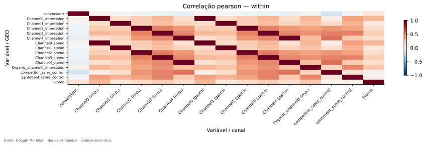

**Como ler:** Ambos os eixos são variáveis; cores de −1 a 1 representam Pearson após retirar médias locais.

**O que observamos:** Há pares quase perfeitos gasto–impressões do mesmo canal; pares substantivos como Channel2/Channel3 são menos extremos.

**Por que importa:** Explica por que separar redundância contábil e co-movimento entre canais.

**O que não permite concluir:** Correlação residual não é sinergia e não substitui diagnóstico conjunto.

### A23 — Mídia × KPI: associação muda ao retirar o tamanho

#### 1. Pergunta

Como a mídia se associa ao KPI nas quatro lentes?

#### 2. Por que importa

Uma associação positiva no painel bruto pode refletir mercados grandes, e não resposta a campanhas.

#### 3. Conceito em linguagem simples

Comparar níveis mostra se o sinal depende de juntar mercados com níveis médios diferentes.

#### 4. Analogia

Sorvetes e queimaduras solares aumentam no verão sem que um cause o outro. Em marketing, campanhas e vendas podem aumentar por demanda esperada, promoções ou sazonalidade.

#### 5. Definição técnica

Usam-se as mesmas correlações de Pearson/Spearman, agora entre KPI e preditores. Within remove diferenças médias de geo; two-way remove ainda médias de tempo, sem constituir ajuste causal completo.

#### 6. Cálculo neste projeto

`predictor_kpi_comparison` filtra pares com `conversions`. Nenhum MMM foi ajustado e nenhum coeficiente foi transformado em retorno.

#### 7. Onde encontrar

Notebook [05](../notebooks/05_eda_relationships.ipynb); `investigation.relationship_investigation`; [predictor_kpi_comparison.csv](../outputs/tables/predictor_kpi_comparison.csv).

#### 8. Como ler

Leia uma linha por preditor e compare colunas de nível na tabela abaixo. Um sinal que troca de positivo para negativo merece investigação, não interpretação causal automática.

#### 9. Resultado real

| right | national | overall | within | two_way |
| --- | --- | --- | --- | --- |
| Channel0_impression | 0.0514 | 0.4138 | 0.0318 | 0.0308 |
| Channel1_impression | 0.0121 | 0.2931 | -0.0102 | -0.0129 |
| Channel2_impression | -0.1104 | 0.1479 | -0.0498 | -0.0451 |
| Channel3_impression | -0.1240 | 0.4689 | -0.0518 | -0.0458 |
| Channel4_impression | -0.1788 | 0.3482 | -0.0787 | -0.0707 |
| Organic_channel0_impression | 0.0165 | 0.2982 | 0.0336 | 0.0366 |
| Promo | 0.2993 | 0.0802 | 0.1332 | 0.1198 |
| competitor_sales_control | -0.3796 | -0.1167 | -0.2010 | -0.1930 |
| sentiment_score_control | -0.0563 | -0.0095 | -0.0317 | -0.0296 |

Fonte: [predictor_kpi_comparison.csv](../outputs/tables/predictor_kpi_comparison.csv).

#### 10. Interpretação

Channel3 × KPI é +0,4689 overall, mas −0,0518 within e −0,0458 two-way; nacional é −0,1240. Channel0 passa de +0,4138 overall para +0,0318 within. O padrão é compatível com forte papel das diferenças médias territoriais nas associações brutas, sem identificar sua causa única.

#### 11. Implicação para MMM

Justificar a estrutura geográfica e controles antes de estimar efeitos. A EDA não seleciona canais por correlação marginal nem considera correlação pequena uma prova de ineficácia.

#### 12. Limite da conclusão

Não concluir que Channel3 destrói conversões. Defasagem, saturação, targeting, confundimento e a própria geração sintética podem afetar essas associações; a EDA não distinguiu causalmente essas explicações.

#### 13. Próxima pergunta

Quais controles e tratamentos precisam de definição causal antes de entrar no futuro modelo?

#### Como explicar isso oralmente

> A correlação positiva do painel bruto muda bastante quando retiro as médias dos mercados. Isso mostra que comparar mercados grandes e pequenos pode produzir uma impressão enganosa sobre mídia. Eu uso essa mudança para orientar a especificação, não para afirmar efeitos positivos ou negativos.

### A24 — Controles, Promo e mídia orgânica

#### 1. Pergunta

O que representam os sinais não pagos e como variam?

#### 2. Por que importa

Mídia não explica tudo; incluir um controle inadequado também pode distorcer a interpretação causal.

#### 3. Conceito em linguagem simples

Controle é uma variável usada para representar fatores externos relevantes. Promo é tratamento não mídia, e orgânico é exposição com papel próprio; não são todos sinônimos.

#### 4. Analogia

Avaliar o desempenho de uma loja exige considerar concorrência e ambiente. Mas controlar uma variável que foi alterada pela própria campanha pode retirar parte do efeito que se quer medir.

#### 5. Definição técnica

Um confundidor antecede e pode influenciar exposição e resultado. Uma variável pós-tratamento pode ser mediadora ou gerar viés, conforme a estrutura causal. Correlação ou nome de coluna não determina esse papel; um DAG é um diagrama explícito de hipóteses causais.

#### 6. Cálculo neste projeto

`control_detailed_profile` registra amplitude, desvio, valores distintos e maior mudança nacional ponderada. `control_relationship_review` reúne R², VIF e principal associação two-way. Orgânico entra nas correlações e VIF com as mídias; Promo mantém papel não mídia no InputData.

#### 7. Onde encontrar

Notebooks [02](../notebooks/02_eda_temporal.ipynb), [03](../notebooks/03_eda_geo.ipynb), [05](../notebooks/05_eda_relationships.ipynb); [control_detailed_profile.csv](../outputs/tables/control_detailed_profile.csv), [control_relationship_review.csv](../outputs/tables/control_relationship_review.csv), [data_dictionary.csv](../outputs/tables/data_dictionary.csv).

#### 8. Como ler

Controles nacionais são médias ponderadas, não soma de vendas. Histogramas usam as células GEO × TIME; não confundir com a distribuição da média nacional. Índice com valor negativo não indica erro automaticamente.

#### 9. Resultado real

Concorrência: −4,8256 a 3,9247, desvio 1,2101; R² GEO 0,54%, TIME 33,22%; VIF within 1,83; maior associação two-way com Channel4 (0,4781). Sentimento: −4,2304 a 4,3203, desvio 1,1755; R² GEO 0,42%, TIME 27,40%; VIF within 1,88; maior associação com orgânico (0,4369). Promo: 0 a 4,8006, desvio 0,6942, 46,83% zeros; R² TIME 19,84%, VIF within 1,28. Orgânico: 2.075 zeros (33,25%); R² GEO 13,02%, TIME 17,04%, resíduo 69,94%.

#### 10. Interpretação

Os dois controles não são constantes e apresentam mais variação temporal comum que as mídias brutas. As maiores mudanças nacionais ponderadas são concorrência em 16/05/2022 (−2,3823), sentimento em 13/12/2021 (+2,3571), Promo em 21/08/2023 (−1,1330). Não sabemos os eventos de negócio por trás delas. Promo é contínuo; as 3.319 magnitudes distintas impedem tratá-lo como simples indicador 0/1.

#### 11. Implicação para MMM

Antes do ajuste, justificar temporalidade e papel causal de cada variável. Concorrência e sentimento não são controles válidos só porque receberam `_control` no nome.

#### 12. Limite da conclusão

CV de índice centrado/próximo de zero não tem interpretação estável de intensidade. O projeto também suprime CV de Promo como convenção de cautela; inflação de zeros, isoladamente, não torna matematicamente impossível calcular CV de toda variável não negativa. Nada aqui identifica efeito de Promo ou orgânico.

#### 13. Próxima pergunta

As relações entre vários preditores em conjunto são mais fortes que os pares isolados?

### A25 — VIF e multicolinearidade

#### 1. Pergunta

Um preditor é quase reproduzido pela combinação dos demais?

#### 2. Por que importa

Correlação par a par pode ser modesta enquanto uma combinação de variáveis produz forte redundância.

#### 3. Conceito em linguagem simples

VIF indica quanto a redundância linear dificulta distinguir um preditor no conjunto considerado.

#### 4. Analogia

Tentar separar chuva e número de guarda-chuvas é difícil se ambos sempre se movem juntos. Com várias medidas, uma pode ser reconstruída por uma soma das outras, mesmo sem um único par perfeito.

#### 5. Definição técnica

$VIF_j=1/(1-R_j^2)$, em que $R_j^2$ vem de regressão auxiliar do preditor $j$ sobre os outros, com intercepto. Exemplo fictício: $R_j^2=0,75$ produz VIF=4. A interpretação clássica de inflação de variância pertence ao contexto linear e suas hipóteses.

#### 6. Cálculo neste projeto

`vif_table` padroniza colunas variáveis e usa mínimos quadrados com intercepto. Inclui cinco impressões pagas, orgânico, dois controles e Promo. Não inclui KPI; não põe gasto junto a impressões. Constantes têm NaN e dependência linear exata produz infinito.

#### 7. Onde encontrar

Notebook [05](../notebooks/05_eda_relationships.ipynb); [statistics.py](../src/statistics.py): `vif_table`; [vif_summary.csv](../outputs/tables/vif_summary.csv).

#### 8. Como ler

No heatmap, a cor é log10(VIF), não VIF original. Por exemplo, cor 0,3 corresponde aproximadamente a VIF 2. Colunas são níveis de agregação/transformação; confira os valores no CSV.

#### 9. Resultado real

VIF máximo: nacional 3,8573; overall 2,4843; within 2,1117; two-way 1,7994. Os quatro máximos pertencem a Channel3. VIF within dos canais 0–4: 1,36; 1,19; 1,62; 2,11; 1,65.

#### 10. Interpretação

Não há redundância linear extrema nesse conjunto examinado. A queda após retirar médias é compatível com parte do co-movimento associada a estrutura territorial e temporal.

#### 11. Implicação para MMM

Repetir diagnóstico relevante depois das transformações futuras e examinar incerteza/convergência. Priors e modelo hierárquico alteram a situação em relação a uma regressão linear simples.

#### 12. Limite da conclusão

VIF moderado não prova identificação causal, exogeneidade ou precisão posterior. Não aplicar automaticamente “VIF acima de X, excluir”. Threshold oficial de 1000 é um guardrail extremo, não nota de qualidade.

#### 13. Próxima pergunta

Uma associação defasada muda a leitura sem virar seleção automática de adstock?

#### Como explicar isso oralmente

> O VIF pergunta se consigo reconstruir um canal usando os demais preditores. Os valores observados não indicam redundância linear extrema. Mesmo assim, isso não resolve confundimento e terá de ser reconsiderado depois das transformações do MMM.

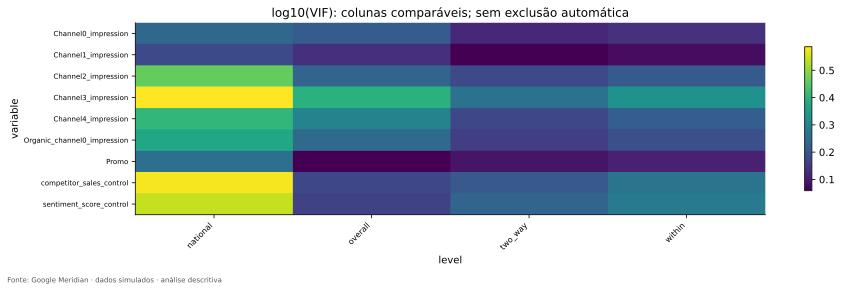

**Como ler:** Linhas são os nove preditores; colunas são níveis; a cor é log10(VIF).

**O que observamos:** Channel3 tem os maiores valores, ainda moderados no conjunto bruto analisado.

**Por que importa:** Complementa as correlações par a par com uma medida conjunta.

**O que não permite concluir:** Não certifica efeitos causais nem ausência de problemas após adstock e saturação.

### A26 — Lags exploratórios: alinhamento sem estimar adstock

#### 1. Pergunta

A mídia de semanas anteriores apresenta associação linear com o KPI atual?

#### 2. Por que importa

Publicidade pode ter persistência temporal, mas uma correlação deslocada é apenas um diagnóstico preliminar.

#### 3. Conceito em linguagem simples

Deslocamos uma série para comparar exposição anterior e resultado posterior.

#### 4. Analogia

É como comparar estudo na semana passada com uma prova nesta semana. Uma associação pode refletir esforço persistente ou outros fatores, não o efeito isolado de uma semana de estudo.

#### 5. Definição técnica

Calcula-se $Corr(M_{t-k},Y_t)$, $k=0,\ldots,8$, no nacional. Adstock seria uma transformação que acumula exposição ao longo do tempo segundo pesos; não é essa simples correlação.

#### 6. Cálculo neste projeto

`relationships` usa `shift(k)`, alinha datas e remove as pontas sem observação correspondente. O número de pares vai de 156 no lag 0 a 148 no lag 8.

#### 7. Onde encontrar

Notebook [05](../notebooks/05_eda_relationships.ipynb); [exploratory_lags.csv](../outputs/tables/exploratory_lags.csv); figura [lags.svg](../outputs/figures/relationships/lags.svg).

#### 8. Como ler

X é lag em semanas e Y é Pearson; cada linha é um canal. Confira `n` porque os pontos não usam exatamente o mesmo conjunto de semanas.

#### 9. Resultado real

Channel2 passa de −0,1104 no lag 0 para +0,1789 no lag 5; no lag 8 é −0,0353. Channel4 chega a +0,1439 no lag 7, após −0,1788 no lag 0. Não há estimativa de parâmetro de decaimento.

#### 10. Interpretação

As associações mudam conforme alinhamento. Escolher retrospectivamente o maior ponto capitalizaria flutuações da própria amostra e confundiria exploração com seleção validada.

#### 11. Implicação para MMM

Usar apenas para formular perguntas sobre persistência; definir max_lag e priors por justificativa e avaliação futura, não pelo máximo dessa curva.

#### 12. Limite da conclusão

Não concluir que Channel2 tem efeito causal máximo após cinco semanas. Há múltiplas comparações, dependência temporal e confundimento não resolvidos.

#### 13. Próxima pergunta

O conjunto dos diagnósticos permite distinguir quais perguntas sobre identificabilidade continuam abertas?

## 15. O que significa identificar um efeito?

Duas torneiras enchem uma piscina. Se sempre abrem juntas, na mesma proporção e duração, o nível observado informa a vazão total, mas não separa facilmente a contribuição de cada torneira. Um modelo pode atribuir números diferentes às duas e ainda reproduzir quase a mesma trajetória. Isso ilustra **dificuldade de identificação estatística**.

No marketing, diferenças de campanha entre geos e semanas podem oferecer contrastes para distinguir canais. Aqui, resíduo two-way e padrões de atividade mostram que há contrastes observados. VIF e correlações ajudam a investigar redundância linear. Mas a analogia das torneiras omite algo decisivo: a empresa escolhe quando anunciar, frequentemente reagindo à demanda. Separar dois sinais matematicamente não elimina essa endogeneidade.

**Identificação causal** exige hipóteses que liguem os contrastes observados ao que aconteceria sob outra exposição. Medição consistente, confundidores adequados, estrutura temporal, ausência ou tratamento de spillovers e outras hipóteses precisam ser discutidos. Esta EDA não testou integralmente essas condições nem estimou um efeito causal.

| Evidência atual | Pergunta que ajuda a responder | Questão que permanece |
|---|---|---|
| Resíduo per capita 64,85%–79,28% nas mídias | Há variação além de médias locais e semanais? | É variação causalmente utilizável ou também ruído/targeting? |
| Channel2 com sequências zero longas | Existe suporte em toda janela? | Como escolher treino e holdout sem perder contraste? |
| VIF within até 2,11 | Há redundância linear extrema no conjunto atual? | O que ocorre após transformações e com incerteza posterior? |
| Correlações KPI mudam entre níveis | Composição territorial importa? | Quais confundidores e mecanismos devem compor o modelo? |
| Checks oficiais e reconciliação | Cálculos/definições estão coerentes? | As hipóteses do futuro modelo são defensáveis? |

### Como explicar isso oralmente

> A EDA mostra que há contrastes geográficos e temporais para investigar um MMM. Também mostra onde o suporte é frágil e onde os sinais se movem juntos. Isso prepara a especificação, mas não resolve sozinho a identificação causal, porque variação observada pode responder à demanda e a outros fatores.

### Checkpoint de aprendizagem

Ao terminar este capítulo, tente responder sem consultar as fórmulas:

- Qual a unidade de observação de cada uma das quatro correlações?
- Por que associação positiva overall pode desaparecer within?
- Por que gasto e impressões do mesmo canal não devem duplicar o VIF?
- Por que VIF baixo não resolve endogeneidade?
- Por que o lag de maior correlação não é adstock estimado?

## 16. Meridian Official EDA: confronto de definições e revisão de alertas

### A27 — O que foi efetivamente executado no Meridian

#### 1. Pergunta

Quais diagnósticos oficiais foram produzidos e que objetos eles exigem?

#### 2. Por que importa

A ferramenta oficial confronta nossa exploração com regras e transformações específicas da biblioteca.

#### 3. Conceito em linguagem simples

A EDA customizada responde às perguntas do TCC; a oficial oferece um conjunto padronizado de verificações e relatório.

#### 4. Analogia

Uma inspeção detalhada feita para sua casa e um checklist do fabricante dos equipamentos se complementam. Passar no checklist não substitui entender a casa.

#### 5. Definição técnica

O estado examinado usa Google Meridian 2.1.0 no commit fixado, `DataFrameInputDataBuilder`, `Meridian`, `ModelSpec()` e `MeridianEDA`. O objeto precisa de uma especificação provisória para executar seus diagnósticos.

#### 6. Cálculo neste projeto

`official_eda` monta InputData com KPI não monetário, fator de receita, população, cinco mídias, orgânico, controles e Promo; gera HTML, exporta 13 métodos de checks e registra warnings. A execução publicada contém grupo `prior` e nenhum `posterior`.

#### 7. Onde encontrar

Notebook [06](../notebooks/06_meridian_official_eda.ipynb); [official_eda.py](../src/official_eda.py); [meridian_run.json](../data/metadata/meridian_run.json), [meridian_eda_report.html](../outputs/reports/meridian_eda_report.html), [meridian_eda_checks.csv](../outputs/tables/meridian_eda_checks.csv).

#### 8. Como ler

Leia check, severidade, causa e explicação. Um método pode gerar mais de um achado, portanto 13 checks e 16 achados não são contraditórios. Baixe o HTML e abra em navegador; GitHub pode mostrar apenas seu código.

#### 9. Resultado real

16 achados: 10 INFO, 6 REVIEW e nenhum FAIL entre os checks exportados. Defaults provisórios registrados: 156 knots e max_lag=8. O construtor executa amostragem da prior, com 500 draws por default da API utilizada, conforme o código upstream examinado na [auditoria, seção 9](EDA_AUDIT_REPORT.md#9-meridian-official-eda), e seed explícita.

#### 10. Interpretação

Há evidência publicada de execução da EDA oficial, não apenas chamadas escritas. O HTML completo contém também diagnósticos de prior; esses não são resultados aprendidos de ajuste posterior.

#### 11. Implicação para MMM

Usar os diagnósticos para revisar a especificação futura. Knots representam flexibilidade temporal; 156 é o default observado, não a escolha final recomendada pelo TCC.

#### 12. Limite da conclusão

Não houve posterior, ROI estimado ou otimização. A documentação consultada em 07/10/2026 é referência complementar; a descrição histórica se ancora no commit utilizado. Não se declara equivalência com toda versão futura da API.

#### 13. Próxima pergunta

Por que um R² ou VIF oficial pode diferir do próprio sem que alguém esteja errado?

### A28 — Reconciliação: mesma escala antes de comparar números

#### 1. Pergunta

As implementações concordam quando calculam a mesma definição nos mesmos dados transformados?

#### 2. Por que importa

Diferenças de escala ou agregação podem ser confundidas com erro numérico.

#### 3. Conceito em linguagem simples

Antes de comparar medidas, precisamos usar a mesma régua e medir o mesmo objeto.

#### 4. Analogia

Duas pessoas podem informar 1 metro e 100 centímetros para a mesma distância. Outras vezes medem média e soma: converter unidade não basta; é necessário igualar também a operação.

#### 5. Definição técnica

O R² oficial é ajustado: $R^2_{aj}=1-(1-R^2)(N-1)/(N-K)$, onde $K$ conta parâmetros incluindo intercepto; para dummies de um fator, $K$ é o número de grupos. Pode ser negativo e não obedece à identidade aditiva dos R² brutos. Variáveis oficiais são transformadas.

#### 6. Cálculo neste projeto

`official_eda` reconstrói R² por somas de quadrados na escala oficial. `compare_and_review` recalcula Pearson/VIF nas matrizes oficiais e compara localizações de IQR por chave. No nacional, controles/Promo oficiais usam soma por default; a EDA própria usa média ponderada por população.

#### 7. Onde encontrar

Notebook [06](../notebooks/06_meridian_official_eda.ipynb); [official_r2_reconciliation.csv](../outputs/tables/official_r2_reconciliation.csv), [official_correlation_reconciliation.csv](../outputs/tables/official_correlation_reconciliation.csv), [official_vif_reconciliation.csv](../outputs/tables/official_vif_reconciliation.csv), [custom_official_scale_comparison.csv](../outputs/tables/custom_official_scale_comparison.csv).

#### 8. Como ler

Compare `custom_same_scale` e `official` e leia diferença absoluta. Na tabela de IQR, diferença simétrica zero significa igualdade do conjunto de localizações, mais forte que ter a mesma contagem.

#### 9. Resultado real

Na validação publicada, diferença máxima de correlação 4,88×10⁻¹⁵ e VIF 1,33×10⁻¹⁵; R² inferior a 10⁻¹⁵. A tolerância é 10⁻⁵. Quatro conjuntos de IQR coincidem nas chaves: 36, 1.461, 1 e 21 casos, com diferença simétrica zero.

#### 10. Interpretação

A concordância apoia consistência computacional para as definições confrontadas. As diferenças entre números brutos customizados e escalados oficiais têm explicações metodológicas e continuam documentadas.

#### 11. Implicação para MMM

Levar ao futuro modelo entradas e escalas corretas, evitando “corrigir” resultados para igualar medidas que respondem perguntas distintas.

#### 12. Limite da conclusão

Reconciliar algoritmos não valida mecanismos causais ou plausibilidade comercial. A tabela cobre correlação/VIF geo agregado e nacional especificados em `compare_and_review`, não uma alegação de reconciliação de toda visualização interativa do HTML.

#### 13. Próxima pergunta

Quais são os seis alertas que persistiram e qual foi a decisão descritiva?

### A29 — Seis REVIEW: investigar sem apagar os alertas

#### 1. Pergunta

O que disparou os alertas oficiais, onde estão os casos e o que foi decidido?

#### 2. Por que importa

Um alerta só se torna útil quando se conhece sua escala, localização e consequência.

#### 3. Conceito em linguagem simples

REVIEW pede investigação; registrar uma decisão não muda automaticamente sua severidade.

#### 4. Analogia

Um detector pode acusar fumaça de torrada. Investigar o motivo não exige quebrar o detector nem alterar sua sensibilidade para a cozinha parecer segura.

#### 5. Definição técnica

Os quatro REVIEW de extremos usam regras oficiais sobre variáveis transformadas; os dois de CPMU sinalizam custos fora das faixas. Um caso é uma combinação de variável, tempo e, quando aplicável, geo; contagens não equivalem a linhas únicas do painel.

#### 6. Cálculo neste projeto

`official_review.compare_and_review` reconstrói os limites e chaves, registra valor bruto/escalado e mantém dados/thresholds. Os artefatos oficiais preservam os alertas, enquanto `official_review_resolution` documenta decisão e limitação residual.

#### 7. Onde encontrar

Notebook [06](../notebooks/06_meridian_official_eda.ipynb); [official_review_resolution.csv](../outputs/tables/official_review_resolution.csv), [official_outlier_cases.csv](../outputs/tables/official_outlier_cases.csv), [official_outlier_selected_cases.csv](../outputs/tables/official_outlier_selected_cases.csv), [official_cpmu_cases_geo.csv](../outputs/tables/official_cpmu_cases_geo.csv), [official_cpmu_cases_national.csv](../outputs/tables/official_cpmu_cases_national.csv).

#### 8. Como ler

Leia `finding`, `decision`, `status` e `residual_limitation` conjuntamente. “Encerrado para EDA simulada” significa decisão descritiva registrada; não significa que REVIEW virou INFO.

#### 9. Resultado real

| Alerta | Casos e evidência principal | Leitura/decisão |
|---|---|---|
| KPI por geo | 36 extremos; maior módulo escalado 3,9162 em Geo13, 03/04/2023 | Preservar; contexto e escala reconciliados |
| Tratamentos/controles por geo | 1.461, incluindo 824 Channel2 e 267 Promo; máximo 6,2055 em Geo19/Promo, 18/10/2021 | Intermitência/caudas não são erro automático |
| KPI nacional | 1 extremo em 19/09/2022; módulo escalado 2,8281 | Preservar e acompanhar influência futura |
| Tratamentos/controles nacionais | 21 extremos; máximo 5,4395 em Channel2, 30/08/2021 | Preservar; não inventar evento de negócio |
| CPMU geo | 200 casos; máximo desvio relativo na série 1,427×10⁻⁷ | Magnitude microscópica, sem inconsistência gasto/mídia |
| CPMU nacional | 15 casos; máximo desvio relativo 8,771×10⁻⁸ | Mesma cautela de precisão |

Fonte: `official_review_resolution.csv`.

#### 10. Interpretação

Os alertas de custo refletem desvios muito pequenos em torno de razões quase constantes; os outros localizam caudas em escalas próprias. Ausência de corrupção identificada sustenta preservar a simulação, sem inventar correções.

#### 11. Implicação para MMM

Registrar os casos para futura influência/sensibilidade. INFO também deve ser lido: correlação 0,999 e VIF 1000 são limiares extremos dos checks, não metas desejáveis. Os valores efetivos estão em [official_thresholds.csv](../outputs/tables/official_thresholds.csv).

#### 12. Limite da conclusão

Concordância de chaves e domínio válido não certificam plausibilidade econômica. Warnings de backend/compatibilidade estão em [meridian_warnings.csv](../outputs/tables/meridian_warnings.csv); não foram escondidos.

#### 13. Próxima pergunta

O guardrail de quantidade de dados permite declarar que o futuro modelo terá precisão suficiente?

#### Como explicar isso oralmente

> Os seis alertas foram investigados e mantidos visíveis. Alguns refletem caudas e intermitência; os de custo têm magnitude relativa microscópica. A decisão foi preservar a base simulada, deixando a influência sobre o ajuste para a próxima etapa.

### A30 — Razão dados/parâmetros e a fronteira da adequação

#### 1. Pergunta

A quantidade de dados é grosseiramente compatível com a complexidade provisória?

#### 2. Por que importa

Um diagnóstico de escala ajuda a evitar especificações obviamente desproporcionais ao conjunto observado.

#### 3. Conceito em linguagem simples

A razão compara o número de células com uma contagem simplificada de parâmetros, não com toda a complexidade efetiva.

#### 4. Analogia

É como comparar o número de medições disponíveis com o número de ajustes de um instrumento. Muitos registros repetidos não garantem informação independente.

#### 5. Definição técnica

No guardrail usado: $n_{dados}=GT$ e $n_{par}=(G-1)+knots+controles+tratamentos$. Tratamentos incluem cinco mídias pagas, uma orgânica e Promo, totalizando sete.

#### 6. Cálculo neste projeto

O método `check_data_param_ratio` usa a especificação provisória do objeto. A exportação registra cada parcela da conta.

#### 7. Onde encontrar

Notebook [06](../notebooks/06_meridian_official_eda.ipynb); [meridian_data_adequacy.csv](../outputs/tables/meridian_data_adequacy.csv); `official_eda.official_eda`.

#### 8. Como ler

Leia numerador, denominador e configuração; não apenas a razão. Se a especificação mudar, o número também muda.

#### 9. Resultado real

$6.240/(39+156+2+7)=6.240/204=30,5882$. O check consta como INFO.

#### 10. Interpretação

A base não aciona esse guardrail de escassez na configuração registrada. A contagem simplificada não trata todos os coeficientes locais como independentes, refletindo a intenção de compartilhamento hierárquico.

#### 11. Implicação para MMM

Planejar avaliação de precisão posterior, convergência e holdout após definir a especificação; não usar 30,59 como autorização científica automática.

#### 12. Limite da conclusão

A razão não é tamanho amostral efetivo, poder estatístico ou prova de identificação. O compartilhamento de informação do modelo precisa ser especificado e avaliado.

#### 13. Próxima pergunta

Como reunir estrutura, suporte, geografia, relações e alertas numa resposta única?

### Referências oficiais e limite de versão

A documentação oficial consultada em 07/10/2026 descreve a EDA como etapa anterior à modelagem, diferencia INFO/REVIEW/FAIL e apresenta a razão dados/parâmetros como orientação aproximada. Ela complementa, sem substituir, o código fixado desta execução: [Perform an exploratory data analysis](https://developers.google.com/meridian/docs/pre-modeling/perform-eda) e [Amount of data needed](https://developers.google.com/meridian/docs/pre-modeling/amount-data-needed). O comportamento histórico está registrado no [commit upstream](https://github.com/google/meridian/tree/02111531f8661373aa7b6ba31c316c67d72d1dd2), nos módulos locais e metadados; não presumimos compatibilidade irrestrita com versões futuras.

### Checkpoint de aprendizagem

Ao terminar este capítulo, tente responder sem consultar as fórmulas:

- Por que prior amostrada não é posterior estimado?
- Como 13 checks podem produzir 16 achados?
- Por que R² bruto e ajustado não devem ser comparados diretamente?
- O que diferença simétrica zero acrescenta à igualdade de contagens?
- Por que um REVIEW encerrado descritivamente continua REVIEW?

## 17. Integração das evidências: o que realmente sustenta o diferencial GEO

A resposta mais defensável é **SIM, COM RESSALVAS**: há variação geo-temporal adicional potencialmente útil. O argumento exige várias peças, porque cada diagnóstico isolado admite outra explicação.

Primeiro, o painel é completo: as diferenças não surgem de uma grade irregular. Segundo, os volumes locais diferem, mas acompanham fortemente população. Ter mais conversões ou impressões em Geo36 do que em Geo0, sozinho, não demonstraria riqueza territorial de execução.

Terceiro, o mix acumulado varia pouco: as amplitudes por canal ficam entre 2,42 e 3,74 p.p. Isso impede exagerar diferenças de estratégia acumulada. Quarto, mesmo após normalização populacional e retirada de médias locais/semanais, permanece 64,85%–79,28% da variância das impressões pagas. Aqui está uma evidência mais diretamente ligada ao espaço e ao tempo conjuntamente.

Quinto, o mecanismo dessa variação não é igual em todos os canais. Channel2 alterna muito entre zero e positivo; Channel3 varia principalmente na intensidade de exposição quase contínua. Sexto, relações entre canais persistem após os ajustes descritivos, embora VIF não indique redundância linear extrema no conjunto atual. Finalmente, os checks oficiais tiveram seus alertas localizados e reconciliados; isso melhora a rastreabilidade, mas não transforma a exploração em inferência causal.

A costura é, portanto: **população pede per capita; diferenças locais pedem between/within; within pede retirada de calendário; o resíduo pede investigação de atividade; relações entre sinais pedem VIF e hipóteses causais; alertas pedem contexto e decisão documentada**. Nenhuma dessas etapas substitui as demais.

## 18. Fichas de interpretação dos cinco canais

| Canal | Síntese empírica | O que levar para o próximo passo |
|---|---|---|
| Channel0 | 18,45% do gasto; 12,10% zeros; CV positivo mediano 0,592; R² GEO bruto 24,84%, per capita 0,586%; resíduo per capita 78,28%; VIF within 1,36 | Preservar candidato; formular relação com demanda/controles e verificar colinearidade transformada. Maior par two-way é sentimento, 0,365 |
| Channel1 | 14,27% do gasto; 27,92% zeros; CV positivo 0,674; maior amplitude de mix, 3,74 p.p.; R² GEO per capita 0,438%; resíduo 76,52%; VIF within 1,19 | Não confundir maior CPMU com pior retorno. Investigar suporte local e associação com sentimento, 0,307 two-way |
| Channel2 | 5,50% do gasto; 64,26% zeros; até 27 semanas zeradas; alternância explica 50,48% da variância within; resíduo per capita 79,28%; VIF within 1,62 | Prioridade para suporte em treino/holdout e incerteza. Não chamar o maior resíduo de melhor canal; par com Channel3 é 0,451 two-way |
| Channel3 | 40,03% do gasto; 2,71% zeros; CV positivo 0,485; maior R² GEO bruto, 38,99%, mas 0,493% per capita; resíduo 64,85%; VIF within 2,11 | Distinguir tamanho populacional e intensidade; considerar relação com Channel2 e competição com baseline. Maior gasto não indica maior eficácia |
| Channel4 | 21,75% do gasto; 13,14% zeros; CV positivo 0,596; R² GEO bruto 23,72%, per capita 0,420%; resíduo 70,58%; VIF within 1,65 | Justificar o papel do controle de concorrência, seu maior par two-way (0,478); não interpretar sua correlação negativa com KPI como dano causal |

Fonte: [channel_integrated_review.csv](../outputs/tables/channel_integrated_review.csv), [geo_time_r2_per_capita.csv](../outputs/tables/geo_time_r2_per_capita.csv) e [channel_review.md](channel_review.md). Os critérios de ação e responsáveis constam em [readiness_actions.csv](../outputs/tables/readiness_actions.csv). As fichas mantêm todos os canais como candidatos, sem exclusão por preferência estética ou diagnóstico isolado.

## 19. Respostas às cinco perguntas da EDA

| Pergunta | Resposta atual | Evidências integradas | Fronteira da conclusão |
|---|---|---|---|
| Estrutura apropriada? | Sim quanto ao contrato; extremos descritos e preservados | 40×156, 100% completude, nenhum missing/duplicata, hash e revisão de casos | Integridade não certifica plausibilidade comercial de dados simulados |
| Há variação temporal? | Sim | Séries, CV, STL/ACF, mudanças, atividade e within de 61,01%–94,65% nas mídias pagas | Não há confirmação causal de sazonalidade ou quebra |
| Mercados diferem? | Sim em volume; intensidade exige outra leitura | KPI/população, R² bruto versus per capita, rankings e mix | Grande parte do nível de mídia acompanha população; mix acumulado é parecido |
| Existe variação GEO × TIME × MEDIA adicional? | Sim, com ressalvas | Resíduo per capita 64,85%–79,28%, heatmaps, atividade, CV e baixa sincronização linear do KPI | Não há prova de utilidade causal, nem comparação preditiva de modelos |
| Há riscos para identificação? | Sim, com características específicas | Channel2 esparso; pares de canais/controles associados; efeitos de população/calendário; seis REVIEW | VIF moderado e reconciliação não encerram hipóteses causais |

O [readiness_report.csv](../outputs/tables/readiness_report.csv) reúne dimensões da análise; o [readiness_actions.csv](../outputs/tables/readiness_actions.csv) acrescenta risco, ação, critério, situação e responsável. Leia ambos: uma descrição de prontidão não é a mesma coisa que um plano de decisões.

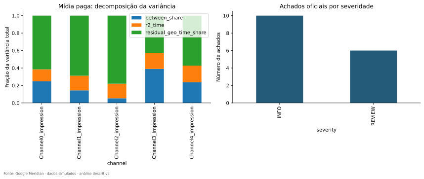

**Como ler:** À esquerda, barras somam GEO, semana e resíduo para cada mídia paga; à direita, contagem de achados INFO/REVIEW.

**O que observamos:** Existe parcela residual relevante em todos os canais e permanecem seis REVIEW documentados.

**Por que importa:** Resume o raciocínio depois da investigação individual.

**O que não permite concluir:** A altura das barras não mede impacto; contar INFO/REVIEW não produz nota automática de qualidade.

## 20. Descrição, associação, predição e causalidade: limites práticos

| Afirmação | Natureza | Situação nesta EDA |
|---|---|---|
| Channel2 tem 4.010 células sem exposição | Descrição | Confirmada na tabela de atividade |
| Channel2 e Channel3 têm correlação nacional 0,7003 | Associação | Confirmada, sem efeito causal atribuído |
| Um modelo prevê melhor as últimas semanas | Predição | Não avaliada; exige treino/holdout e métrica comum |
| Aumentar Channel2 produziria mais conversões | Causalidade | Não demonstrada; exige hipóteses e modelagem apropriada |
| Um canal apresenta ROI maior | Inferência de retorno | Não estimada; gasto e KPI isolados não bastam |

O fato de os dados serem simulados não elimina a necessidade de rigor. Também não autoriza recuperar os efeitos verdadeiros da simulação a partir de correlações: este trabalho não reconstruiu nem avaliou a verdade causal do processo gerador.

## 21. O que aprendemos com a auditoria

A auditoria foi publicada em `ac9960a` e avaliou o estado `c301905`. A nota **8,2/10** pertence àquela versão. A revisão `5d8c6a3` tratou seus achados; este guia não atribui nova nota nem transfere automaticamente a nota antiga para o estado revisado.

| Ponto histórico | Por que era importante | Situação na revisão examinada |
|---|---|---|
| Extremos e REVIEW pouco contextualizados | Triagem não justificava decisão por caso/grupo | Casos, janelas, escalas e decisões em `outlier_*` e `official_review_resolution`; severidades mantidas |
| Channel2 pouco explorado | Zeros e CV podiam ser confundidos com riqueza de sinal | Atividade por geo/janela, streaks e identidade atividade/intensidade |
| Mix/população e relações genéricos | Risco de exagerar heterogeneidade ou destacar pares contábeis | Amplitude em p.p., bruto/per capita e pares substantivos |
| Ordem de heatmaps per capita incorreta | Mudança de linha prejudicava comparação visual | Reindexação após divisão e verificações de eixos |
| Dois SVGs vazios | Figura publicada não era evidência visual utilizável | Regeneração, gravação atômica e validação de XML/conteúdo |
| Comparação oficial incompleta fora de R² | Escalas distintas podiam ser tomadas por divergência de cálculo | Correlação/VIF na mesma escala e igualdade de chaves IQR |
| Bootstrap e outputs antigos | Código/outputs de versões distintas podiam ser misturados | Verificação de ref/origem do pacote, manifesto e hashes |
| Tabelas truncadas e narrativa genérica | Leitor podia perder controles e resultados importantes | Tabelas pequenas completas, sínteses selecionadas e fichas por canal |
| Colab real não comprovado | Execução local não prova serviço/frontend | Continua pendente externa, explicitamente documentada |

Fontes: [relatório integral](EDA_AUDIT_REPORT.md), [resposta ponto a ponto](AUDIT_RESPONSE.md) e [validação da revisão](validation.md). A decomposição between/within e os principais cálculos já foram considerados corretos na auditoria; seria incorreto dizer que todos os fundamentos matemáticos precisaram ser refeitos.

A lição é distinguir cinco estágios: código escrito, código executado, cálculo coerente, interpretação correta e conclusão sustentada. Um não implica automaticamente o seguinte. O objetivo do guia é tornar explícitas as últimas duas transições.

## 22. Lacunas, ressalvas e evidências que não devem ser exageradas

A pendência operacional clara é a execução em uma sessão real do Google Colab. A revisão registra 19 testes aprovados, nove notebooks executados por células originais em processos IPython novos, 79 SVGs válidos, 21 verificações de ordem e 129 CSVs. A tentativa nbclient falhou antes das células por restrição de sockets; o mecanismo alternativo não valida comunicação kernel/frontend. Essas evidências são históricas da revisão, não testes repetidos durante a escrita deste guia.

Os seis REVIEW receberam decisões descritivas para esta simulação. Continuam abertas a avaliação de influência no ajuste, a plausibilidade comercial que a base não permite atestar e as escolhas causais. Não são defeitos que se resolvam mudando thresholds ou removendo canais até que desapareçam avisos.

Sensibilidades por subperíodos, retirada temporária de grandes geos e estabilidade temporal de correlações foram citadas como extensões opcionais. Não foram descritas neste guia como análises executadas. Mapas de cidades reais, clustering inferencial, MMM posterior e otimização de orçamento também não foram executados.

A especificação original foi localizada como [execution_specification.md](execution_specification.md). O prompt separado da auditoria, com nome equivalente a `2.4.EDA_AUDITORIA_PROMPT.md`, **não está versionado na árvore examinada**. Sua estrutura foi contextualizada pelo relatório de auditoria e pela matriz de 84 requisitos publicada em [eda_requirement_matrix.csv](../outputs/audit/eda_requirement_matrix.csv); não alegamos leitura de um arquivo ausente do repositório. O anexo desta tarefa definiu o escopo pedagógico do guia.

A inspeção visual deste guia foi amostral: scatter de R², decomposição de variância, heatmaps per capita de Channel2 e Channel3, small multiples, desvios de mix, STL e VIF. As demais figuras foram localizadas e seus métodos/valores correspondentes confrontados; não se afirma inspeção visual individual de todas as 79 ou navegação interativa completa do HTML.

## 23. O que a EDA preparou para o próximo passo

### Sabemos agora

O painel é completo, tem papéis e unidades documentados e preserva a fonte. A mídia apresenta variação temporal, territorial e residual, com suporte muito diferente entre Channel2 e Channel3. Volume acompanha população; intensidade e execução semanal oferecem outra perspectiva. Mix acumulado relativamente semelhante não elimina variação local no tempo. Correlações mudam com a agregação; VIF não aponta redundância linear extrema no conjunto atual. Alertas oficiais têm localização e decisão registradas.

### Ainda não sabemos

Não conhecemos efeitos causais recuperados por canal, ROI, mROI, contribuição incremental, resposta marginal, parâmetros de adstock/saturação, posterior ou orçamento ótimo. Não sabemos se o MMM geográfico terá previsão melhor que o nacional ou se suas estimativas serão suficientemente precisas. Não basta haver mais linhas para antecipar essas respostas.

### Próxima etapa, sem executá-la aqui

O autor deverá formular hipóteses causais e definir alvo/estimando; justificar controles e tratamentos; escolher especificação temporal e estrutura hierárquica; documentar priors e uma janela de holdout temporal. Para Channel2, verificar exposição positiva em treino e validação é especialmente importante. As decisões devem preceder comparações que poderiam favorecer um modelo por escolhas oportunistas.

Após isso virão ajuste posterior, diagnósticos de convergência e predição, sensibilidade e comparação de modelos em períodos e métricas compatíveis. A comparação causal exigirá discussão própria; uma previsão melhor não prova atribuição causal correta. A EDA oferece o mapa das questões e das evidências, não uma especificação final escolhida automaticamente.

## 24. Reprodutibilidade, requisitos e Google Colab

GitHub guarda versões de código e artefatos; Colab é um ambiente de execução. Abrir o notebook no GitHub não executa células. Abrir no Colab pode exibir outputs antigos; isso também não comprova uma execução atual.

`requirements.txt` fixa o Meridian por commit, enquanto várias dependências transitivas são determinadas pela instalação. `validated_environment.txt` registra o ambiente efetivamente usado. Portanto, congelar só a string “2.1.0” não descreve sozinho uma reprodução histórica completa. O bootstrap verifica tanto a referência Git resolvida quanto a origem VCS do pacote.

O manifesto registra status por etapa, horários, commit no momento da execução, alterações locais, hash do raw, hash do código/dependências, versões e hashes das saídas. Uma revisão pode ser executada antes do commit final: nesse caso, o commit base e as alterações locais ficam registrados, e os hashes identificam o conteúdo realmente executado. Isso explica por que o manifesto pode citar o commit base da auditoria sem significar que somente aquele código antigo executou.

Para estudar em Colab, abra [o master](https://colab.research.google.com/github/thiagossilva17/MMM_Google_Meridian_Project/blob/main/notebooks/EDA_COMPLETE_COLAB.ipynb), comece em runtime CPU novo e execute o bootstrap antes dos capítulos. Para reprodução histórica, use o SHA da revisão na referência, conforme o [procedimento de validação](COLAB_VALIDATION.md). Se dependências diferentes já estiverem importadas, pode ser necessário reiniciar a sessão depois da instalação. Os capítulos usam funções de `src`, obtidas com o repositório; não são células autocontidas independentes desse código.

O [README](../README.md) mantém os comandos locais oficiais. `scripts/build_notebooks.py` gera notebooks; os executores validam células; `scripts/validate_artifacts.py` verifica artefatos/manifesto. Não execute o gerador apenas para ler o projeto, pois ele recria notebooks. A célula final do master prepara `EDA_RESULTS.zip`; o download no Colab é uma ação explicitamente comentada no código.

## 25. Como explicar o percurso para a banca

> Meu objetivo nesta fase foi avaliar se o painel geográfico fornece variação adicional potencialmente útil para um MMM. Comecei verificando a integridade das 6.240 combinações de mercado e semana, depois examinei escala, atividade, extremos e dinâmica temporal.
>
> A comparação geográfica mostrou que grande parte das diferenças de volume acompanha população. O mix acumulado é relativamente semelhante entre mercados, mas os padrões semanais continuam diferentes. A decomposição two-way, repetida por habitante, mostrou que permanece uma parcela relevante de variação além das médias de geo e semana.
>
> Essa variação não é igual em todos os canais. Channel2 tem exposição intermitente e janelas sem suporte; Channel3 é mais contínuo. Por isso combinei decomposição, heatmaps, atividade, correlações e VIF em vez de usar um único gráfico como justificativa.
>
> Os diagnósticos oficiais foram confrontados na mesma escala e seus seis alertas receberam revisão descritiva. A conclusão é que vale investigar a modelagem geo-level. Ainda não estimei retorno, efeito causal ou superioridade sobre um modelo nacional; isso pertence à próxima etapa.

Se perguntarem “então GEO melhora o modelo?”, a resposta é: **a EDA justifica testar essa hipótese; a melhora ainda precisa ser avaliada em modelos comparáveis**. Se perguntarem “qual canal é melhor?”, a resposta é: **esta etapa caracteriza exposição e suporte, não estima retorno**.

## 26. Confusões que eu não posso cometer

| Confusão | Correção e consequência |
|---|---|
| Share de spend = ROI | Share descreve a distribuição do gasto. Retorno exige resultado incremental e definição monetária; Channel3 ter 40,03% não o torna mais eficiente. |
| Correlação = causalidade | Associação pode refletir demanda, targeting, tempo e tamanho. O contraste entre overall e within mostra como a lente altera o número. |
| Volume = performance | Geo36 tem maior volume, mas Geo39 lidera intensidade per capita. Nenhum dos rankings é efeito causal. |
| Per capita = taxa de usuários convertidos | O numerador é conversão sintética, sem unicidade de pessoas. Por 1.000 habitantes é unidade de escala, não probabilidade de conversão. |
| Mix = allocation | Mix fixa GEO e soma canais no denominador. Allocation fixa canal e soma GEO; as normalizações atuam em direções distintas. |
| R² GEO = efeito de GEO | R² descreve ajuste às médias locais. Não mede o que aconteceria se um mercado mudasse de localização. |
| R² TIME = sazonalidade causal | Dummies semanais capturam qualquer média comum semanal. Tendência, sazonalidade, choques e outros fatores podem contribuir. |
| Between = within | Between compara níveis médios; within compara desvios internos. Seus denominadores e significados devem permanecer explícitos. |
| Within = informação exclusivamente local | Within ainda inclui movimento nacional comum. O resíduo two-way retira também esse componente aditivo. |
| Resíduo = efeito identificado | Resíduo é o que a decomposição não explica. Pode incluir informação útil, ruído e endogeneidade. |
| R² ajustado = R² bruto | O ajustado penaliza complexidade e pode ser negativo. Não transferir a identidade de soma dos componentes brutos para valores oficiais ajustados. |
| Mais zeros = experimento melhor | Zeros dão contraste, mas podem resultar de escolhas associadas à demanda. Janelas muito esparsas podem reduzir suporte. |
| VIF elevado = excluir | É um diagnóstico dependente do conjunto de preditores. Exclusão exige justificativa substantiva e não resolve automaticamente confundimento. |
| Outlier = erro | Regras estatísticas sinalizam excepcionalidade. Mudança de escala pode alterar flags; preservar ou tratar requer contexto. |
| Prior = posterior | Prior representa hipóteses antes de atualizar pelos dados; posterior resulta dessa atualização. Só a primeira foi amostrada aqui. |
| Mais gráficos = mais evidência independente | Gasto e impressão são quase proporcionais. Mostrar ambos não dobra a informação. |
| Colab no nome = Colab validado | O master passou em execução local de células; o serviço/frontend ainda requer comprovação própria. |
| REVIEW encerrado = alerta apagado | A decisão descritiva foi registrada mantendo severidade. O risco de influência no futuro ajuste continua a ser avaliado. |

## 27. Glossário de Marketing Science

| Termo | Significado neste projeto |
|---|---|
| MMM — Marketing Mix Modeling | Modelagem do KPI em relação a mídia e outros fatores. Aqui estudamos os dados que prepararão o modelo. |
| KPI | Indicador de resultado; `conversions`, não receita diretamente. |
| Media / media units | Exposição; nesta base, impressões. Não equivale a usuários únicos. |
| Spend / media spend | Gasto pago por canal, em moeda não especificada. |
| Channel | Canal; os rótulos Channel0–4 não identificam plataformas. |
| GEO | Unidade territorial fictícia observada semanalmente. |
| Geo-level | Modelo ou análise que mantém as unidades geográficas. |
| National-level | Representação agregada por semana. |
| Reach | Pessoas/unidades distintas alcançadas. Ausente nesta base. |
| Frequency | Exposições médias por unidade alcançada. Ausente nesta base; não reconstruída de impressões isoladas. |
| Control | Variável para representar fatores relevantes; papel causal exige justificativa, não só correlação. |
| Organic media | Exposição orgânica, registrada em `Organic_channel0_impression`, sem gasto pago pareado. |
| Non-media treatment | Ação de marketing não representada como mídia; aqui `Promo`, contínua com zeros. |
| Media mix | Participação de cada canal no orçamento de um geo. |
| Geo allocation | Participação de cada geo no orçamento de um canal. |
| Per capita | Divisão por população; a apresentação usa por 1.000 habitantes. |
| CPMU | Custo por unidade de mídia; gasto/impressões. Não confundir com CPM. |
| Always-on | Exposição contínua ou quase contínua; Channel3 é o contraste descritivo de maior continuidade. |
| Campaign flight | Intervalo de atividade de campanha; o projeto mede sequências positivas, sem afirmar um calendário comercial real. |
| Sparsity | Presença de zeros no painel; especialmente elevada em Channel2. |
| Incrementality | Diferença de resultado em relação a um contrafactual sem determinada intervenção. Não foi estimada nesta EDA. |
| Identifiability | Capacidade de distinguir parâmetros/efeitos sob dados e hipóteses. Diagnósticos atuais apenas localizam oportunidades e dificuldades. |
| Confounding | Fator que influencia exposição e resultado e pode distorcer a atribuição causal. |
| Multicollinearity | Redundância linear entre preditores no conjunto considerado. |
| VIF | Diagnóstico de inflação de variância ligado à regressão auxiliar de cada preditor. Não valida causalidade. |
| ROI | Retorno por investimento; a definição exata deverá ser explicitada na etapa de modelagem. Não foi estimado nesta EDA. |
| mROI | Retorno marginal associado a gasto adicional. Não foi estimado nesta EDA. |
| Adstock | Representação da persistência de exposição ao longo do tempo. Lags exploratórios não estimaram seus parâmetros. |
| Saturation | Resposta marginal decrescente em níveis maiores de exposição, quando assumida/modelada. Não foi estimada nesta EDA. |
| Response curve | Curva de resposta prevista a níveis de exposição/gasto. Não foi estimada nesta EDA. |
| Baseline | Componente de resultado de referência na especificação futura; sua interpretação depende do modelo. Não é simplesmente a média do KPI. |
| Prior | Distribuição de hipóteses sobre parâmetros antes da atualização pelos dados; foi amostrada automaticamente pela EDA oficial. |
| Posterior | Distribuição após combinar prior e informação dos dados segundo o modelo. Não foi estimada nesta EDA. |
| Hierarchical model | Modelo que permite diferenças entre geos com compartilhamento de informação. O ajuste hierárquico pertence à próxima etapa. |
| Holdout | Período reservado para avaliação; deverá respeitar ordem temporal e suporte dos canais. Não foi usado para comparar MMMs nesta fase. |
| Knots | Pontos que controlam a representação temporal no modelo. O valor provisório registrado não é especificação final. |
| Spillover | Exposição/efeito que atravessa fronteiras de geos; não medido nem descartado pela EDA. |

## 28. Glossário estatístico contextualizado

| Termo | Como aparece na EDA |
|---|---|
| Média | Nível médio de uma série; no KPI nacional resume 156 semanas. |
| Mediana | Valor central; a mediana de impressão de Channel2 é zero. |
| Variância | Média de desvios quadráticos; na decomposição usa `ddof=0`. |
| Desvio padrão | Raiz da variância, na unidade original; contextualiza oscilação. |
| CV | Desvio/média; muda quando se retiram zeros e fica instável perto de média zero. |
| Percentil | Posição na distribuição; P95 deixa aproximadamente 95% dos valores abaixo ou iguais, conforme interpolação. |
| IQR | Q75−Q25; descreve dispersão central e alimenta triagem de extremos. |
| MAD | Mediana dos desvios absolutos da mediana; zero impede o z modificado usado. |
| Pearson | Associação linear entre duas séries/colunas alinhadas. |
| Spearman | Associação das ordenações; útil em população versus mídia e complementar a Pearson. |
| R² | Parcela descritiva de ajuste da regressão à variável, não efeito causal. |
| Efeito categórico de GEO | Uma média/intercepto por mercado na projeção descritiva. Não confundir com efeito causal da localização. |
| Efeito categórico de TIME | Uma média por semana; captura qualquer movimento médio semanal, não apenas tendência. |
| Between | Diferenças entre médias geográficas. |
| Within | Desvios em relação à média do próprio geo; inclui calendário comum. |
| Double demeaning | Retirar médias locais e semanais e recolocar média global no painel completo. |
| Resíduo two-way | Desvio restante após esses dois componentes aditivos. |
| Normalização | Alterar referência, por exemplo dividir por população ou pelo orçamento de linha/coluna. |
| Padronização | Aqui, z-score: centrar e dividir pelo próprio desvio. Não é per capita. |
| Outlier | Valor sinalizado por uma regra e grupo de comparação; não erro comprovado. |
| Correlação | Medida de associação que depende de agregação, transformação e alinhamento. |
| Painel balanceado | Todos os 40 geos observados nas mesmas 156 semanas. |
| Missing | Valor ausente; distinto de mídia observada igual a zero. |
| Heatmap | Matriz representada por cores; sempre ler eixos e unidade da barra. |
| HHI | Soma dos quadrados de participações; aqui concentração territorial de gasto. |
| Ponto percentual | Diferença absoluta de percentuais; 12%−10%=2 p.p. |
| STL | Decomposição exploratória em tendência, sazonalidade e resíduo. |
| ACF | Autocorrelação por defasagem temporal; não é estimativa de adstock. |
| `ddof` | Ajuste no divisor da variância. Usar N nas identidades evita misturar definições incompatíveis. |
| Guardrail | Verificação que detecta determinada condição de risco; não aprovação geral do projeto. |

## 29. Índice de navegação: quero entender, onde vou?

| Quero entender… | Vá para… |
|---|---|
| Origem e hash | [source.json](../data/metadata/source.json), [data.py](../src/data.py) |
| Schema e papéis | [data_dictionary.md](data_dictionary.md), [config.py](../src/config.py) |
| Qualidade estrutural | [00](../notebooks/00_data_audit.ipynb), [data_audit.csv](../outputs/tables/data_audit.csv) |
| Escala do KPI e orçamento | [01](../notebooks/01_eda_general.ipynb), [channel_summary.csv](../outputs/tables/channel_summary.csv) |
| Tempo, STL e ACF | [02](../notebooks/02_eda_temporal.ipynb), [temporal_interpretation.csv](../outputs/tables/temporal_interpretation.csv) |
| GEO, população e intensidade | [03](../notebooks/03_eda_geo.ipynb), [geo_kpi_summary.csv](../outputs/tables/geo_kpi_summary.csv) |
| Between/within e R² | [statistics.py](../src/statistics.py), [within_between_variance.csv](../outputs/tables/within_between_variance.csv) |
| Mix e allocation | [04](../notebooks/04_eda_media_geo.ipynb), [media_mix.csv](../outputs/tables/media_mix.csv), [geo_allocation.csv](../outputs/tables/geo_allocation.csv) |
| Heatmaps | [figuras GEO](../outputs/figures/geo), [figuras mídia/GEO](../outputs/figures/media_geo), [eixos](../outputs/logs/heatmap_axes.json) |
| Suporte e Channel2 | [activity_support_by_geo.csv](../outputs/tables/activity_support_by_geo.csv), [activity_intensity_summary.csv](../outputs/tables/activity_intensity_summary.csv) |
| Correlações e VIF | [05](../notebooks/05_eda_relationships.ipynb), [vif_summary.csv](../outputs/tables/vif_summary.csv) |
| Meridian e seis REVIEW | [06](../notebooks/06_meridian_official_eda.ipynb), [official_review_resolution.csv](../outputs/tables/official_review_resolution.csv) |
| Conclusões e ações | [07](../notebooks/07_eda_conclusions.ipynb), [findings.md](findings.md), [readiness_actions.csv](../outputs/tables/readiness_actions.csv) |
| Auditoria e correções | [EDA_AUDIT_REPORT.md](EDA_AUDIT_REPORT.md), [AUDIT_RESPONSE.md](AUDIT_RESPONSE.md) |
| Evidência de execução | [validation.md](validation.md), [notebook_validation.json](../outputs/logs/notebook_validation.json) |
| Pendência Colab | [COLAB_VALIDATION.md](COLAB_VALIDATION.md) |

## 30. Mapa dos artefatos: pergunta, código, saída e narrativa

Os nomes das funções abaixo pertencem ao estado examinado. Em cada linha, o relatório do capítulo conecta as saídas à narrativa; o presente guia acrescenta a explicação conceitual. Famílias completas de CSV/SVG aparecem no inventário seguinte.

| Análise | Notebook | Função em src | Tabela | Figura | Relatório |
|---|---|---|---|---|---|
| A01 Contrato | [00](../notebooks/00_data_audit.ipynb) | eda.data_audit; validation.audit; data.load_panel | [data_audit](../outputs/tables/data_audit.csv) | [panel_completeness](../outputs/figures/data_audit/panel_completeness.svg) | [00](../outputs/reports/00_data_audit.md) |
| A02 CPMU | [00](../notebooks/00_data_audit.ipynb) | statistics.safe_divide; eda.data_audit | [cost_per_media_unit](../outputs/tables/cost_per_media_unit.csv) | [Channel2_timeseries](../outputs/figures/temporal/Channel2_timeseries.svg) | [00](../outputs/reports/00_data_audit.md) |
| A03 KPI | [01](../notebooks/01_eda_general.ipynb) | data.national; statistics.describe; eda.general | [national_descriptive](../outputs/tables/national_descriptive.csv) | [kpi_distribution](../outputs/figures/general/kpi_distribution.svg) | [01](../outputs/reports/01_eda_general.md) |
| A04 Fichas/share | [01](../notebooks/01_eda_general.ipynb) | eda.general | [channel_summary](../outputs/tables/channel_summary.csv) | [spend_share](../outputs/figures/general/spend_share.svg) | [01](../outputs/reports/01_eda_general.md) |
| A05 Atividade | [01](../notebooks/01_eda_general.ipynb) | investigation.activity_investigation | [activity_support_by_geo](../outputs/tables/activity_support_by_geo.csv) | [channel_activity](../outputs/figures/general/channel_activity.svg) | [01](../outputs/reports/01_eda_general.md) |
| A06 Atividade/intensidade e CV | [01](../notebooks/01_eda_general.ipynb) | investigation.activity_investigation; geo_analysis.media_geo | [activity_intensity_summary](../outputs/tables/activity_intensity_summary.csv) | [within_cv_distribution](../outputs/figures/media_geo/within_cv_distribution.svg) | [01](../outputs/reports/01_eda_general.md) |
| A07 Extremos | [01](../notebooks/01_eda_general.ipynb) | statistics.outliers; investigation.outlier_investigation | [outlier_case_review](../outputs/tables/outlier_case_review.csv) | Sem SVG específico; consultar tabelas/HTML no capítulo 06 | [01](../outputs/reports/01_eda_general.md) |
| A08 Trajetória | [02](../notebooks/02_eda_temporal.ipynb) | eda.temporal | [kpi_level_changes](../outputs/tables/kpi_level_changes.csv) | [kpi_trend](../outputs/figures/temporal/kpi_trend.svg) | [02](../outputs/reports/02_eda_temporal.md) |
| A09 STL/ACF | [02](../notebooks/02_eda_temporal.ipynb) | eda.temporal; investigation.temporal_investigation | [temporal_interpretation](../outputs/tables/temporal_interpretation.csv) | [kpi_stl_52](../outputs/figures/temporal/kpi_stl_52.svg) | [02](../outputs/reports/02_eda_temporal.md) |
| A10 Z-score | [02](../notebooks/02_eda_temporal.ipynb) | eda.temporal | [national_timeseries](../outputs/tables/national_timeseries.csv) | [Channel2_kpi_z](../outputs/figures/temporal/Channel2_kpi_z.svg) | [02](../outputs/reports/02_eda_temporal.md) |
| A11 Ranking | [03](../notebooks/03_eda_geo.ipynb) | geo_analysis.geo_analysis | [geo_kpi_summary](../outputs/tables/geo_kpi_summary.csv) | [kpi_concentration](../outputs/figures/geo/kpi_concentration.svg) | [03](../outputs/reports/03_eda_geo.md) |
| A12 População/KPI | [03](../notebooks/03_eda_geo.ipynb) | geo_analysis.geo_analysis | [population_kpi_correlation](../outputs/tables/population_kpi_correlation.csv) | [population_kpi](../outputs/figures/geo/population_kpi.svg) | [03](../outputs/reports/03_eda_geo.md) |
| A13 Small multiples | [03](../notebooks/03_eda_geo.ipynb) | geo_analysis.geo_analysis | [geo_plot_selection](../outputs/tables/geo_plot_selection.csv) | [kpi_small_multiples](../outputs/figures/geo/kpi_small_multiples.svg) | [03](../outputs/reports/03_eda_geo.md) |
| A14 Sincronização | [03](../notebooks/03_eda_geo.ipynb) | investigation.enrich; geo_analysis.geo_analysis | [geo_synchronization_summary](../outputs/tables/geo_synchronization_summary.csv) | [geo_correlation](../outputs/figures/geo/geo_correlation.svg) | [03](../outputs/reports/03_eda_geo.md) |
| A15 Between/within | [03](../notebooks/03_eda_geo.ipynb) | statistics.variance_decomposition | [within_between_variance](../outputs/tables/within_between_variance.csv) | [variance_decomposition](../outputs/figures/geo/variance_decomposition.svg) | [03](../outputs/reports/03_eda_geo.md) |
| A16 R² | [03](../notebooks/03_eda_geo.ipynb) | statistics.variance_decomposition | [geo_time_r2](../outputs/tables/geo_time_r2.csv) | [geo_time_r2](../outputs/figures/geo/geo_time_r2.svg) | [03](../outputs/reports/03_eda_geo.md) |
| A17 Two-way | [03](../notebooks/03_eda_geo.ipynb) | statistics.variance_decomposition | [geo_time_r2_per_capita](../outputs/tables/geo_time_r2_per_capita.csv) | [readiness_dashboard](../outputs/figures/relationships/readiness_dashboard.svg) | [03](../outputs/reports/03_eda_geo.md) |
| A18 Population scaling | [04](../notebooks/04_eda_media_geo.ipynb) | investigation.media_investigation; geo_analysis.geo_analysis | [channel_geo_interpretation](../outputs/tables/channel_geo_interpretation.csv) | [Channel2_population](../outputs/figures/media_geo/Channel2_population.svg) | [04](../outputs/reports/04_eda_media_geo.md) |
| A19 Mix | [04](../notebooks/04_eda_media_geo.ipynb) | geo_analysis.media_geo; investigation.media_investigation | [media_mix](../outputs/tables/media_mix.csv) | [mix_deviations_pp](../outputs/figures/media_geo/mix_deviations_pp.svg) | [04](../outputs/reports/04_eda_media_geo.md) |
| A20 Allocation/HHI | [04](../notebooks/04_eda_media_geo.ipynb) | geo_analysis.media_geo | [channel_geo_concentration](../outputs/tables/channel_geo_concentration.csv) | [geo_allocation](../outputs/figures/media_geo/geo_allocation.svg) | [04](../outputs/reports/04_eda_media_geo.md) |
| A21 Heatmaps | [04](../notebooks/04_eda_media_geo.ipynb) | geo_analysis.media_geo; plots.heatmap | [per_capita_panel](../outputs/tables/per_capita_panel.csv) | [Channel2_impression_pc_geo_time](../outputs/figures/media_geo/Channel2_impression_pc_geo_time.svg) | [04](../outputs/reports/04_eda_media_geo.md) |
| A22 Mídia/mídia | [05](../notebooks/05_eda_relationships.ipynb) | eda.relationships; investigation.relationship_investigation | [substantive_pair_comparison](../outputs/tables/substantive_pair_comparison.csv) | [correlation_within](../outputs/figures/relationships/correlation_within.svg) | [05](../outputs/reports/05_eda_relationships.md) |
| A23 Mídia/KPI | [05](../notebooks/05_eda_relationships.ipynb) | investigation.relationship_investigation | [predictor_kpi_comparison](../outputs/tables/predictor_kpi_comparison.csv) | [correlation_two_way](../outputs/figures/relationships/correlation_two_way.svg) | [05](../outputs/reports/05_eda_relationships.md) |
| A24 Controles | [05](../notebooks/05_eda_relationships.ipynb) | investigation.temporal_investigation; relationship_investigation | [control_relationship_review](../outputs/tables/control_relationship_review.csv) | [competitor_sales_control_geo_time](../outputs/figures/geo/competitor_sales_control_geo_time.svg) | [05](../outputs/reports/05_eda_relationships.md) |
| A25 VIF | [05](../notebooks/05_eda_relationships.ipynb) | statistics.vif_table | [vif_summary](../outputs/tables/vif_summary.csv) | [vif](../outputs/figures/relationships/vif.svg) | [05](../outputs/reports/05_eda_relationships.md) |
| A26 Lags | [05](../notebooks/05_eda_relationships.ipynb) | eda.relationships | [exploratory_lags](../outputs/tables/exploratory_lags.csv) | [lags](../outputs/figures/relationships/lags.svg) | [05](../outputs/reports/05_eda_relationships.md) |
| A27 EDA oficial | [06](../notebooks/06_meridian_official_eda.ipynb) | official_eda.official_eda | [meridian_eda_checks](../outputs/tables/meridian_eda_checks.csv) | Sem SVG específico; consultar tabelas/HTML no capítulo 06 | [06](../outputs/reports/06_meridian_official_eda.md) |
| A28 Reconciliação | [06](../notebooks/06_meridian_official_eda.ipynb) | official_review.compare_and_review; official_eda.official_eda | [official_r2_reconciliation](../outputs/tables/official_r2_reconciliation.csv) | Sem SVG específico; consultar tabelas/HTML no capítulo 06 | [06](../outputs/reports/06_meridian_official_eda.md) |
| A29 REVIEW | [06](../notebooks/06_meridian_official_eda.ipynb) | official_review.compare_and_review | [official_review_resolution](../outputs/tables/official_review_resolution.csv) | Sem SVG específico; consultar tabelas/HTML no capítulo 06 | [06](../outputs/reports/06_meridian_official_eda.md) |
| A30 Adequação | [06](../notebooks/06_meridian_official_eda.ipynb) | official_eda.official_eda | [meridian_data_adequacy](../outputs/tables/meridian_data_adequacy.csv) | Sem SVG específico; consultar tabelas/HTML no capítulo 06 | [06](../outputs/reports/06_meridian_official_eda.md) |
| Integração e ações | [07](../notebooks/07_eda_conclusions.ipynb) | reporting.conclusions; investigation.integrated_review | [readiness_actions](../outputs/tables/readiness_actions.csv) | [readiness_dashboard](../outputs/figures/relationships/readiness_dashboard.svg) | [07](../outputs/reports/07_eda_conclusions.md) |

## 31. Ordem recomendada de estudo

1. Leia os capítulos 1–6 para compreender a pergunta, o dataset e os caminhos do projeto. Explique em voz alta por que “simulado” e “não causal” importam.
2. Abra o notebook 00 com as análises A01–A02. Confira completude e uma linha de CPMU; explique por que existem NaNs sem missing no raw.
3. Abra o 01 com A03–A07. Compare Channel2/Channel3 e examine um caso bruto versus per capita. Não tente memorizar todas as contagens.
4. Abra o 02 com A08–A10. Localize máximo/mínimo, leia STL e ACF juntos e interprete uma curva em z-score.
5. Dedique mais tempo ao 03 e A11–A18. Refaça o exemplo fictício de duas lojas à mão; depois leia a decomposição real de KPI e Channel3.
6. Abra o 04 com A19–A21. Escolha uma linha de mix e uma coluna de allocation. Compare os heatmaps de Channel2/Channel3 lendo as duas barras de cor.
7. Abra o 05 com A22–A26. Explique a mudança da correlação Channel3–KPI entre overall e within. Interprete VIF e lags sem escolher efeitos.
8. Abra o 06 com A27–A30. Acompanhe um REVIEW até sua localização e decisão, e uma linha de reconciliação até a diferença numérica.
9. Leia o 07 junto aos capítulos 17–23. Responda às cinco perguntas usando duas ou mais evidências por resposta central.
10. Use o capítulo 25 para treinar a explicação oral. Depois reformule com suas próprias palavras e abra os CSVs quando precisar sustentar um número.

## 32. Checkpoint final: consigo explicar sem tratar como caixa-preta?

Você deve conseguir reconstruir o argumento sem recitar métricas: partir do contrato, distinguir quantidade/preço, situar tempo, questionar tamanho populacional, decompor fontes de variação, investigar suporte e relações, confrontar diagnósticos e delimitar o próximo passo.

Pergunte a si mesmo:

- Se eu removesse a coluna geo e somasse tudo por semana, que informação perderia? Qual resultado sustenta minha resposta?
- Por que a existência de 40 geos não é, sozinha, uma justificativa?
- Como um mix parecido pode coexistir com variação geo-temporal relevante?
- Por que Channel2 exige atenção mesmo tendo o maior resíduo per capita entre as mídias?
- Como explico correlação positiva overall e pequena/negativa within sem declarar causalidade?
- O que exatamente foi amostrado no Meridian e o que não foi estimado?
- O que falta comprovar no Colab e por que isso é diferente de correção estatística?
- Quais resultados devo consultar antes de defender uma escolha do primeiro modelo?

## 33. Conclusão pedagógica

O percurso permite compreender a EDA de ponta a ponta **com ressalvas explicitadas**: os resultados sustentam estudar um MMM geo-level, enquanto hipóteses causais, posterior, comparação de modelos e validação no serviço Colab continuam fora do que foi demonstrado. O aprendizado principal é saber conectar cada conclusão à sua unidade de análise, denominador, escala e evidência.

A força do trabalho não está em afirmar que todos os mercados são radicalmente diferentes. Está em mostrar que diferenças de tamanho, composição acumulada, exposição intermitente e execução semanal são dimensões distintas — e que o painel conserva contrastes que a soma nacional perde. A próxima fase deverá investigar se esses contrastes permitem estimativas úteis e defensáveis.

## 34. Apêndice — árvore real completa de arquivos examinados

A relação abaixo reproduz os caminhos versionados no commit analítico `5d8c6a3`, agrupados pela pasta principal. É um inventário de navegação, não uma alegação de que cada artefato seja uma análise independente. O novo guia é o acréscimo documental desta entrega; os CSVs e SVGs analíticos permanecem os da revisão examinada.

Raiz — 5 arquivos

- [.gitignore](../.gitignore)
- [README.md](../README.md)
- [pytest.ini](../pytest.ini)
- [requirements-colab.txt](../requirements-colab.txt)
- [requirements.txt](../requirements.txt)

data — 7 arquivos

- [data/metadata/MERIDIAN_LICENSE](../data/metadata/MERIDIAN_LICENSE)
- [data/metadata/execution.json](../data/metadata/execution.json)
- [data/metadata/meridian_run.json](../data/metadata/meridian_run.json)
- [data/metadata/source.json](../data/metadata/source.json)
- [data/metadata/validated_environment.txt](../data/metadata/validated_environment.txt)
- [data/processed/geo_time_panel.csv](../data/processed/geo_time_panel.csv)
- [data/raw/geo_all_channels.csv](../data/raw/geo_all_channels.csv)

docs — 12 arquivos

- [docs/AUDIT_RESPONSE.md](../docs/AUDIT_RESPONSE.md)
- [docs/COLAB_VALIDATION.md](../docs/COLAB_VALIDATION.md)
- [docs/EDA_AUDIT_REPORT.md](../docs/EDA_AUDIT_REPORT.md)
- [docs/channel_review.md](../docs/channel_review.md)
- [docs/coverage.md](../docs/coverage.md)
- [docs/data_dictionary.md](../docs/data_dictionary.md)
- [docs/decisions.md](../docs/decisions.md)
- [docs/eda_story.md](../docs/eda_story.md)
- [docs/execution_specification.md](../docs/execution_specification.md)
- [docs/findings.md](../docs/findings.md)
- [docs/methodology_eda.md](../docs/methodology_eda.md)
- [docs/validation.md](../docs/validation.md)

notebooks — 9 arquivos

- [notebooks/00_data_audit.ipynb](../notebooks/00_data_audit.ipynb)
- [notebooks/01_eda_general.ipynb](../notebooks/01_eda_general.ipynb)
- [notebooks/02_eda_temporal.ipynb](../notebooks/02_eda_temporal.ipynb)
- [notebooks/03_eda_geo.ipynb](../notebooks/03_eda_geo.ipynb)
- [notebooks/04_eda_media_geo.ipynb](../notebooks/04_eda_media_geo.ipynb)
- [notebooks/05_eda_relationships.ipynb](../notebooks/05_eda_relationships.ipynb)
- [notebooks/06_meridian_official_eda.ipynb](../notebooks/06_meridian_official_eda.ipynb)
- [notebooks/07_eda_conclusions.ipynb](../notebooks/07_eda_conclusions.ipynb)
- [notebooks/EDA_COMPLETE_COLAB.ipynb](../notebooks/EDA_COMPLETE_COLAB.ipynb)

src — 13 arquivos

- [src/__init__.py](../src/__init__.py)
- [src/config.py](../src/config.py)
- [src/data.py](../src/data.py)
- [src/eda.py](../src/eda.py)
- [src/geo_analysis.py](../src/geo_analysis.py)
- [src/investigation.py](../src/investigation.py)
- [src/official_eda.py](../src/official_eda.py)
- [src/official_review.py](../src/official_review.py)
- [src/plots.py](../src/plots.py)
- [src/provenance.py](../src/provenance.py)
- [src/reporting.py](../src/reporting.py)
- [src/statistics.py](../src/statistics.py)
- [src/validation.py](../src/validation.py)

scripts — 5 arquivos

- [scripts/build_notebooks.py](../scripts/build_notebooks.py)
- [scripts/execute_cells.py](../scripts/execute_cells.py)
- [scripts/execute_notebooks.py](../scripts/execute_notebooks.py)
- [scripts/run_eda.py](../scripts/run_eda.py)
- [scripts/validate_artifacts.py](../scripts/validate_artifacts.py)

tests — 2 arquivos

- [tests/test_audit_fixes.py](../tests/test_audit_fixes.py)
- [tests/test_data_contract.py](../tests/test_data_contract.py)

outputs/audit — 26 arquivos

- [outputs/audit/00_data_audit.ipynb.log](../outputs/audit/00_data_audit.ipynb.log)
- [outputs/audit/01_eda_general.ipynb.log](../outputs/audit/01_eda_general.ipynb.log)
- [outputs/audit/02_eda_temporal.ipynb.log](../outputs/audit/02_eda_temporal.ipynb.log)
- [outputs/audit/03_eda_geo.ipynb.log](../outputs/audit/03_eda_geo.ipynb.log)
- [outputs/audit/04_eda_media_geo.ipynb.log](../outputs/audit/04_eda_media_geo.ipynb.log)
- [outputs/audit/05_eda_relationships.ipynb.log](../outputs/audit/05_eda_relationships.ipynb.log)
- [outputs/audit/06_meridian_official_eda.ipynb.log](../outputs/audit/06_meridian_official_eda.ipynb.log)
- [outputs/audit/07_eda_conclusions.ipynb.log](../outputs/audit/07_eda_conclusions.ipynb.log)
- [outputs/audit/EDA_COMPLETE_COLAB.ipynb.log](../outputs/audit/EDA_COMPLETE_COLAB.ipynb.log)
- [outputs/audit/artifact_comparison.json](../outputs/audit/artifact_comparison.json)
- [outputs/audit/audit_manifest.json](../outputs/audit/audit_manifest.json)
- [outputs/audit/cell_execution.json](../outputs/audit/cell_execution.json)
- [outputs/audit/channel_evidence.json](../outputs/audit/channel_evidence.json)
- [outputs/audit/cli_execution.log](../outputs/audit/cli_execution.log)
- [outputs/audit/eda_requirement_matrix.csv](../outputs/audit/eda_requirement_matrix.csv)
- [outputs/audit/eda_scorecard.csv](../outputs/audit/eda_scorecard.csv)
- [outputs/audit/environment.txt](../outputs/audit/environment.txt)
- [outputs/audit/execute_cells.py](../outputs/audit/execute_cells.py)
- [outputs/audit/heatmap_order.json](../outputs/audit/heatmap_order.json)
- [outputs/audit/independent_checks.json](../outputs/audit/independent_checks.json)
- [outputs/audit/install.log](../outputs/audit/install.log)
- [outputs/audit/inventory.json](../outputs/audit/inventory.json)
- [outputs/audit/nbclient_attempt.log](../outputs/audit/nbclient_attempt.log)
- [outputs/audit/pytest.txt](../outputs/audit/pytest.txt)
- [outputs/audit/source_download.json](../outputs/audit/source_download.json)
- [outputs/audit/verify_independent.py](../outputs/audit/verify_independent.py)

outputs/figures — 79 arquivos

- [outputs/figures/data_audit/missing_values.svg](../outputs/figures/data_audit/missing_values.svg)
- [outputs/figures/data_audit/panel_completeness.svg](../outputs/figures/data_audit/panel_completeness.svg)
- [outputs/figures/general/channel_activity.svg](../outputs/figures/general/channel_activity.svg)
- [outputs/figures/general/kpi_distribution.svg](../outputs/figures/general/kpi_distribution.svg)
- [outputs/figures/general/national_kpi.svg](../outputs/figures/general/national_kpi.svg)
- [outputs/figures/general/spend_share.svg](../outputs/figures/general/spend_share.svg)
- [outputs/figures/geo/competitor_sales_control_geo_time.svg](../outputs/figures/geo/competitor_sales_control_geo_time.svg)
- [outputs/figures/geo/conversions_geo_time.svg](../outputs/figures/geo/conversions_geo_time.svg)
- [outputs/figures/geo/geo_correlation.svg](../outputs/figures/geo/geo_correlation.svg)
- [outputs/figures/geo/geo_time_r2.svg](../outputs/figures/geo/geo_time_r2.svg)
- [outputs/figures/geo/kpi_by_geo.svg](../outputs/figures/geo/kpi_by_geo.svg)
- [outputs/figures/geo/kpi_concentration.svg](../outputs/figures/geo/kpi_concentration.svg)
- [outputs/figures/geo/kpi_pc_geo_time.svg](../outputs/figures/geo/kpi_pc_geo_time.svg)
- [outputs/figures/geo/kpi_per_capita.svg](../outputs/figures/geo/kpi_per_capita.svg)
- [outputs/figures/geo/kpi_small_multiples.svg](../outputs/figures/geo/kpi_small_multiples.svg)
- [outputs/figures/geo/population_by_geo.svg](../outputs/figures/geo/population_by_geo.svg)
- [outputs/figures/geo/population_kpi.svg](../outputs/figures/geo/population_kpi.svg)
- [outputs/figures/geo/sentiment_score_control_geo_time.svg](../outputs/figures/geo/sentiment_score_control_geo_time.svg)
- [outputs/figures/geo/variance_decomposition.svg](../outputs/figures/geo/variance_decomposition.svg)
- [outputs/figures/media_geo/Channel0_impression_geo_time.svg](../outputs/figures/media_geo/Channel0_impression_geo_time.svg)
- [outputs/figures/media_geo/Channel0_impression_pc_geo_time.svg](../outputs/figures/media_geo/Channel0_impression_pc_geo_time.svg)
- [outputs/figures/media_geo/Channel0_population.svg](../outputs/figures/media_geo/Channel0_population.svg)
- [outputs/figures/media_geo/Channel0_spend_geo_time.svg](../outputs/figures/media_geo/Channel0_spend_geo_time.svg)
- [outputs/figures/media_geo/Channel0_spend_pc_geo_time.svg](../outputs/figures/media_geo/Channel0_spend_pc_geo_time.svg)
- [outputs/figures/media_geo/Channel1_impression_geo_time.svg](../outputs/figures/media_geo/Channel1_impression_geo_time.svg)
- [outputs/figures/media_geo/Channel1_impression_pc_geo_time.svg](../outputs/figures/media_geo/Channel1_impression_pc_geo_time.svg)
- [outputs/figures/media_geo/Channel1_population.svg](../outputs/figures/media_geo/Channel1_population.svg)
- [outputs/figures/media_geo/Channel1_spend_geo_time.svg](../outputs/figures/media_geo/Channel1_spend_geo_time.svg)
- [outputs/figures/media_geo/Channel1_spend_pc_geo_time.svg](../outputs/figures/media_geo/Channel1_spend_pc_geo_time.svg)
- [outputs/figures/media_geo/Channel2_impression_geo_time.svg](../outputs/figures/media_geo/Channel2_impression_geo_time.svg)
- [outputs/figures/media_geo/Channel2_impression_pc_geo_time.svg](../outputs/figures/media_geo/Channel2_impression_pc_geo_time.svg)
- [outputs/figures/media_geo/Channel2_population.svg](../outputs/figures/media_geo/Channel2_population.svg)
- [outputs/figures/media_geo/Channel2_spend_geo_time.svg](../outputs/figures/media_geo/Channel2_spend_geo_time.svg)
- [outputs/figures/media_geo/Channel2_spend_pc_geo_time.svg](../outputs/figures/media_geo/Channel2_spend_pc_geo_time.svg)
- [outputs/figures/media_geo/Channel3_impression_geo_time.svg](../outputs/figures/media_geo/Channel3_impression_geo_time.svg)
- [outputs/figures/media_geo/Channel3_impression_pc_geo_time.svg](../outputs/figures/media_geo/Channel3_impression_pc_geo_time.svg)
- [outputs/figures/media_geo/Channel3_population.svg](../outputs/figures/media_geo/Channel3_population.svg)
- [outputs/figures/media_geo/Channel3_spend_geo_time.svg](../outputs/figures/media_geo/Channel3_spend_geo_time.svg)
- [outputs/figures/media_geo/Channel3_spend_pc_geo_time.svg](../outputs/figures/media_geo/Channel3_spend_pc_geo_time.svg)
- [outputs/figures/media_geo/Channel4_impression_geo_time.svg](../outputs/figures/media_geo/Channel4_impression_geo_time.svg)
- [outputs/figures/media_geo/Channel4_impression_pc_geo_time.svg](../outputs/figures/media_geo/Channel4_impression_pc_geo_time.svg)
- [outputs/figures/media_geo/Channel4_population.svg](../outputs/figures/media_geo/Channel4_population.svg)
- [outputs/figures/media_geo/Channel4_spend_geo_time.svg](../outputs/figures/media_geo/Channel4_spend_geo_time.svg)
- [outputs/figures/media_geo/Channel4_spend_pc_geo_time.svg](../outputs/figures/media_geo/Channel4_spend_pc_geo_time.svg)
- [outputs/figures/media_geo/geo_allocation.svg](../outputs/figures/media_geo/geo_allocation.svg)
- [outputs/figures/media_geo/media_mix.svg](../outputs/figures/media_geo/media_mix.svg)
- [outputs/figures/media_geo/mix_deviations_pp.svg](../outputs/figures/media_geo/mix_deviations_pp.svg)
- [outputs/figures/media_geo/mix_stacked.svg](../outputs/figures/media_geo/mix_stacked.svg)
- [outputs/figures/media_geo/spend_geo_channel.svg](../outputs/figures/media_geo/spend_geo_channel.svg)
- [outputs/figures/media_geo/spend_per_capita.svg](../outputs/figures/media_geo/spend_per_capita.svg)
- [outputs/figures/media_geo/within_cv_distribution.svg](../outputs/figures/media_geo/within_cv_distribution.svg)
- [outputs/figures/media_geo/within_geo_cv.svg](../outputs/figures/media_geo/within_geo_cv.svg)
- [outputs/figures/relationships/correlation_national.svg](../outputs/figures/relationships/correlation_national.svg)
- [outputs/figures/relationships/correlation_overall.svg](../outputs/figures/relationships/correlation_overall.svg)
- [outputs/figures/relationships/correlation_two_way.svg](../outputs/figures/relationships/correlation_two_way.svg)
- [outputs/figures/relationships/correlation_within.svg](../outputs/figures/relationships/correlation_within.svg)
- [outputs/figures/relationships/lags.svg](../outputs/figures/relationships/lags.svg)
- [outputs/figures/relationships/readiness_dashboard.svg](../outputs/figures/relationships/readiness_dashboard.svg)
- [outputs/figures/relationships/vif.svg](../outputs/figures/relationships/vif.svg)
- [outputs/figures/temporal/Channel0_kpi_z.svg](../outputs/figures/temporal/Channel0_kpi_z.svg)
- [outputs/figures/temporal/Channel0_timeseries.svg](../outputs/figures/temporal/Channel0_timeseries.svg)
- [outputs/figures/temporal/Channel1_kpi_z.svg](../outputs/figures/temporal/Channel1_kpi_z.svg)
- [outputs/figures/temporal/Channel1_timeseries.svg](../outputs/figures/temporal/Channel1_timeseries.svg)
- [outputs/figures/temporal/Channel2_kpi_z.svg](../outputs/figures/temporal/Channel2_kpi_z.svg)
- [outputs/figures/temporal/Channel2_timeseries.svg](../outputs/figures/temporal/Channel2_timeseries.svg)
- [outputs/figures/temporal/Channel3_kpi_z.svg](../outputs/figures/temporal/Channel3_kpi_z.svg)
- [outputs/figures/temporal/Channel3_timeseries.svg](../outputs/figures/temporal/Channel3_timeseries.svg)
- [outputs/figures/temporal/Channel4_kpi_z.svg](../outputs/figures/temporal/Channel4_kpi_z.svg)
- [outputs/figures/temporal/Channel4_timeseries.svg](../outputs/figures/temporal/Channel4_timeseries.svg)
- [outputs/figures/temporal/Organic_channel0_impression_distribution.svg](../outputs/figures/temporal/Organic_channel0_impression_distribution.svg)
- [outputs/figures/temporal/Organic_channel0_impression_time.svg](../outputs/figures/temporal/Organic_channel0_impression_time.svg)
- [outputs/figures/temporal/Promo_distribution.svg](../outputs/figures/temporal/Promo_distribution.svg)
- [outputs/figures/temporal/Promo_time.svg](../outputs/figures/temporal/Promo_time.svg)
- [outputs/figures/temporal/competitor_sales_control_distribution.svg](../outputs/figures/temporal/competitor_sales_control_distribution.svg)
- [outputs/figures/temporal/competitor_sales_control_time.svg](../outputs/figures/temporal/competitor_sales_control_time.svg)
- [outputs/figures/temporal/kpi_stl_52.svg](../outputs/figures/temporal/kpi_stl_52.svg)
- [outputs/figures/temporal/kpi_trend.svg](../outputs/figures/temporal/kpi_trend.svg)
- [outputs/figures/temporal/sentiment_score_control_distribution.svg](../outputs/figures/temporal/sentiment_score_control_distribution.svg)
- [outputs/figures/temporal/sentiment_score_control_time.svg](../outputs/figures/temporal/sentiment_score_control_time.svg)

outputs/tables — 129 arquivos

- [outputs/tables/activity_intensity_summary.csv](../outputs/tables/activity_intensity_summary.csv)
- [outputs/tables/activity_runs.csv](../outputs/tables/activity_runs.csv)
- [outputs/tables/activity_streaks.csv](../outputs/tables/activity_streaks.csv)
- [outputs/tables/activity_support_by_geo.csv](../outputs/tables/activity_support_by_geo.csv)
- [outputs/tables/channel_activity.csv](../outputs/tables/channel_activity.csv)
- [outputs/tables/channel_geo_concentration.csv](../outputs/tables/channel_geo_concentration.csv)
- [outputs/tables/channel_geo_interpretation.csv](../outputs/tables/channel_geo_interpretation.csv)
- [outputs/tables/channel_integrated_review.csv](../outputs/tables/channel_integrated_review.csv)
- [outputs/tables/channel_summary.csv](../outputs/tables/channel_summary.csv)
- [outputs/tables/control_detailed_profile.csv](../outputs/tables/control_detailed_profile.csv)
- [outputs/tables/control_relationship_review.csv](../outputs/tables/control_relationship_review.csv)
- [outputs/tables/control_temporal_summary.csv](../outputs/tables/control_temporal_summary.csv)
- [outputs/tables/correlation_national_pearson.csv](../outputs/tables/correlation_national_pearson.csv)
- [outputs/tables/correlation_national_spearman.csv](../outputs/tables/correlation_national_spearman.csv)
- [outputs/tables/correlation_overall_pearson.csv](../outputs/tables/correlation_overall_pearson.csv)
- [outputs/tables/correlation_overall_spearman.csv](../outputs/tables/correlation_overall_spearman.csv)
- [outputs/tables/correlation_summary.csv](../outputs/tables/correlation_summary.csv)
- [outputs/tables/correlation_two_way_pearson.csv](../outputs/tables/correlation_two_way_pearson.csv)
- [outputs/tables/correlation_two_way_spearman.csv](../outputs/tables/correlation_two_way_spearman.csv)
- [outputs/tables/correlation_within_pearson.csv](../outputs/tables/correlation_within_pearson.csv)
- [outputs/tables/correlation_within_spearman.csv](../outputs/tables/correlation_within_spearman.csv)
- [outputs/tables/cost_per_media_unit.csv](../outputs/tables/cost_per_media_unit.csv)
- [outputs/tables/custom_official_scale_comparison.csv](../outputs/tables/custom_official_scale_comparison.csv)
- [outputs/tables/custom_vs_meridian.csv](../outputs/tables/custom_vs_meridian.csv)
- [outputs/tables/data_audit.csv](../outputs/tables/data_audit.csv)
- [outputs/tables/data_dictionary.csv](../outputs/tables/data_dictionary.csv)
- [outputs/tables/duplicate_summary.csv](../outputs/tables/duplicate_summary.csv)
- [outputs/tables/exploratory_lags.csv](../outputs/tables/exploratory_lags.csv)
- [outputs/tables/geo_allocation.csv](../outputs/tables/geo_allocation.csv)
- [outputs/tables/geo_cpmu.csv](../outputs/tables/geo_cpmu.csv)
- [outputs/tables/geo_kpi_correlation.csv](../outputs/tables/geo_kpi_correlation.csv)
- [outputs/tables/geo_kpi_summary.csv](../outputs/tables/geo_kpi_summary.csv)
- [outputs/tables/geo_media_summary.csv](../outputs/tables/geo_media_summary.csv)
- [outputs/tables/geo_plot_selection.csv](../outputs/tables/geo_plot_selection.csv)
- [outputs/tables/geo_synchronization_pairs.csv](../outputs/tables/geo_synchronization_pairs.csv)
- [outputs/tables/geo_synchronization_summary.csv](../outputs/tables/geo_synchronization_summary.csv)
- [outputs/tables/geo_time_r2.csv](../outputs/tables/geo_time_r2.csv)
- [outputs/tables/geo_time_r2_per_capita.csv](../outputs/tables/geo_time_r2_per_capita.csv)
- [outputs/tables/impression_correlation_national_pearson.csv](../outputs/tables/impression_correlation_national_pearson.csv)
- [outputs/tables/impression_correlation_national_spearman.csv](../outputs/tables/impression_correlation_national_spearman.csv)
- [outputs/tables/impression_correlation_overall_pearson.csv](../outputs/tables/impression_correlation_overall_pearson.csv)
- [outputs/tables/impression_correlation_overall_spearman.csv](../outputs/tables/impression_correlation_overall_spearman.csv)
- [outputs/tables/impression_correlation_two_way_pearson.csv](../outputs/tables/impression_correlation_two_way_pearson.csv)
- [outputs/tables/impression_correlation_two_way_spearman.csv](../outputs/tables/impression_correlation_two_way_spearman.csv)
- [outputs/tables/impression_correlation_within_pearson.csv](../outputs/tables/impression_correlation_within_pearson.csv)
- [outputs/tables/impression_correlation_within_spearman.csv](../outputs/tables/impression_correlation_within_spearman.csv)
- [outputs/tables/kpi_acf.csv](../outputs/tables/kpi_acf.csv)
- [outputs/tables/kpi_concentration.csv](../outputs/tables/kpi_concentration.csv)
- [outputs/tables/kpi_level_changes.csv](../outputs/tables/kpi_level_changes.csv)
- [outputs/tables/kpi_stl_52.csv](../outputs/tables/kpi_stl_52.csv)
- [outputs/tables/media_mix.csv](../outputs/tables/media_mix.csv)
- [outputs/tables/meridian_data_adequacy.csv](../outputs/tables/meridian_data_adequacy.csv)
- [outputs/tables/meridian_eda_checks.csv](../outputs/tables/meridian_eda_checks.csv)
- [outputs/tables/meridian_warnings.csv](../outputs/tables/meridian_warnings.csv)
- [outputs/tables/missing_by_channel.csv](../outputs/tables/missing_by_channel.csv)
- [outputs/tables/missing_by_geo.csv](../outputs/tables/missing_by_geo.csv)
- [outputs/tables/missing_by_time.csv](../outputs/tables/missing_by_time.csv)
- [outputs/tables/missing_summary.csv](../outputs/tables/missing_summary.csv)
- [outputs/tables/national_cpmu.csv](../outputs/tables/national_cpmu.csv)
- [outputs/tables/national_descriptive.csv](../outputs/tables/national_descriptive.csv)
- [outputs/tables/national_timeseries.csv](../outputs/tables/national_timeseries.csv)
- [outputs/tables/national_zero_media_weeks.csv](../outputs/tables/national_zero_media_weeks.csv)
- [outputs/tables/official_check_geo_cost_per_media_unit_0_cost_media_unit_inconsistency_df.csv](../outputs/tables/official_check_geo_cost_per_media_unit_0_cost_media_unit_inconsistency_df.csv)
- [outputs/tables/official_check_geo_cost_per_media_unit_0_cost_per_media_unit_da.csv](../outputs/tables/official_check_geo_cost_per_media_unit_0_cost_per_media_unit_da.csv)
- [outputs/tables/official_check_geo_cost_per_media_unit_0_outlier_df.csv](../outputs/tables/official_check_geo_cost_per_media_unit_0_outlier_df.csv)
- [outputs/tables/official_check_geo_pairwise_corr_0_corr_matrix.csv](../outputs/tables/official_check_geo_pairwise_corr_0_corr_matrix.csv)
- [outputs/tables/official_check_geo_pairwise_corr_0_extreme_corr_var_pairs.csv](../outputs/tables/official_check_geo_pairwise_corr_0_extreme_corr_var_pairs.csv)
- [outputs/tables/official_check_geo_pairwise_corr_1_corr_matrix.csv](../outputs/tables/official_check_geo_pairwise_corr_1_corr_matrix.csv)
- [outputs/tables/official_check_geo_pairwise_corr_1_extreme_corr_var_pairs.csv](../outputs/tables/official_check_geo_pairwise_corr_1_extreme_corr_var_pairs.csv)
- [outputs/tables/official_check_geo_std_0_outlier_df.csv](../outputs/tables/official_check_geo_std_0_outlier_df.csv)
- [outputs/tables/official_check_geo_std_0_std_ds.csv](../outputs/tables/official_check_geo_std_0_std_ds.csv)
- [outputs/tables/official_check_geo_std_1_outlier_df.csv](../outputs/tables/official_check_geo_std_1_outlier_df.csv)
- [outputs/tables/official_check_geo_std_1_std_ds.csv](../outputs/tables/official_check_geo_std_1_std_ds.csv)
- [outputs/tables/official_check_geo_vif_0_outlier_df.csv](../outputs/tables/official_check_geo_vif_0_outlier_df.csv)
- [outputs/tables/official_check_geo_vif_0_vif_da.csv](../outputs/tables/official_check_geo_vif_0_vif_da.csv)
- [outputs/tables/official_check_geo_vif_1_outlier_df.csv](../outputs/tables/official_check_geo_vif_1_outlier_df.csv)
- [outputs/tables/official_check_geo_vif_1_vif_da.csv](../outputs/tables/official_check_geo_vif_1_vif_da.csv)
- [outputs/tables/official_check_national_cost_per_media_unit_0_cost_media_unit_inconsistency_df.csv](../outputs/tables/official_check_national_cost_per_media_unit_0_cost_media_unit_inconsistency_df.csv)
- [outputs/tables/official_check_national_cost_per_media_unit_0_cost_per_media_unit_da.csv](../outputs/tables/official_check_national_cost_per_media_unit_0_cost_per_media_unit_da.csv)
- [outputs/tables/official_check_national_cost_per_media_unit_0_outlier_df.csv](../outputs/tables/official_check_national_cost_per_media_unit_0_outlier_df.csv)
- [outputs/tables/official_check_national_pairwise_corr_0_corr_matrix.csv](../outputs/tables/official_check_national_pairwise_corr_0_corr_matrix.csv)
- [outputs/tables/official_check_national_pairwise_corr_0_extreme_corr_var_pairs.csv](../outputs/tables/official_check_national_pairwise_corr_0_extreme_corr_var_pairs.csv)
- [outputs/tables/official_check_national_std_0_outlier_df.csv](../outputs/tables/official_check_national_std_0_outlier_df.csv)
- [outputs/tables/official_check_national_std_0_std_ds.csv](../outputs/tables/official_check_national_std_0_std_ds.csv)
- [outputs/tables/official_check_national_std_1_outlier_df.csv](../outputs/tables/official_check_national_std_1_outlier_df.csv)
- [outputs/tables/official_check_national_std_1_std_ds.csv](../outputs/tables/official_check_national_std_1_std_ds.csv)
- [outputs/tables/official_check_national_vif_0_outlier_df.csv](../outputs/tables/official_check_national_vif_0_outlier_df.csv)
- [outputs/tables/official_check_national_vif_0_vif_da.csv](../outputs/tables/official_check_national_vif_0_vif_da.csv)
- [outputs/tables/official_check_overall_kpi_invariability_0_kpi_da.csv](../outputs/tables/official_check_overall_kpi_invariability_0_kpi_da.csv)
- [outputs/tables/official_check_overall_kpi_invariability_0_kpi_stdev.csv](../outputs/tables/official_check_overall_kpi_invariability_0_kpi_stdev.csv)
- [outputs/tables/official_check_population_corr_raw_media_0_correlation_ds.csv](../outputs/tables/official_check_population_corr_raw_media_0_correlation_ds.csv)
- [outputs/tables/official_check_population_corr_scaled_treatment_control_0_correlation_ds.csv](../outputs/tables/official_check_population_corr_scaled_treatment_control_0_correlation_ds.csv)
- [outputs/tables/official_check_variable_geo_time_collinearity_0_rsquared_ds.csv](../outputs/tables/official_check_variable_geo_time_collinearity_0_rsquared_ds.csv)
- [outputs/tables/official_correlation_reconciliation.csv](../outputs/tables/official_correlation_reconciliation.csv)
- [outputs/tables/official_cpmu_cases_geo.csv](../outputs/tables/official_cpmu_cases_geo.csv)
- [outputs/tables/official_cpmu_cases_national.csv](../outputs/tables/official_cpmu_cases_national.csv)
- [outputs/tables/official_outlier_cases.csv](../outputs/tables/official_outlier_cases.csv)
- [outputs/tables/official_outlier_reconciliation.csv](../outputs/tables/official_outlier_reconciliation.csv)
- [outputs/tables/official_outlier_selected_cases.csv](../outputs/tables/official_outlier_selected_cases.csv)
- [outputs/tables/official_r2_reconciliation.csv](../outputs/tables/official_r2_reconciliation.csv)
- [outputs/tables/official_review_resolution.csv](../outputs/tables/official_review_resolution.csv)
- [outputs/tables/official_thresholds.csv](../outputs/tables/official_thresholds.csv)
- [outputs/tables/official_vif_reconciliation.csv](../outputs/tables/official_vif_reconciliation.csv)
- [outputs/tables/outlier_case_review.csv](../outputs/tables/outlier_case_review.csv)
- [outputs/tables/outlier_case_windows.csv](../outputs/tables/outlier_case_windows.csv)
- [outputs/tables/outlier_coincidence.csv](../outputs/tables/outlier_coincidence.csv)
- [outputs/tables/outlier_group_review.csv](../outputs/tables/outlier_group_review.csv)
- [outputs/tables/outliers.csv](../outputs/tables/outliers.csv)
- [outputs/tables/per_capita_panel.csv](../outputs/tables/per_capita_panel.csv)
- [outputs/tables/population_kpi_correlation.csv](../outputs/tables/population_kpi_correlation.csv)
- [outputs/tables/population_media_correlation.csv](../outputs/tables/population_media_correlation.csv)
- [outputs/tables/population_summary.csv](../outputs/tables/population_summary.csv)
- [outputs/tables/predictor_kpi_comparison.csv](../outputs/tables/predictor_kpi_comparison.csv)
- [outputs/tables/readiness_actions.csv](../outputs/tables/readiness_actions.csv)
- [outputs/tables/readiness_report.csv](../outputs/tables/readiness_report.csv)
- [outputs/tables/spend_correlation_national_pearson.csv](../outputs/tables/spend_correlation_national_pearson.csv)
- [outputs/tables/spend_correlation_national_spearman.csv](../outputs/tables/spend_correlation_national_spearman.csv)
- [outputs/tables/spend_correlation_overall_pearson.csv](../outputs/tables/spend_correlation_overall_pearson.csv)
- [outputs/tables/spend_correlation_overall_spearman.csv](../outputs/tables/spend_correlation_overall_spearman.csv)
- [outputs/tables/spend_correlation_two_way_pearson.csv](../outputs/tables/spend_correlation_two_way_pearson.csv)
- [outputs/tables/spend_correlation_two_way_spearman.csv](../outputs/tables/spend_correlation_two_way_spearman.csv)
- [outputs/tables/spend_correlation_within_pearson.csv](../outputs/tables/spend_correlation_within_pearson.csv)
- [outputs/tables/spend_correlation_within_spearman.csv](../outputs/tables/spend_correlation_within_spearman.csv)
- [outputs/tables/spend_share.csv](../outputs/tables/spend_share.csv)
- [outputs/tables/substantive_pair_comparison.csv](../outputs/tables/substantive_pair_comparison.csv)
- [outputs/tables/temporal_interpretation.csv](../outputs/tables/temporal_interpretation.csv)
- [outputs/tables/vif_summary.csv](../outputs/tables/vif_summary.csv)
- [outputs/tables/within_between_variance.csv](../outputs/tables/within_between_variance.csv)
- [outputs/tables/within_geo_cv.csv](../outputs/tables/within_geo_cv.csv)

outputs/reports — 9 arquivos

- [outputs/reports/00_data_audit.md](../outputs/reports/00_data_audit.md)
- [outputs/reports/01_eda_general.md](../outputs/reports/01_eda_general.md)
- [outputs/reports/02_eda_temporal.md](../outputs/reports/02_eda_temporal.md)
- [outputs/reports/03_eda_geo.md](../outputs/reports/03_eda_geo.md)
- [outputs/reports/04_eda_media_geo.md](../outputs/reports/04_eda_media_geo.md)
- [outputs/reports/05_eda_relationships.md](../outputs/reports/05_eda_relationships.md)
- [outputs/reports/06_meridian_official_eda.md](../outputs/reports/06_meridian_official_eda.md)
- [outputs/reports/07_eda_conclusions.md](../outputs/reports/07_eda_conclusions.md)
- [outputs/reports/meridian_eda_report.html](../outputs/reports/meridian_eda_report.html)

outputs/logs — 17 arquivos

- [outputs/logs/artifact_validation.json](../outputs/logs/artifact_validation.json)
- [outputs/logs/cell_execution/00_data_audit.ipynb.log](../outputs/logs/cell_execution/00_data_audit.ipynb.log)
- [outputs/logs/cell_execution/01_eda_general.ipynb.log](../outputs/logs/cell_execution/01_eda_general.ipynb.log)
- [outputs/logs/cell_execution/02_eda_temporal.ipynb.log](../outputs/logs/cell_execution/02_eda_temporal.ipynb.log)
- [outputs/logs/cell_execution/03_eda_geo.ipynb.log](../outputs/logs/cell_execution/03_eda_geo.ipynb.log)
- [outputs/logs/cell_execution/04_eda_media_geo.ipynb.log](../outputs/logs/cell_execution/04_eda_media_geo.ipynb.log)
- [outputs/logs/cell_execution/05_eda_relationships.ipynb.log](../outputs/logs/cell_execution/05_eda_relationships.ipynb.log)
- [outputs/logs/cell_execution/06_meridian_official_eda.ipynb.log](../outputs/logs/cell_execution/06_meridian_official_eda.ipynb.log)
- [outputs/logs/cell_execution/07_eda_conclusions.ipynb.log](../outputs/logs/cell_execution/07_eda_conclusions.ipynb.log)
- [outputs/logs/cell_execution/EDA_COMPLETE_COLAB.ipynb.log](../outputs/logs/cell_execution/EDA_COMPLETE_COLAB.ipynb.log)
- [outputs/logs/execution.log](../outputs/logs/execution.log)
- [outputs/logs/heatmap_axes.json](../outputs/logs/heatmap_axes.json)
- [outputs/logs/nbclient_attempt.txt](../outputs/logs/nbclient_attempt.txt)
- [outputs/logs/notebook_validation.json](../outputs/logs/notebook_validation.json)
- [outputs/logs/pytest.txt](../outputs/logs/pytest.txt)
- [outputs/logs/pytest_revision.txt](../outputs/logs/pytest_revision.txt)
- [outputs/logs/run_manifest.json](../outputs/logs/run_manifest.json)

### Como interpretar as famílias de artefatos

Os arquivos `official_check_*` são exportações dos artefatos dos checks oficiais: matrizes, variabilidade, CPMU e R². Os `official_*_reconciliation` registram comparações independentes; `official_review_resolution` registra decisões. Não são três listas concorrentes de resultados, mas três camadas: saída oficial, confronto e interpretação.

Os oito relatórios `00_...md` a `07_...md` são narrativas geradas. `docs/eda_story.md` as reúne; `docs/findings.md` sintetiza. As famílias `correlation_*`, `impression_correlation_*` e `spend_correlation_*` distinguem conjunto de variáveis, nível e método. Os nomes são parte da definição: trocar `national` por `within` muda a pergunta.

Para cada figura referenciada no inventário, aplique a chave de leitura do capítulo correspondente: barras com unidade no Y; séries com calendário no X; heatmaps de correlação com duas listas de variáveis; heatmaps GEO × TIME com geos nas linhas e semanas nas colunas. Cores de figuras diferentes não são comparáveis sem conferir as respectivas escalas. O corpo do guia escolhe exemplos representativos; o inventário mantém acesso ao conjunto completo.

